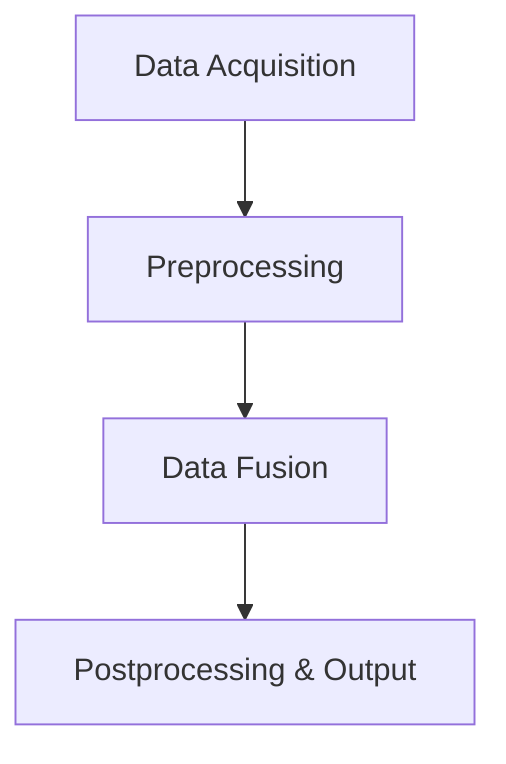

## Overview

Sensor Fusion Techniques involve the integration and processing of data from multiple sensors to create a more accurate and reliable representation of the environment than could be obtained from any individual sensor. This pattern is particularly essential in IoT and edge computing applications where data from various sources, like GPS, accelerometers, gyroscopes, cameras, and other sensors, need to be synthesized to support refined decision-making processes.

The key advantage of sensor fusion is its ability to enhance data reliability, increase precision, and reduce the uncertainty of sensor data. These techniques are crucial for applications such as autonomous driving, robotics, smart cities, and industrial IoT.

## Architectural Approach

In a typical sensor fusion architecture, data from multiple sensors is collected through interfaces that can handle various data formats. This data is subsequently normalized and synchronized to account for differences in sampling rates and data types.

### Stages of Sensor Fusion:

1. **Data Acquisition**: Interface with various sensors and gather raw data.
   
2. **Preprocessing**: Normalize data formats, perform noise filtering, and synchronize data timestamps.

3. **Data Fusion**: Apply fusion algorithms like Kalman Filters, Bayesian Networks, or Machine Learning models to integrate data.

4. **Postprocessing and Output**: Extract meaningful insights from fused data and present it in a usable format. 

### Data Fusion Techniques:

- **Kalman Filtering**: An algorithm that utilizes a series of measurements over time, containing statistical noise and other inaccuracies, to estimate unknown variables.
- **Bayesian Inference**: Utilizes Bayes' Theorem to update the probability for a hypothesis as more information becomes available.
- **Machine Learning Models**: Utilize neural networks and other AI techniques to improve fusion accuracy by learning from data patterns.

## Example Code

Below is a simple Python code example that shows how Kalman filtering might be used for sensor fusion:

```python
import numpy as np

class KalmanFilter:
    def __init__(self, process_variance, measurement_variance, estimated_measurement_variance):
        self.process_variance = process_variance
        self.measurement_variance = measurement_variance
        self.estimated_measurement_variance = estimated_measurement_variance
        self.posteri_estimate = 0.0
        self.posteri_error_estimate = 1.0

    def update(self, measurement):
        # Prediction Update
        self.priori_estimate = self.posteri_estimate
        self.priori_error_estimate = self.posteri_error_estimate + self.process_variance
        
        # Measurement Update
        blending_factor = self.priori_error_estimate / (self.priori_error_estimate + self.measurement_variance)
        self.posteri_estimate = self.priori_estimate + blending_factor * (measurement - self.priori_estimate)
        self.posteri_error_estimate = (1 - blending_factor) * self.priori_error_estimate
        
        return self.posteri_estimate

kf = KalmanFilter(process_variance=1e-5, measurement_variance=0.1**2, estimated_measurement_variance=1.0)
sensor_measurements = [1.0, 1.1, 0.9, 1.05, 1.2]

for measurement in sensor_measurements:
    print(kf.update(measurement))
```

## Diagrams



## Related Patterns

- **Edge Data Processing**: Processing data near the source sensor reduces latency and enhances the efficiency of sensor fusion techniques.
- **Event-Driven Architecture**: This paradigm can be used to trigger data fusion processes based on specific events or conditions detected in the sensor data.

## Additional Resources

- [Kalman Filter Tutorial](https://www.kalmanfilter.net/)
- "Pattern Recognition and Machine Learning" by Christopher M. Bishop
- [Sensor Fusion Explained](https://medium.com/@sensorfusion/sensor-fusion-explained-7bea0bffb3d6)

## Summary

Sensor Fusion Techniques are crucial for enhancing the accuracy and reliability of systems that depend on diverse, often noisy, data sources. Utilizing a combination of algorithms such as Kalman Filters, Bayesian Inference, and Machine Learning models facilitates the creation of more precise models of the sensed environment. This pattern is vital for applications within IoT, edge computing, autonomous systems, and smart environments, where data accuracy is crucial for sound decision-making.
