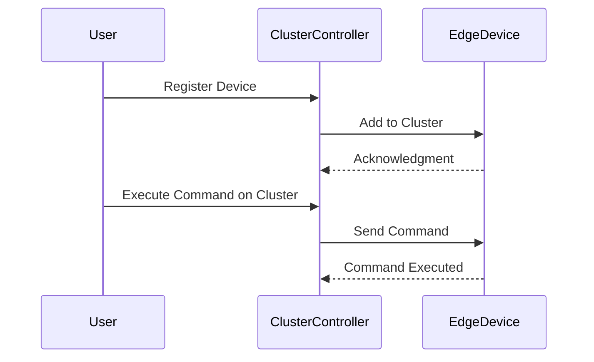

## Introduction

In the rapidly evolving landscape of edge computing and the Internet of Things (IoT), managing numerous distributed devices efficiently is critical. Edge Cluster Management addresses this challenge by providing strategies to manage groups of edge devices as a cohesive unit, ensuring streamlined operations, scalability, and performance optimization.

## Design Pattern Explanation

**Edge Cluster Management** involves organizing edge devices into clusters that can be managed collectively. This pattern leverages cloud-based services to handle communication, data processing, and maintenance activities, while ensuring reduced latency and enhanced reliability.

### Key Components

1. **Edge Device Grouping**: Organizes devices based on geographical proximity, functionality, or network topology to form manageable clusters.
2. **Cluster Controller**: A centralized management entity that oversees the coordination and operation of clusters.
3. **Data Aggregators**: Facilitate data collection and preprocessing at edge clusters before transmitting it to the cloud.
4. **Network Optimization Tools**: Ensure efficient data flow and minimize latency in communication between edge clusters and cloud services.
5. **Security Protocols**: Ensure secure data transmission and robust authentication across the clusters.

## Architectural Approach

### Cluster Formation

Edge devices are grouped based on common attributes such as location, functionality, or data exchange needs. This hierarchy helps in managing devices more systematically.

### Centralized Management

A central cluster controller maintains and monitors the status of each edge cluster. It handles tasks such as:

- Policy enforcement across clusters.
- Distributing software updates and configurations.
- Coordinating load balancing among clusters.

### Data Handling

Local data processing is performed within clusters, reducing the need to transmit raw data to the cloud, which enhances response times and reduces bandwidth usage. Only aggregate data results or essential information are sent to cloud systems for further analysis.

### Network and Communication

Effective networking strategies, such as the use of content delivery networks (CDNs) and optimized routing protocols, enhance the efficiency and reliability of data transmission between edge clusters and cloud resources.

### Security Management

Robust encryption techniques and secure communication protocols protect data integrity across all devices and networks within the cluster.

## Best Practices

- **Automated Scaling**: Implement elasticity in cluster management, allowing dynamic addition or removal of devices based on workload demands.
- **Efficient Data Strategy**: Deploy techniques like data deduplication and edge caching to minimize unnecessary data transfer.
- **Proactive Monitoring**: Utilize advanced monitoring tools to track device performance and detect anomalies in real-time.
- **Regular Updates**: Ensure timely updates and patches across the device clusters to maintain security and functionality.
- **Redundancy and Failover**: Design the architecture to handle device or communication failures gracefully.

## Example Code

Below is a simplified example in JavaScript demonstrating a basic logic to handle device registration into a cluster.

```javascript
class EdgeClusterManager {
  constructor() {
    this.clusters = {};
  }

  registerDevice(clusterId, device) {
    if (!this.clusters[clusterId]) {
      this.clusters[clusterId] = [];
    }
    this.clusters[clusterId].push(device);
    console.log(`Device ${device.id} registered to cluster ${clusterId}`);
  }

  getClusterDevices(clusterId) {
    return this.clusters[clusterId] || [];
  }

  executeCommandOnCluster(clusterId, command) {
    const devices = this.getClusterDevices(clusterId);
    devices.forEach(device => device.execute(command));
  }
}
```

## Diagrams

### Edge Cluster Management Sequence Diagram



## Related Patterns

- **Data Aggregation Pipeline**: Focuses on processing and aggregating data at the edge or cloud levels to optimize bandwidth and processing.
- **Event-Driven Architecture**: Enhances responsiveness and real-time data processing in edge computing systems.

## Additional Resources

- [Edge Computing with AWS Greengrass](https://aws.amazon.com/greengrass/)
- [Microsoft Azure IoT Edge](https://azure.microsoft.com/en-us/services/iot-edge/)
- [Google Cloud IoT solutions](https://cloud.google.com/solutions/iot)

## Summary

The Edge Cluster Management pattern provides a robust framework for managing edge devices as cohesive units. By leveraging centralized control, data optimization, and secure communications, organizations can effectively streamline operations and enhance the performance of their IoT applications. Implementing best practices such as automated scaling, proactive monitoring, and redundancy planning ensures resilient and efficient edge computing environments.
