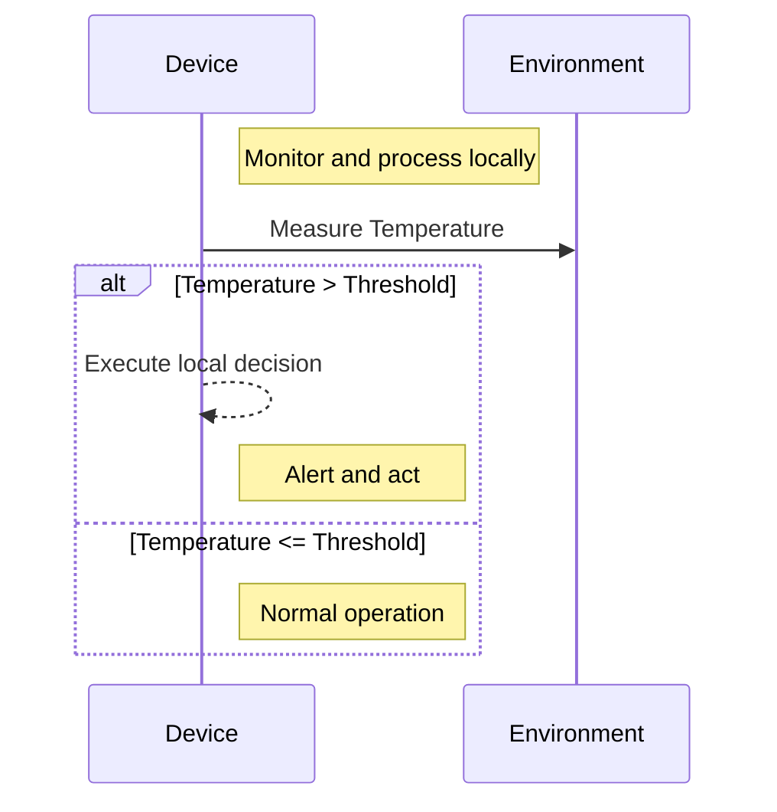

## Introduction

In modern cloud architectures, where real-time data processing and immediate responsiveness are critical, the **Local Decision Making** design pattern emerges as a pivotal solution. This pattern enables edge devices, such as IoT sensors and gateways, to process data locally rather than offloading everything to the cloud. By doing so, devices can make autonomous decisions, thereby reducing dependency on cloud computing resources and minimizing latency.

## Context and Problem

With the proliferation of IoT devices and the demand for immediate data processing, traditional cloud-centric models face challenges such as high latency and bandwidth constraints. In scenarios where time-sensitive decisions are crucial—like autonomous vehicles, industrial automation, or emergency response systems—waiting for cloud processing is impractical and potentially disastrous.

## Solution

The **Local Decision Making** pattern addresses these issues by enabling edge devices to process data locally. Leveraging local computational resources, such devices can analyze data, execute machine learning models, and make decisions without cloud involvement. This approach not only reduces latency but also alleviates concerns over bandwidth and enhances privacy by keeping sensitive data local.

### Key Components

1. **Edge Device**: Equipped with sufficient computing power to process data and trained ML models locally.
2. **Local Storage**: For storing necessary data and models securely on the device.
3. **Decision Engine**: A software component that executes the required algorithms and rule sets to make decisions.
4. **Cloud Synchronization**: For periodic data updates, synchronization, and more intensive computations when necessary. 

### Implementation Example

Here's a simple implementation in Kotlin to illustrate local decision-making logic on an IoT sensor:

```kotlin
class TemperatureSensor(private val threshold: Double) {

    fun measureTemperature(currentTemperature: Double): String {
        return if (currentTemperature > threshold) {
            "Alert: High Temperature! Taking action locally."
        } else {
            "Temperature is normal."
        }
    }
}

// Usage
fun main() {
    val sensor = TemperatureSensor(30.0)
    println(sensor.measureTemperature(32.0)) // Output: Alert: High Temperature! Taking action locally.
}
```

In this snippet, the `TemperatureSensor` class processes temperature data locally and makes an immediate decision without cloud interaction.

## Diagrams

### Sequence Diagram
Below is a simplified sequence diagram using Mermaid demonstrating local decision-making:



## Related Patterns

- **Gateway Aggregation**: Collects data from multiple edge devices to optimize network traffic before any decision making.
- **Cloud Offloading**: An alternative where non-critical decisions are batched and processed in the cloud to save local resources.
- **Stateful Processing**: Maintains state across events and decisions for enhancing real-time processing capabilities.

## Additional Resources

- [Edge AI: Converting cloud-based machine learning models for edge deployment](https://example.com)
- [OpenFog Consortium Architecture Overview](https://example.com)
- [Azure IoT Edge](https://docs.microsoft.com/en-us/azure/iot-edge/)

## Conclusion

The **Local Decision Making** pattern is essential for applications where quick, autonomous decisions are critical. By processing data at the edge, this pattern not only enhances system responsiveness but also optimizes resource usage and reduces dependency on cloud bandwidth. As the IoT ecosystem grows, mastering this pattern will be increasingly vital for developers and architects aiming to build efficient and responsive systems.
