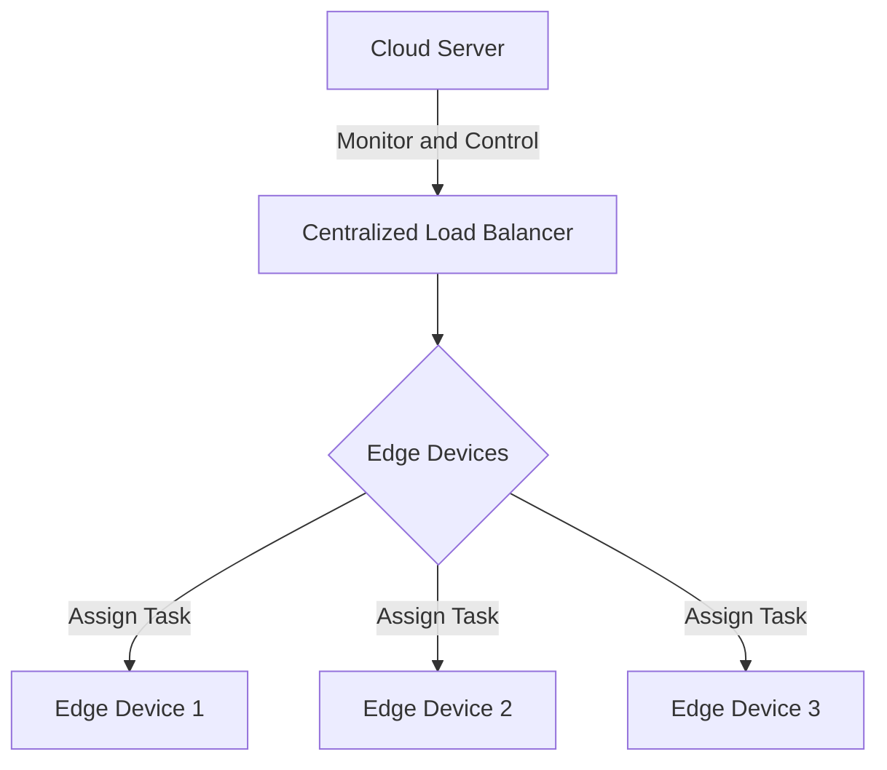

Edge Load Balancing is a pivotal design pattern in edge computing that optimizes resource utilization and ensures service reliability by distributing workloads across multiple edge devices. This pattern is particularly relevant in scenarios where IoT devices generate vast amounts of data requiring real-time processing and minimal latency. It ensures efficient management of workloads by leveraging the computational power of edge devices, thus offloading processes from centralized cloud servers and enhancing response times.

## Design Pattern Explanation

### Key Concepts

1. **Edge Devices**: These are hardware components located near the data source, responsible for processing data locally before it's sent to the cloud.
   
2. **Load Balancing**: A technique used to distribute workloads across multiple computing resources to maximize throughput, minimize response time, and avoid overload.

3. **Latency**: The time taken for data to travel from one point to another, which in this context, impacts the promptness of data processing and response times.

### Mechanism

Edge Load Balancing involves distributing incoming data processing requests among various edge devices to ensure that no single device is overwhelmed. This distribution can be based on several factors such as:

- **Processing Capacity**: Load is distributed to devices capable of handling it without overloading.
- **Proximity to Data Source**: Devices closer to the source data may be prioritized to reduce latency.
- **Current Load**: Devices with a lesser current load may be prioritized to ensure all devices are efficiently utilized.

### Advantages

- **Reduced Latency**: Processing data closer to the source reduces the time required to send data back and forth to a centralized cloud.
- **Scalability**: Easily scales by adding more edge devices rather than increasing cloud resources.
- **Reliability**: Distributes the risk of failure by spreading workloads, making systems more resilient to downtime.

## Architectural Approaches

### Decentralized Load Balancing

In this architecture, load balancing is managed individually by each edge device based on pre-set criteria or algorithms, allowing them to independently decide how to handle incoming workload.

### Centralized Edge Load Balancer

An external load balancer is responsible for distributing workloads among edge devices. This centralized controller monitors all edge devices' status and optimally distributes tasks according to their capabilities and location.

## Best Practices

- **Monitoring and Alerts**: Set up comprehensive monitoring tools to track the performance of edge devices and implement an alert system to detect potential issues early.
- **Dynamic Configuration**: Ensure that the load balancing setup can dynamically adjust to changes in demand or device availability.
- **Security**: Deploy robust security measures at the edge level to protect against potential attacks and data breaches.

## Example Code

Here is a simplified example in JavaScript to demonstrate dynamic task assignment to edge devices based on load:

```javascript
const edgeDevices = [
  { id: 'edge1', load: 30 },
  { id: 'edge2', load: 55 },
  { id: 'edge3', load: 20 },
];

function assignTask(taskLoad) {
  // Find the device with the minimum load
  const targetDevice = edgeDevices.reduce((min, device) => 
    device.load < min.load ? device : min, edgeDevices[0]);

  if ((targetDevice.load + taskLoad) > 100) {
    console.log('No available edge device can handle this task load.');
  } else {
    console.log(`Assigning task to device ${targetDevice.id}`);
    targetDevice.load += taskLoad;
  }
}

assignTask(15);
```

## Diagrams

### Architecture Diagram



## Related Patterns

- **Content Delivery Network (CDN)**: Similar in aim to edge load balancing, focusing on delivering content closer to the user to reduce latency.
- **Service Mesh**: Provides a dedicated infrastructure layer for managing service-to-service communication within a distributed system.

## Additional Resources

- [The Edge Computing Advantage](https://www.gartner.com/en/information-technology/glossary/edge-computing)
- [Building Scalable Edge Systems](https://aws.amazon.com/edge-services/)
- [IoT and Edge Computing](https://azure.microsoft.com/en-us/overview/iot/)

## Summary

Edge Load Balancing is an essential pattern for distributing workloads efficiently among edge devices, enhancing system performance by reducing latency and offering scalability. By understanding and implementing this pattern, cloud architects can build robust and responsive edge computing platforms capable of handling the increasing data demands of IoT and real-time applications.
