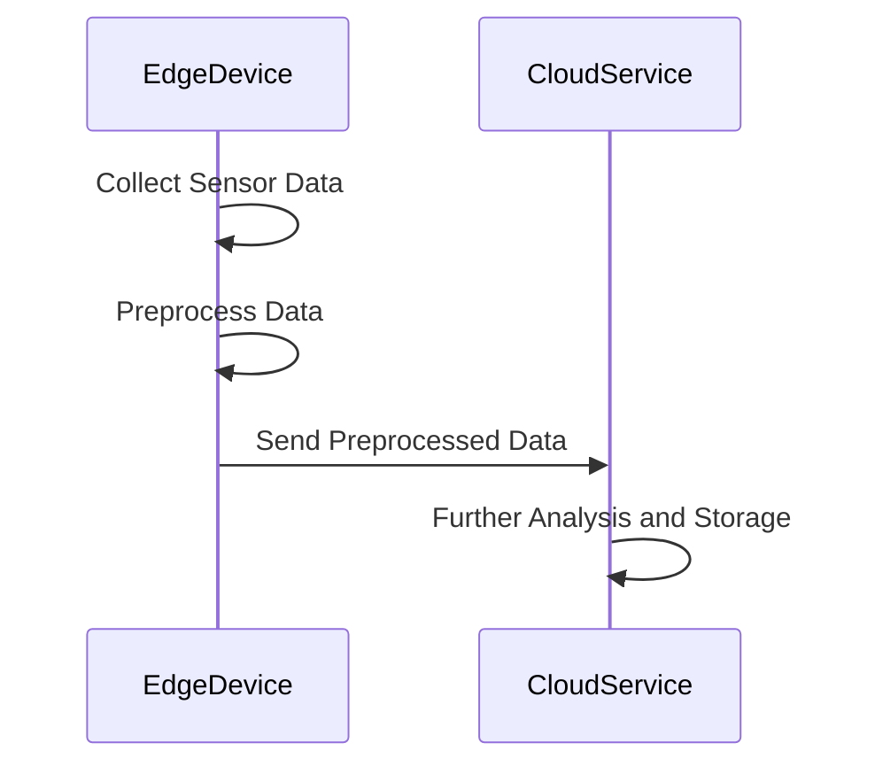

## Overview

The **Hybrid Edge-Cloud Processing** pattern seeks to balance the demand for real-time processing and reduced latency at the edge with the need for immense computational resources and centralized data management in the cloud. In IoT applications, devices generate large volumes of data that need to be processed efficiently. A hybrid architecture enables offloading computation tasks between edge devices and the cloud, reducing bandwidth usage, enhancing responsiveness, and maintaining central oversight.

## Design Pattern Details

### Architectural Approach

- **Edge Layer:** Comprised of IoT devices or gateways local to the data sources, the edge layer focuses on real-time data processing, filtering, and aggregation.
- **Cloud Layer:** The cloud layer manages extensive data storage, complex analytics, machine learning model training, centralized control, and integration with other enterprise systems.

### Paradigms and Best Practices

- **Data Reduction and Pre-processing:** Perform initial data cleaning and summarization at the edge to mitigate unnecessary data transfer to the cloud.
- **Latency-Sensitive Processing:** Execute time-critical operations at the edge to minimize latency, such as anomaly detection or localized data-based decision-making.
- **Scalability and Elasticity:** The cloud should manage workload spikes with its scalable and elastic nature, ensuring that resource allocation is optimized according to demand.
- **Security and Compliance:** Implement robust security measures at both levels to protect data in transit and at rest, and ensure compliance with industry regulations.

### Example Code

Here's a basic example using JavaScript to illustrate how edge devices can preprocess data before sending it to a cloud service like AWS Lambda for further processing:

```javascript
// Edge device script: Data preprocessing
function processData(sensorData) {
    // Example preprocessing: Filter and compress data
    const filteredData = sensorData.filter(item => item.value >= 0);
    const compressedData = JSON.stringify(filteredData);
    return compressedData;
}

// Simulated sensor data stream
const sensorData = [
    { time: '2024-07-07T00:00:00Z', value: 10 },
    { time: '2024-07-07T00:01:00Z', value: -5 }, // Filter out
    { time: '2024-07-07T00:02:00Z', value: 20 }
];

// Preprocess and send to cloud
const preprocessedData = processData(sensorData);

// Simulate sending data to AWS Lambda via HTTP
sendToCloud(preprocessedData);

function sendToCloud(data) {
    // Assume implementation of HTTP POST request to AWS Lambda
    console.log('Sending data to cloud:', data);
}
```

### UML Diagram



### Related Patterns

- **Edge Gateway Pattern:** Facilitates communication between IoT devices and cloud services, serving as a control and aggregation point.
- **Data Lake Pattern:** Complements hybrid processing by storing raw and processed data centrally for comprehensive analytics.
- **Event-Driven Architecture Pattern:** Enhances responsiveness and decoupling between components across edge and cloud environments.

### Additional Resources

- *"Architecting the Internet of Things"* by Dieter Uckelmann and Mark Harrison for insights into IoT architectures.
- AWS IoT Greengrass documentation for specifics on implementing edge computing solutions.
- Google Cloud Platform's Edge TPU application guides for leveraging cloud capabilities in edge processing.

## Summary

The **Hybrid Edge-Cloud Processing** pattern is essential for leveraging the strengths of both edge and cloud computing environments. By strategically partitioning workloads, this pattern addresses critical concerns like low latency, high computational demands, and scalable analytics, crucial for modern IoT and real-time data-driven applications. Implementing this pattern effectively can lead to significant performance enhancements and cost reductions.
