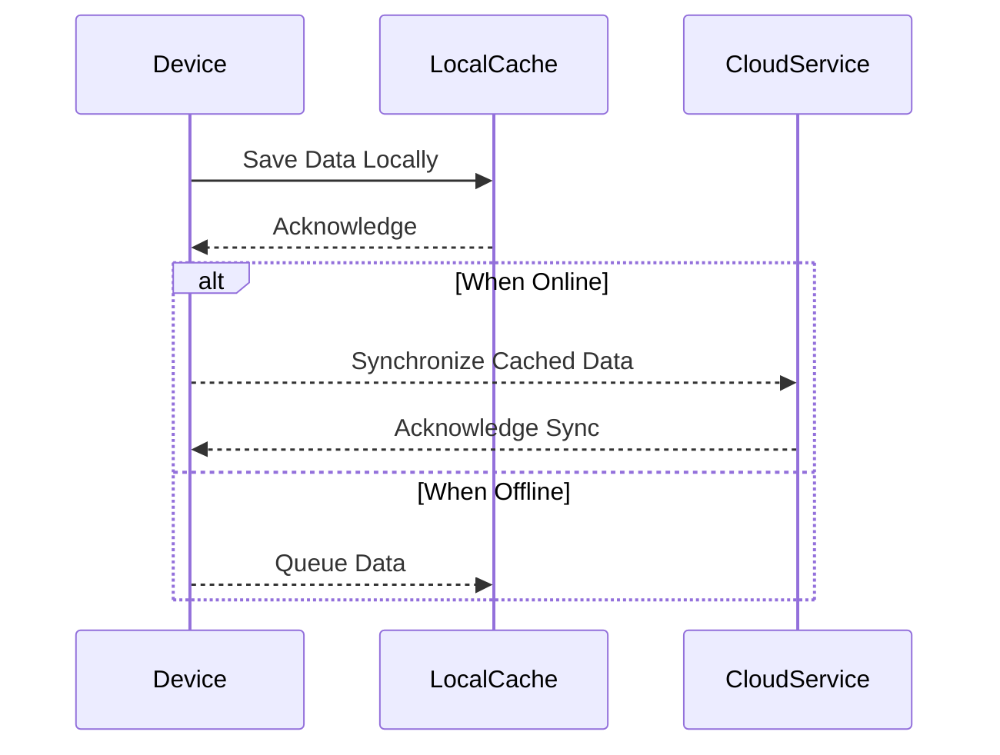

## Introduction

In the realm of edge computing and IoT, devices often operate under conditions where network connectivity can be unpredictable. This can pose significant challenges for systems that rely on steady network access. The **Intermittent Connectivity Handling** design pattern focuses on minimizing performance degradation and ensuring continuous service operation despite these network uncertainties. 

## Key Concepts

- **Decentralization**: Employ local data processing and storage to minimize dependence on continuous network connectivity.
- **Synchronization Queue**: Use a queue to store operations or data that need to sync with the cloud when connectivity is restored.
- **Graceful Degradation**: Implement systems that can adjust functionality depending on the level of connectivity available.
- **Retry Mechanism**: Incorporate a robust retry policy for reconnecting and resynchronizing data when network access is regained.

## Architectural Approaches

1. **Local Caching and Logging**: Store critical data and logs locally to be synced or processed later. This reduces data losses and ensures that vital operations can continue offline.
   
2. **Priority-Based Synchronization**: Develop a mechanism to prioritize data that needs to be synchronized when connectivity is available, ensuring bandwidth is used effectively for critical updates.

3. **Adaptive Data Policies**: Implement data management policies that adapt based on network conditions, reducing data payloads during low connectivity and increasing them when connectivity is stable.

## Example Implementation

Here's a basic implementation in JavaScript using local storage and indexedDB for a web-based application that requires offline capabilities:

```javascript
// Check network status and update connectivity state
function updateConnectivityStatus() {
    const condition = navigator.onLine ? "online" : "offline";
    console.log(`Device is currently: ${condition}`);
}

// Listen for connectivity changes
window.addEventListener('online', updateConnectivityStatus);
window.addEventListener('offline', updateConnectivityStatus);

// Save data locally when offline
function saveLocalData(data) {
    if (!navigator.onLine) {
        const db = window.indexedDB.open('DataSyncDB', 1);
        db.onupgradeneeded = event => {
            const database = event.target.result;
            const store = database.createObjectStore('data', { keyPath: 'id' });
        };
        db.onsuccess = event => {
            const transaction = event.target.result.transaction('data', 'readwrite');
            const store = transaction.objectStore('data');
            store.add(data).onsuccess = () => {
                console.log('Data saved locally.');
            };
        };
    }
}

// Function to retry data synchronization once back online
function syncDataWhenOnline() {
    if (navigator.onLine) {
        const db = window.indexedDB.open('DataSyncDB', 1);
        db.onsuccess = event => {
            const database = event.target.result;
            const transaction = database.transaction('data', 'readonly');
            const store = transaction.objectStore('data');
            const request = store.getAll();
            request.onsuccess = () => {
                const allData = request.result;
                // Process data synchronization logic here
                console.log('Syncing data:', allData);
            };
        }
    }
}
```

## Diagrams

Here's Sequence diagram illustrating how the intermittent connectivity handling pattern can be implemented:



## Related Patterns and Practices

- **Circuit Breaker Pattern**: A design pattern used to detect failures and encapsulate the logic of preventing different system failures from cascading.
- **Offline First Strategy**: A development strategy where applications are designed to work primarily offline, syncing data when connectivity exists.
- **Retry Pattern**: A pattern used to handle transient failures by automatically retrying a failed operation.

## Additional Resources

- [Designing Network Resilient Applications](https://aws.amazon.com/architecture/resilient-applications/)
- [Edge computing: The essentials](https://azure.microsoft.com/en-us/resources-books/edge-computing-the-essentials/)
- [Offline Web Applications Using IndexedDB](https://developer.mozilla.org/en-US/docs/Web/API/IndexedDB_API/Using_IndexedDB)

## Summary

The **Intermittent Connectivity Handling** pattern is vital for ensuring that edge computing and IoT systems remain functional amidst unstable network conditions. By employing local caching, synchronization queues, and adaptive approaches to connectivity, systems can gracefully manage the challenges of intermittent connectivity, ensuring that critical processes continue with minimal disruption. This pattern represents a key strategy for building robust and resilient cloud-connected solutions.
