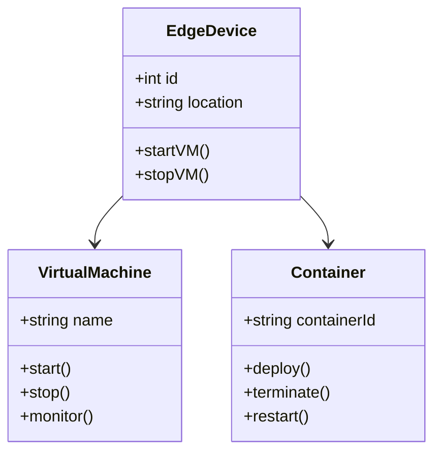
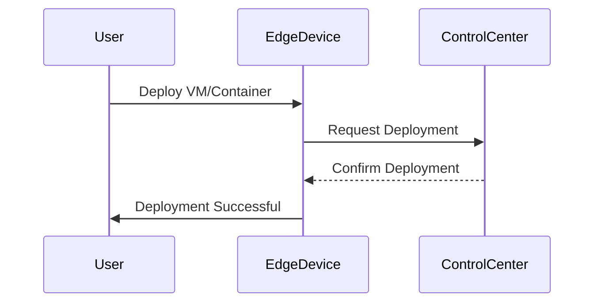

## Introduction

Edge device virtualization refers to the practice of running virtualized instances, such as virtual machines or containers, directly on edge hardware. This approach leverages edge computing to process data locally, thereby reducing latency, bandwidth usage, and improving responsiveness of IoT applications. By executing computational tasks closer to where data is generated, businesses can offload processing from central data centers, leading to faster data analysis and response times critical for real-time applications.

## Architectural Approach

Edge device virtualization follows a decentralized architecture. Instead of sending all data to a centralized cloud server for processing, data is processed at or near the source – the edge devices. This architectural approach involves:

- **Virtual Machines or Containers**: Running these on edge devices allows multiple isolated workloads to process simultaneously, optimizing resource usage and providing fault isolation.
  
- **Edge Orchestration**: Manages workloads across multiple edge devices, ensuring efficient use of resources and scaling up/down as needed.

- **Network Connectivity**: Utilizes high-speed local networks to connect edge devices with each other and the central cloud when necessary, maintaining a balance between edge and central processing.

- **Security and Data Privacy**: Enforces local data processing to protect sensitive information and comply with regulations, minimizing data transmitted over the internet.

## Best Practices

1. **Select the Right Virtualization Technology**: Use lightweight containers for efficient resource utilization on limited-capacity edge devices.
   
2. **Implement Efficient Orchestration**: Utilize orchestration platforms like Kubernetes to manage edge deployments and automate resource scaling and application updates.

3. **Security Best Practices**: Ensure security by using end-to-end encryption, securing access points, and regularly updating edge device security policies.

4. **Monitor and Optimize Performance**: Use monitoring tools to track performance metrics and optimize resource allocation based on workload demands.

5. **Data Management Strategy**: Employ local data handling strategies to reduce unnecessary data transfer, such as filtering and aggregating data at the edge.

## Example Code

Here's a basic example showcasing container deployment using Kubernetes at the edge:

```yaml
apiVersion: apps/v1
kind: Deployment
metadata:
  name: edge-device-deployment
spec:
  replicas: 3
  selector:
    matchLabels:
      app: edge-app
  template:
    metadata:
      labels:
        app: edge-app
    spec:
      containers:
      - name: edge-app-container
        image: edge-app-image:v1.0
        ports:
        - containerPort: 8080
```

## Diagrams

### UML Class Diagram



### Sequence Diagram



## Related Patterns

- **Gateway Offloading**: Redirects processing tasks to edge devices to balance load and improve application responsiveness.
  
- **Microservices Architecture**: Decomposes applications for scalable deployment, often used in conjunction with containerized workloads at the edge.

## Additional Resources

- [Edge Computing Consortium](https://www.edgecomputingconsortium.com/)
- [Kubernetes on Edge Devices](https://kubernetes.io/docs/concepts/architecture/nodes/)
- [IoT Edge Solutions on Azure](https://azure.microsoft.com/en-us/solutions/iot/edge/)

## Summary

Edge Device Virtualization is critical for optimizing IoT applications by executing computations closer to data sources. This pattern reduces latency and bandwidth usage while enhancing security and regulatory compliance. By employing virtualization technologies and orchestrating workloads efficiently, businesses can realize significant gains in operational efficiency and application responsiveness.
