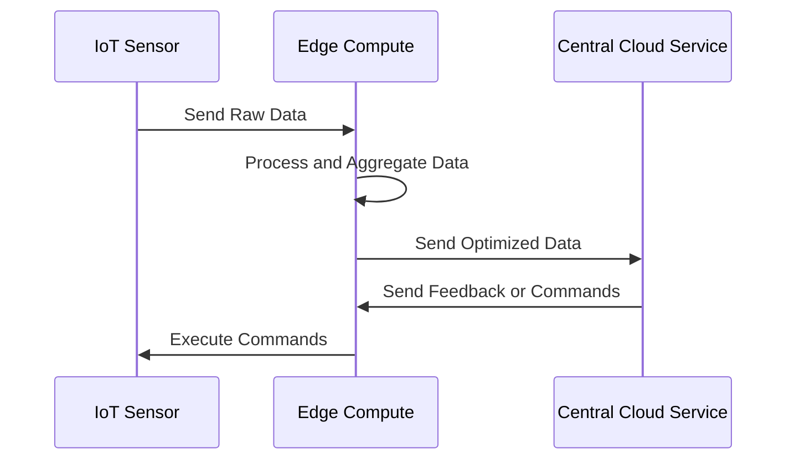

### Introduction

Latency-sensitive applications, often found in edge computing and IoT environments, require designs that minimize delay to ensure responsiveness and reliability. Whether you're dealing with real-time data processing or interaction with physical devices, latency considerations are critical for maintaining a seamless user experience or achieving operational effectiveness.

### Design Pattern and Architectural Approach

Latency-sensitive applications leverage several key architectural patterns and approaches:

1. **Edge Computing Deployment**: By deploying computation to the edge of the network close to data sources, applications can significantly reduce the data transmission time.

2. **Data Preprocessing**: Implement preprocessing at the edge to reduce data volume and complexity before sending to centralized servers.

3. **Event-Driven Architecture**: Utilize event-driven systems where responses are triggered by events rather than continuous data polling, reducing unnecessary processing delays.

4. **Optimized Networking**: Implement networking optimizations like content delivery networks (CDNs), efficient routing, and network protocols tailored to reduce latency.

5. **Caching Strategies**: Use local caching mechanisms to store frequently accessed data closer to users.

6. **Service Decomposition**: Break down applications into microservices allowing independent scaling and optimization based on performance needs.

### Example Code

Below is an example of leveraging edge functions for latency reduction in an IoT application:

```javascript
// Edge function to preprocess data
const processSensorData = (data) => {
    // Filter noise from raw sensor data
    const cleanedData = data.filter(sample => isValidSample(sample));
    // Aggregate data locally
    const aggregatedData = aggregateSensorData(cleanedData);
    return aggregatedData;
};

// Simulating deployment at edge
let rawData = getRawSensorData();
let optimizedData = processSensorData(rawData);
sendDataToCentralSystem(optimizedData); // Send only necessary data
```

### Diagrams

#### Example Sequence Diagram



### Related Patterns

- **Data Locality Pattern**: Focuses on processing data where it is generated or gathered to reduce latency and costs associated with data movement.
- **Reactive Programming Pattern**: Asynchronous programming paradigm concerned with data streams and the propagation of changes.
- **API Gateway Pattern**: Manages requests into microservices-based applications to optimize latency and security.

### Best Practices

- Minimize API call dependencies to lower coordination time.
- Use parallel processing wherever possible to enhance throughput.
- Continuously monitor and optimize network bandwidth and latency.
- Design failover strategies to maintain application resilience.

### Additional Resources

- [Edge Computing: Principles and Practices](https://example.com/edge-computing-principles)
- [Improving Web Application Latency](https://example.com/web-app-latency)
- [AWS Edge Computing Services](https://aws.amazon.com/edge/)

### Summary

Latency-sensitive application design is crucial for areas like IoT and edge computing, where response time is critical. By leveraging strategies such as edge computing, caching, and optimized networking, developers can build scalable, efficient, and responsive systems. Additionally, using patterns like event-driven architecture and service decomposition can further refine performance and reduce latency.

In conclusion, the right combination of design patterns and technology choices will ultimately lead to a more performant application architecture tailored for latency-sensitive use cases.
