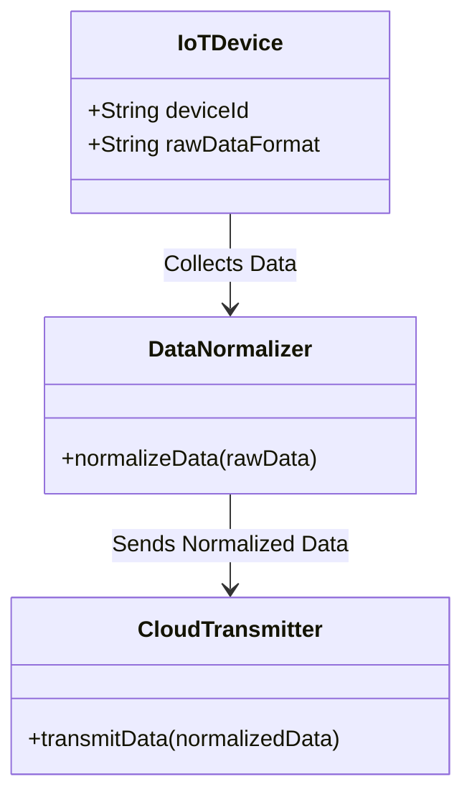
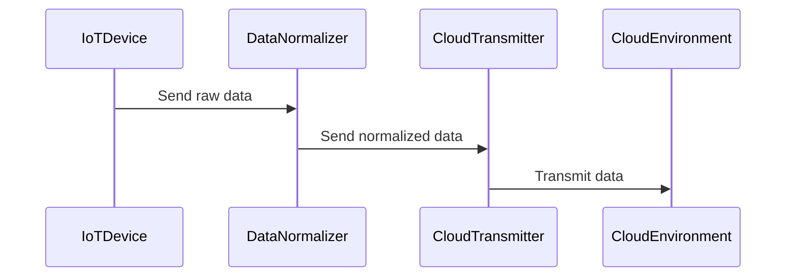

## Introduction

In the rapidly evolving landscape of edge computing and IoT, the **Data Normalization at Edge** design pattern plays a crucial role in ensuring that data generated by various edge devices is standardized and consistent before being transmitted to the cloud. This pattern addresses the challenges of handling diverse data formats and structures, thereby improving compatibility, reducing redundancy, and enhancing overall data quality.

## Detailed Explanation

### Design Pattern Overview

Data normalization at the edge involves converting data into a common format or structure close to the source, i.e., at the edge level, before it enters the cloud infrastructure. This method minimizes the bandwidth required for data transmission and reduces the complexity of data processing tasks in the cloud.

### Goals and Benefits

1. **Improved Data Quality**: By ensuring consistent data formats, anomalies and discrepancies can be reduced, leading to high-quality data analysis.
2. **Reduced Cloud Processing**: Performing normalization at the edge decreases the computational and storage demands on cloud resources.
3. **Faster Data Transmission**: Normalized data often leads to smaller and more efficient data packets, resulting in quicker transmission times.
4. **Interoperability**: Simplifies integration with different cloud services and applications by using standardized formats.

### Implementation Approach

1. **Data Collection**: Gather data from various IoT and edge devices.
2. **Schema Definition**: Establish a consistent schema or format to which incoming data must be normalized.
3. **Transformation Logic**: Implement transformation processes using scripts or middleware that adjust data into the predefined schema.
4. **Validation and Enrichment**: Validate data accuracy and completeness, optionally enriching it with context-specific information.
5. **Transmission**: Send the normalized data to the cloud for further processing and analysis.

### Example Code

```javascript
// Example of data normalization at the edge using JavaScript

// Sample raw data from IoT device
const rawData = {
  deviceId: 'dev123',
  temperature: '27.3C',
  timestamp: '2024-07-10T14:00:00Z'
};

// Normalization function to standardize data format
function normalizeData(data) {
  return {
    deviceId: data.deviceId,
    temperature: parseFloat(data.temperature), // Convert temperature to number
    timestamp: new Date(data.timestamp).toISOString() // Standardize timestamp format
  };
}

// Normalized data
const normalizedData = normalizeData(rawData);

// Transmitting normalized data to cloud
sendToCloud(normalizedData);

function sendToCloud(data) {
  console.log("Transmitting to cloud:", data);
}
```

## Diagrams

### Class Diagram



### Sequence Diagram



## Related Patterns

- **Edge Aggregation**: Collecting and aggregating data at the edge before transmission.
- **Data Compression at Edge**: Reducing data size before transmission to the cloud.
- **Event Stream Processing**: Processing data streams in real-time at the edge.

## Additional Resources

- [Edge Computing for IoT Data Management](https://www.example.com)
- [Data Normalization Techniques in Cloud](https://www.example.com)
- [AWS IoT Greengrass Documentation](https://docs.aws.amazon.com/greengrass/v2/developerguide/what-is-gg.html)

## Summary

**Data Normalization at Edge** is a vital pattern in cloud computing and IoT environments. By standardizing data formats prior to cloud transmission, organizations can achieve better data quality, reduce cloud processing demands, and ensure efficient data communication. This pattern is a fundamental building block for efficient and scalable edge-to-cloud architectures, facilitating seamless integration, analysis, and decision-making processes.

