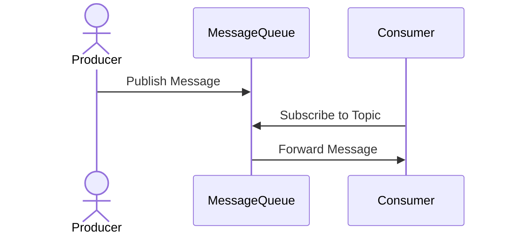

## Introduction

In the rapidly evolving landscape of the Internet of Things (IoT) and edge computing, effective communication among devices and systems is crucial. Message Queueing on Edge Devices pattern addresses this need by implementing asynchronous message handling systems on edge devices. This design pattern is integral for overcoming the challenges of network reliability and latency, enabling scalability, and ensuring reliable data transfer in distributed systems.

## Pattern Details

### Problem

In many IoT applications, edge devices must communicate with each other or with centralized cloud services. Direct synchronous communication can introduce latency issues and become fragile if network connectivity is unstable. These challenges necessitate a more resilient solution to handle communication asynchronously.

### Solution

Message queueing provides a mechanism for storing messages sent from one device or service until they can be properly consumed by the receiver. By utilizing a queue system, messages can be posted to the queue even if the recipient is not ready or available to process the messages immediately. This decouples message production and consumption, leading to improved system reliability and flexibility.

### Components

1. **Producer**: This is the component that generates messages and submits them to the message queue. In an IoT context, these are often edge devices collecting data.

2. **Queue**: Serves as a temporary storage for messages. It acts as a buffer and ensures messages are held until consumed by the consumer.

3. **Consumer**: This component fetches and processes messages from the queue. The consumer can be another edge device or a backend cloud service.

### Benefits

- **Fault Tolerance**: The decoupled nature of queueing allows the system to handle network outages without losing messages.
- **Scalability**: Asynchronous communication enables system components to scale without affecting message producer or consumer.
- **Low Latency**: By avoiding synchronous waiting periods, message queueing can help reduce response times in data processing.

## Example Code

Consider a simplified example using an MQTT broker for edge device communication:

```kotlin
import org.eclipse.paho.client.mqttv3.MqttClient
import org.eclipse.paho.client.mqttv3.MqttConnectOptions
import org.eclipse.paho.client.mqttv3.MqttMessage

fun main() {
    // Initialize MQTT client
    val brokerUrl = "tcp://your-mqtt-broker-address:1883"
    val clientId = "EdgeDevice01"
    val client = MqttClient(brokerUrl, clientId)
    
    // Connection options
    val connOpts = MqttConnectOptions()
    connOpts.isCleanSession = true
    
    // Connect the client
    client.connect(connOpts)
    
    // Publish a message
    val topic = "sensor/data"
    val message = MqttMessage("Hello from Edge Device".toByteArray())
    client.publish(topic, message)
    
    println("Message published to topic $topic")
    
    // Disconnect the client
    client.disconnect()
}
```

### Diagram: Sequence Diagram



## Related Patterns

- **Event Sourcing**: Capture state changes as a sequence of events, complementing the message queue with persistent event storage and retrieval.
- **Command Query Responsibility Segregation (CQRS)**: Separates the write operations (commands) from read operations (queries) to improve scalability, often used in conjunction with message queues.

## Additional Resources

- [MQTT Protocol: Building a Smart IoT System](https://mqtt.org/)
- [AWS IoT Greengrass](https://aws.amazon.com/greengrass/)
- [Apache Kafka on Edge](https://kafka.apache.org/) for high-throughput message processing at scale

## Summary

The Message Queueing on Edge Devices pattern is a backbone of reliable communication in distributed edge computing systems. By allowing messages to be queued and processed asynchronously, it enables robust, scalable, and fault-tolerant IoT applications that efficiently handle network instability and latency. Implementing this pattern positions IoT systems to better meet the demands of modern, data-driven environments, ensuring continuous operation and data integrity.

This design pattern plays a critical role in building future-proof IoT ecosystems that can adapt to varying network conditions and scale efficiently as the number of connected devices grows.
