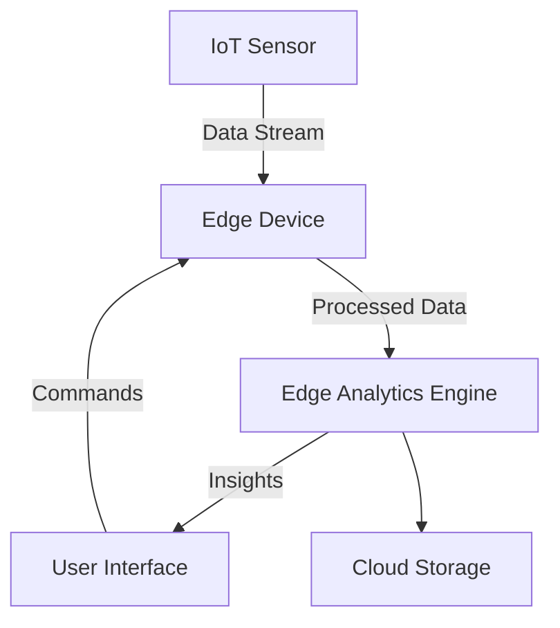

## Introduction

In modern cloud computing and IoT (Internet of Things) environments, processing data close to the source—at the edge—offers critical benefits in terms of latency reduction, bandwidth efficiency, and quick decision-making. The **Edge Analytics and Visualization** design pattern entails performing analytics and visualizing results at the edge of the network, meaning near the data sources. This approach is crucial in scenarios where real-time insights are necessary, such as in smart cities, autonomous vehicles, and industrial IoT.

## Architectural Overview

Edge Analytics and Visualization is rooted in distributing computation closer to the data sources, compared to the traditional cloud-centric approach where data is sent to centralized datacenters. This pattern leverages edge devices that are capable of computing tasks, such as gateways, routers, or bespoke edge servers.

### Key Components

1. **Edge Devices**: These are hardware components that reside near data sources (e.g., sensors, IoT devices) capable of collecting and pre-processing data.

2. **Edge Analytics Engines**: Deployed on edge devices, these engines perform real-time data analysis using lightweight machine learning models or rule-based systems.

3. **Visualization Tools**: Embedded within edge devices or connected systems, these tools render graphical representations of the processed data for quick insight delivery to users.

### Architectural Diagram



## Example Code

Here's a simplified example using Python and a lightweight data visualization library like `Dash`. This code snippet sets up an edge device to process and visualize sensor data:

```python
import dash
from dash import html, dcc
import plotly.express as px
import pandas as pd

app = dash.Dash(__name__)

data = pd.DataFrame({
    'timestamp': pd.date_range(start='1/1/2024', periods=24, freq='H'),
    'temperature': [22, 23, 23, 22, 21, 20, 19, 19, 20, 22, 24, 26, 27, 28, 29, 29, 28, 27, 26, 24, 23, 22, 22, 21]
})

fig = px.line(data, x='timestamp', y='temperature', title='Real-time Temperature Monitoring')

app.layout = html.Div([
    dcc.Graph(figure=fig)
])

if __name__ == '__main__':
    app.run_server(debug=True)
```

## Best Practices

- **Data Filtering**: Implement data filtering at the edge to reduce the amount of data sent to the cloud, ensuring unnecessary data does not occupy bandwidth.
- **Security Measures**: Secure data at the edge to prevent breaches since edge devices are often more vulnerable than centralized systems.
- **Device Management**: Incorporate robust device monitoring and management protocols to maintain operational efficiency and reduce downtime.

## Related Patterns

- **Data Filtering at the Edge**: Minimizing bandwidth usage by filtering data before it reaches the cloud.
- **Fog Computing**: Utilizing local edge networks for preliminary data processing before reaching cloud infrastructures.
- **Event-Driven Architecture**: Leveraging real-time data processing to trigger actions based on observed events.

## Additional Resources

- [Understanding the Edge Computing Landscape](https://www.edgecomputing.org/)
- [IoT and Edge Computing for Dummies](https://www.dummies.com/iot/)
- [EdgeX Foundry Project](https://www.edgexfoundry.org/)

## Summary

The **Edge Analytics and Visualization** pattern shifts the paradigm of data processing from centralized to a distributed model at the network's periphery. This design helps in achieving real-time insights by analyzing and visualizing data at the edge, a necessity in latency-sensitive applications. By adopting this pattern, organizations can benefit from increased efficiency, reduced latency, and actionable insights that drive timely decision-making processes. As edge computing continues to evolve, this pattern will be pivotal in shaping responsive and smart data-driven solutions.
