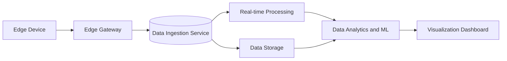

## Introduction

The **Edge-to-Cloud Data Pipelines** design pattern addresses the integration challenge of moving and processing data generated by edge devices within cloud environments. This pattern is crucial for Internet of Things (IoT) solutions that require real-time analysis and decision-making capabilities at the edge while leveraging the vast computing and storage capacities of the cloud for data aggregation, advanced analytics, and long-term storage.

## Design Pattern Overview

In an environment where edge devices generate copious amounts of data, it is imperative to efficiently transfer this data to the cloud for centralized processing and insight generation. The Edge-to-Cloud Data Pipelines pattern enables the seamless flow of data from geographically distributed edge locations to cloud-based systems.

### Key Components

- **Edge Devices**: Sensors or IoT devices located on the periphery of the network that collect and potentially pre-process data.
- **Edge Gateway**: A local device responsible for aggregating data from multiple edge devices, performing initial transformations, and communicating securely with cloud services.
- **Data Ingestion Service**: A cloud-based service that receives data from the edge gateway, which may process the data further for storage or real-time analytics.
- **Data Storage**: Scalable and durable storage solutions on the cloud that store processed or raw data from edge locations.
- **Data Processing and Analytics Services**: Cloud services that provide real-time data processing, machine learning, analytics, and visualization capabilities.
- **Data Governance and Security**: Frameworks and tools that ensure compliance, data protection, and security across the data pipeline.

## Architectural Approaches

### 1. Data Pre-Processing at the Edge
Perform essential computations and reduce data volume at the edge to improve transfer efficiency and speed. Techniques include data aggregation, filtering, and event-driven processing mechanisms.

### 2. Secure and Efficient Data Transfer
Employ secure communication protocols like MQTT or HTTPS for data transmission between edge gateways and cloud services. Optimize data transfer using batching, compression, and encoding strategies.

### 3. Cloud-Based Data Ingestion and Processing
Utilize services like AWS IoT Core, Azure IoT Hub, or Google Cloud IoT Core for data ingestion and apply stream processing frameworks (e.g., Apache Kafka, AWS Kinesis) for real-time analysis.

### 4. Scalable Cloud Storage Solutions
Choose appropriate cloud storage services (e.g., Amazon S3, Azure Blob Storage, Google Cloud Storage) to handle varying data volumes while ensuring data durability and cost-efficiency.

## Best Practices

- **Resiliency and Fault Tolerance**: Implement fallback mechanisms at both edge and cloud layers to handle network disruptions and maintain data flow continuity.
- **Scalability**: Design the architecture to handle scaling up/down with varying loads and increasing number of connected devices.
- **Latency Management**: Optimize to minimize latency by prioritizing critical data paths and using edge processing.
- **Data Security**: Ensure encryption in transit and at rest, robust authentication, and authorization mechanisms.
- **Monitoring and Reporting**: Integrate monitoring tools to gauge system performance, identify bottlenecks, and automate alerts.

## Example Code

Here is a simple example of setting up an MQTT client on the edge device to transmit data to a cloud-based MQTT broker:

```java
import org.eclipse.paho.client.mqttv3.*;

public class EdgeToCloudDataSender {

    private static final String MQTT_BROKER_URL = "tcp://broker.hivemq.com:1883";
    private static final String CLIENT_ID = "EdgeDevice001";
    private static final String TOPIC = "iot/sensorData";

    public static void main(String[] args) {
        try {
            MqttClient client = new MqttClient(MQTT_BROKER_URL, CLIENT_ID);
            MqttConnectOptions options = new MqttConnectOptions();
            options.setCleanSession(true);

            client.connect(options);
            String data = "{\"temperature\": 21.0, \"humidity\": 45.0}";
            MqttMessage message = new MqttMessage(data.getBytes());
            message.setQos(1);

            client.publish(TOPIC, message);
            client.disconnect();
            System.out.println("Data sent to cloud successfully");
        } catch (MqttException e) {
            e.printStackTrace();
        }
    }
}
```

## Diagrams

Below is a high-level view of the Edge-to-Cloud Data Pipeline architecture:



## Related Patterns

- **Event Streaming**: Focuses on real-time event processing and stream management, enhancing the ability to react to data as it arrives.
- **Command Query Responsibility Segregation (CQRS)**: Helps in separating data modification from reading, applicable in scenarios needing different data management for operations and analytics.

## Additional Resources

- [AWS IoT Core Overview](https://aws.amazon.com/iot-core/)
- [Azure IoT Hub Documentation](https://docs.microsoft.com/en-us/azure/iot-hub/about-iot-hub)
- [Google Cloud IoT Platform](https://cloud.google.com/solutions/iot)

## Summary

The Edge-to-Cloud Data Pipelines pattern effectively bridges the gap between local edge computing and global cloud capabilities. By strategically architecting the flow of data from edge devices to centralized processes, organizations can unlock powerful insights and decision-making advantages in real-time and at scale. This pattern is integral to realizing the full potential of IoT and edge computing in various industries, fostering agility and intelligence across distributed landscapes.
