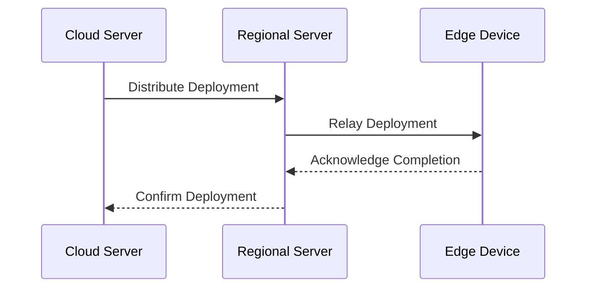
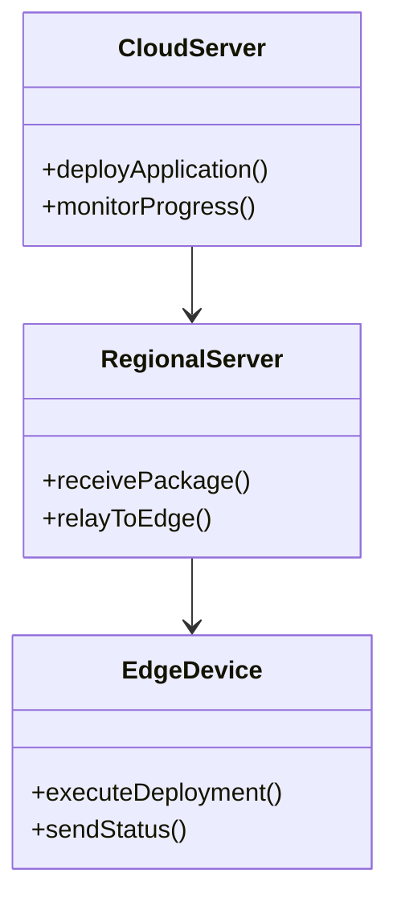

## Introduction

Scalable Edge Deployment is a critical pattern in edge computing and IoT ecosystems that focuses on the efficient deployment of applications and services across a diverse and numerous array of edge devices. As the number of IoT devices grows exponentially, deploying updates and new functionalities becomes a challenging task, requiring robust strategies to ensure seamless operations.

## Design Pattern Overview

### Problem

Deploying applications to a large number of edge devices poses several challenges:

- **Scalability**: As the number of devices increases, traditional deployment processes may not be sufficient to handle the load.
- **Consistency**: Ensuring consistent deployments across all devices is crucial to maintain uniform functionality and reduce error rates.
- **Latency and Bandwidth**: Deployments should minimize latency and use available bandwidth efficiently, especially in bandwidth-constrained environments.
- **Security**: Secure deployments are essential to protect both the device and data from unauthorized access and tampering.

### Solution

The Scalable Edge Deployment pattern provides strategies to:

- Automate deployments with centralized orchestration tools.
- Utilize hierarchical deployment models to distribute the load.
- Employ lightweight containerization for ease of deployment and rollback.
- Monitor real-time diagnostics and logs for deployment accuracy and troubleshooting.
- Implement security best practices such as encrypted communications and secure boot.

## Architectural Approaches

### Hierarchical Model

Utilize a multi-layered approach where deployments flow from the central cloud server to regional servers and eventually to individual edge devices. This hierarchical model helps distribute network load, reducing bottlenecks and improving efficiency.

### Decentralized Orchestration

Utilize container orchestration tools (like Kubernetes at the edge) to manage deployments. Decentralized orchestration enables localized decision-making, which is ideal for scenarios with unreliable connectivity to central systems.

### Light-Weight Virtualization

Implement containerization (using Docker, LXC) to run applications in isolated environments. This provides quick deployment, seamless updates, and reduced chances of "dependency hell."

## Best Practices

- **Version Control & Rollout Strategy**: Implement version control for deployments and practice canary or gradual rollouts to minimize the impact of potential issues.
- **Monitoring & Logs**: Use advanced monitoring and logging to gain insights into deployments, allowing fast identification and resolution of issues.
- **Security Measures**: Encrypt communication channels and use authentication for deployments to safeguard against unauthorized changes.

## Example Code

### Deployment Orchestration Using Kubernetes

```yaml
apiVersion: apps/v1
kind: Deployment
metadata:
  name: edge-application
spec:
  replicas: 100
  template:
    metadata:
      labels:
        app: edge-application
    spec:
      containers:
      - name: edge-container
        image: edge-application:latest
        ports:
        - containerPort: 8080
```

### Dockerfile for Light-Weight Containerization

```dockerfile
FROM alpine:3.14
COPY . /app
WORKDIR /app
RUN apk add --no-cache python3 py3-pip
RUN pip install --no-cache-dir -r requirements.txt
CMD ["python3", "main.py"]
```

## Diagrams

### Sequence Diagram for Deployment



### UML Class Diagram for Edge Deployment Pattern



## Related Patterns

- **Device Shadow Pattern**: Helps manage device states and synchronize them across distributed systems.
- **Gateway Aggregation Pattern**: Useful for organizing communication between numerous devices and central systems.

## Additional Resources

- [Edge Computing in IoT](https://www.ibm.com/cloud/learn/edge-computing-iot)
- [Kubernetes at the Edge](https://kubernetes.io/blog/2020/12/02/kubernetes-on-edge/)
- [Secure Deployment Practices](https://owasp.org/www-project-secure-headers/)

## Summary

Scalable Edge Deployment is essential for modern IoT and edge computing setups, ensuring that application deployments are efficient, consistent, and secure across a widespread array of devices. By leveraging architectural strategies like hierarchical models and decentralized orchestration, and adhering to best practices like version control and security measures, organizations can effectively manage deployments even at large scales.
