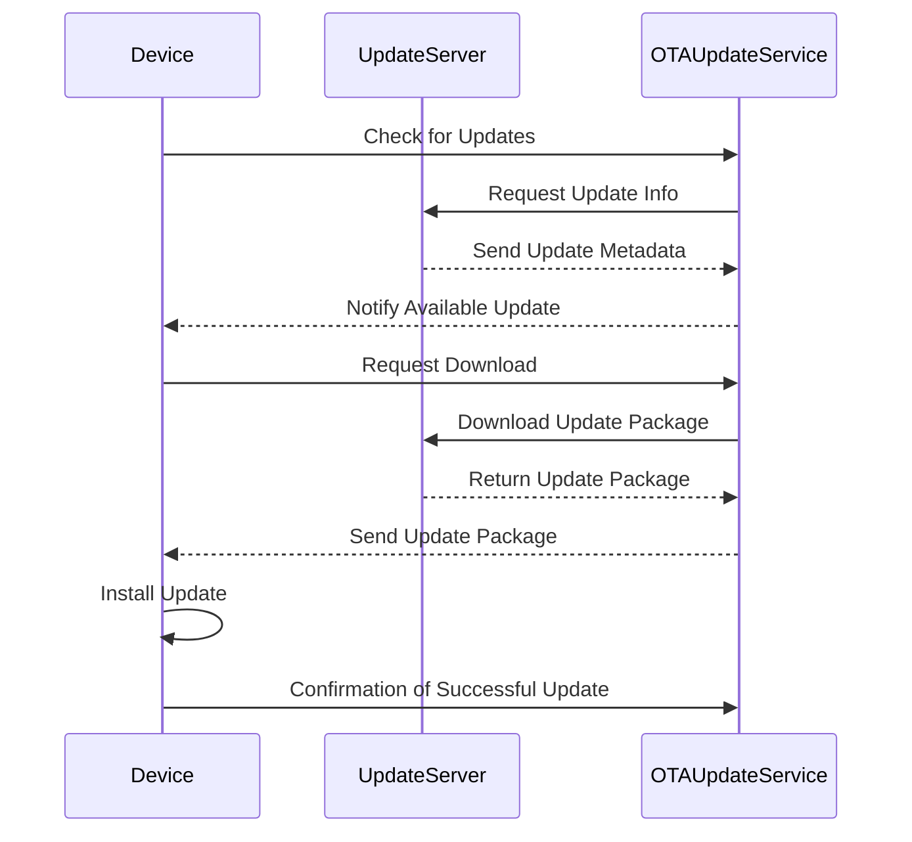

## Introduction

In an ever-connected world, the ability to update and manage IoT devices remotely is crucial. Over-the-Air (OTA) Updates facilitate this by allowing the distribution of new software, firmware, configuration parameters, and even security patches to IoT devices without the need for physical access. This design pattern is essential for maintaining the operation of devices spread across vast geographic areas, enabling businesses to deliver new features, bug fixes, and improvements efficiently.

## Detailed Description

### Overview

OTA Updates are pivotal in IoT and Edge Computing for several reasons:

- **Scalability**: Managing a large number of devices requires an efficient update mechanism.
- **Security**: Quick distribution of security patches to mitigate vulnerabilities.
- **Maintenance**: Reduces downtime and maintenance costs associated with manual updates.
- **Feature Enhancement**: Continuously provide new functionalities and improvements to users.

### Architectural Approach

The process of implementing OTA updates involves several components and steps:

1. **Update Server**: Central repository where updates are stored and managed.
2. **Device Management System**: Handles device registration, authentication, and authorization.
3. **Push/Pull Mechanism**: Devices can either pull updates when they connect to the network, or the server can push updates depending on the architecture.
4. **Update Package**: Composed of binaries, configuration files, and metadata for device compatibility checks.
5. **Update Deployment**: Can be staged (percent deployment) or simultaneous, depending on the use case.
6. **Rollback Mechanism**: Essential for reverting updates in case of failures to ensure device operational integrity.

### Best Practices

- **Security**: Use encryption for update packages and secure channels for transmission.
- **Redundancy**: Implement a fail-safe mechanism for interrupted or failed updates.
- **Validation**: Perform thorough update validation on a subset of devices before full deployment.
- **Versioning**: Maintain clear version control to keep track of update history.

## Example Code

Below is a simple example using a microservices architecture to illustrate an OTA update process:

```scala
// Example code sketch for an OTA Update microservice in Scala

case class Device(id: String, firmwareVersion: String)

class OTAUpdateService(updateServerUrl: String) {

  def checkForUpdates(device: Device): Boolean = {
    // Connect to update server and check for updates
    // For simplicity, always returns true to initiate an update
    true
  }

  def downloadUpdate(device: Device): Array[Byte] = {
    // HTTP request to fetch update package
    // Assume fetchUpdateFromServer is a function that downloads the update
    fetchUpdateFromServer(updateServerUrl, device.id)
  }

  def applyUpdate(device: Device, updateData: Array[Byte]): Unit = {
    // Apply the update and handle rollback on failure
    if (!installUpdate(device, updateData)) {
      rollbackUpdate(device)
    }
  }

  private def fetchUpdateFromServer(url: String, deviceId: String): Array[Byte] = {
    // Pseudo-code for fetching update
    Array()  // Assume an actual download implementation returns update byte array
  }

  private def installUpdate(device: Device, updateData: Array[Byte]): Boolean = {
    // Simulate update installation
    true  // Return true if successful
  }

  private def rollbackUpdate(device: Device): Unit = {
    // Rollback to previous firmware version
    println(s"Rolling back update for device ${device.id}")
  }
}
```

## UML Diagram

Here is a simple sequence diagram illustrating the process:



## Related Patterns

- **Device Shadow**: Maintains a virtual representation of the device's current state, facilitating synchronization during updates.
- **Microservice Architecture**: Ensures updates do not impact the entire system by isolating services.
- **Circuit Breaker**: Protects systems from cascading failures during an update process.

## Additional Resources

- [OTA Update Frameworks](https://www.linktootaframework.com)
- [Best Practices for IoT OTA Updates](https://www.linktoiotbestpractices.com)

## Summary

The Over-the-Air (OTA) Updates pattern is indispensable for maintaining and improving IoT devices. With benefits like reduced maintenance costs, enhanced security, and improved scalability, OTA updates empower organizations to keep up with the rapidly evolving technological landscape. Implementing this pattern requires a thoughtful architecture and adherence to best practices to ensure efficiency and reliability.
