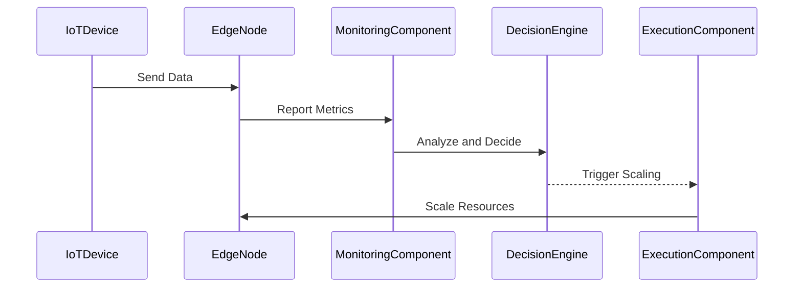

## Introduction

The **Edge Compute Auto-Scaling** pattern addresses the challenge of dynamically adjusting computing resources at the network edge. In the realm of IoT and edge computing, data is processed close to where it is generated, reducing latency and bandwidth use. As the volume of data and processing requirements fluctuate, automatic scaling ensures that resources are optimally allocated, balancing performance and cost.

## Problem

Edge environments can experience significant variability in task demand, often due to time-sensitive processing requirements or sudden increases in data flow. Traditional static resource allocation can lead to over-provisioning or under-utilization, incurring unnecessary costs or performance bottlenecks.

## Solution

To tackle this, the Edge Compute Auto-Scaling pattern implements mechanisms to monitor workload and system performance metrics continuously. It applies predefined rules or machine learning models to decide when to scale resources up or down. This can involve adding or removing compute units, adjusting processing power, or redistributing tasks across nodes.

### Architecture

The architecture of Edge Compute Auto-Scaling typically involves:

1. **Monitoring and Analytics Component**: Collects and analyzes real-time data on system utilization, network traffic, and application performance.
2. **Decision Engine**: Uses thresholds, heuristics, or AI models to determine scaling actions.
3. **Execution Component**: Implements scaling actions by interacting with the infrastructure layer, such as orchestrating containers or managing virtual machine instances.
4. **Feedback Loop**: Continuously evaluates the outcomes of scaling actions to optimize future decisions.

### Example Code

Here's a simplified example using Kubernetes for auto-scaling edge nodes based on CPU utilization:

```yaml
apiVersion: autoscaling/v2beta2
kind: HorizontalPodAutoscaler
metadata:
  name: edge-app-hpa
spec:
  scaleTargetRef:
    apiVersion: apps/v1
    kind: Deployment
    name: edge-app
  minReplicas: 1
  maxReplicas: 10
  metrics:
  - type: Resource
    resource:
      name: cpu
      target:
        type: Utilization
        averageUtilization: 75
```

In this YAML configuration, Kubernetes will automatically scale the number of pods for an edge application based on CPU utilization.

## Diagram

Here is sequence diagram illustrating the interaction within the Edge Compute Auto-Scaling system:



## Related Patterns

- **Auto-Scaling Patterns**: Focus on scaling resources, but in data centers rather than edge environments.
- **Function as a Service (FaaS)**: Often used with edge auto-scaling for ephemeral execution of functions based on events.
- **Load Balancing Patterns**: Distribute incoming tasks across a set of edge nodes effectively.

## Best Practices

- **Performance Monitoring**: Deploy comprehensive monitoring tools to gather data efficiently.
- **Predictive Scaling**: Use machine learning to anticipate scaling needs based on historical data.
- **Cost Management**: Implement policies to maintain a balance between performance gains and operational costs.

## Additional Resources

- [Kubernetes Horizontal Pod Autoscaling](https://kubernetes.io/docs/tasks/run-application/horizontal-pod-autoscale/)
- [AWS Greengrass](https://aws.amazon.com/greengrass/) and its edge capabilities
- [Azure IoT Edge](https://azure.microsoft.com/en-us/services/iot-edge/)

## Summary

The Edge Compute Auto-Scaling pattern is crucial for handling real-time, localized data processing needs inherent to IoT and edge applications. By dynamically managing resources, it ensures optimal performance and cost efficiency, paving the way for scalable, responsive, and robust edge architectures.
