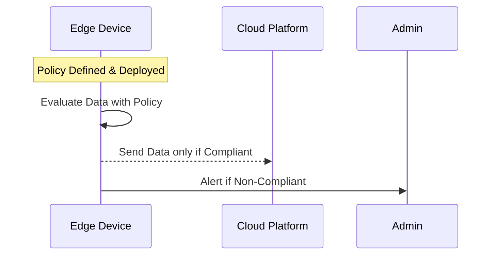

## Introduction

As edge computing continues to revolutionize the way businesses process and analyze data, implementing robust governance mechanisms directly on edge devices has become critical. **Policy Enforcement on Edge Devices** is a pivotal design pattern that emphasizes applying rules and policies close to data origins. This enforcement aids in ensuring data integrity, upholding security, and maintaining operational compliance across distributed network architectures.

## Detailed Explanation

### Key Concepts

- **Edge Computing**: Processing data closer to where it is generated rather than relying solely on a centralized data-processing warehouse. This decentralization minimizes latency and reduces bandwidth use.
  
- **Policy Enforcement**: Techniques and mechanisms to ensure that predefined governance rules, corporate policies, or security requirements are adhered to.

### Benefits

- **Reduced Latency**: Policies are enforced in real-time at the data's origin, decreasing the round trip time to the cloud for policy validation.
  
- **Enhanced Security and Compliance**: Sensitive operations are restricted to authorized routines, minimizing data exposure and ensuring compliance with regulatory requirements.
  
- **Resource Efficiency**: Offloading policy checks to the edge decreases the load on centralized resources and networks.

### Implementing Policy Enforcement

1. **Define Policies**: Clearly articulate what needs to be enforced on edge devices based on business, operational, and security requirements.
   
2. **Policy Distribution**: Use IoT platforms or custom solutions to deploy these policies to edge devices.
   
3. **Local Evaluation**: Ensure that devices have the capability, either through software or hardware enhancements, to evaluate and enforce the policies.
   
4. **Monitor and Audit**: Continuously monitor policy compliance and audit actions on devices for adherence to the rules.

### Technologies and Tools

- **Edge IoT Platforms**: AWS IoT Greengrass, Azure IoT Edge, Google Cloud IoT, etc., provide capabilities to manage and deploy policies on devices.
  
- **Security Protocols**: Utilize secure communication protocols like TLS/SSL and industry standards such as XACML (eXtensible Access Control Markup Language) for defining and controlling access policies.

### Example Code

Here is a simple example of local policy enforcement logic pseudo-code for an edge device:

```javascript
// Define a policy for temperature data
const TemperaturePolicy = {
    maxThreshold: 85,
    minThreshold: 20,
    action: function(temp) {
        if (temp > this.maxThreshold || temp < this.minThreshold) {
            alertAdmin(temp);
        }
    }
};

// Simulate temperature data reading
function readTemperatureSensor() {
    // Simulate reading
    return Math.random() * 100;
}

// Policy Enforcement Loop
setInterval(() => {
    const currentTemp = readTemperatureSensor();
    TemperaturePolicy.action(currentTemp);
}, 5000);

function alertAdmin(temp) {
    console.log(`ALERT: Temperature out of range: ${temp}`);
}
```

### Diagram



## Related Patterns

- **Data Aggregation on Edge**: Enhance policy enforcement with data aggregation to reduce data noise.
  
- **Secure Data Routing**: Focuses on securely routing data from edge to cloud, ensuring encryption and policy compliance.

## Best Practices

- **Modular Policies**: Develop small and reusable policy components for easier updates and maintenance.
  
- **Resilience Planning**: Implement fallback strategies if an edge device cannot enforce policies due to network issues.

## Additional Resources

- [Edge Computing in the Cloud](https://docs.google.com)
- [IoT Security Standards](https://iotsecurity.google.com)
- [AWS IoT Greengrass Documentation](https://docs.aws.amazon.com)

## Summary

Policy enforcement on edge devices is a critical aspect of modern IoT and edge computing deployments. By enabling devices to enforce policies locally, organizations can achieve improved latency, resource management, and security postures. Deploying this pattern requires careful planning, best practice adherence, and ongoing monitoring to adapt to evolving threats and operational needs.
