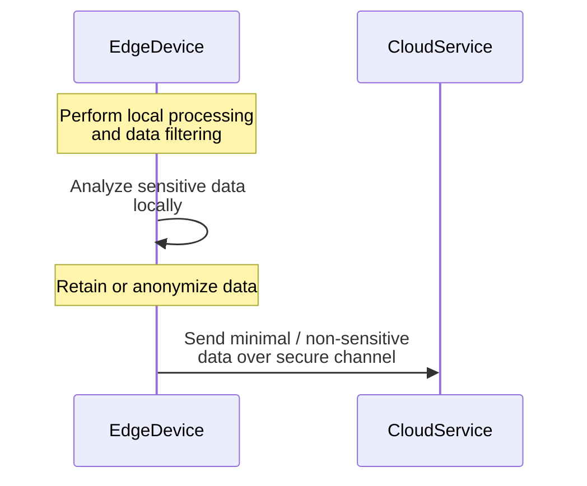

## Introduction

As the number of connected devices continues to surge, the proliferation of data generated at the edges of the network presents both opportunities and challenges. One of the predominant concerns is data privacy. The **Privacy Preservation at Edge** pattern offers a solution by processing data locally on edge devices, thereby minimizing data exposure and reducing the risk of privacy breaches.

## Detailed Explanation

In edge computing, data is processed closer to its source rather than being sent over potentially unsecured networks to centralized data centers. The **Privacy Preservation at Edge** pattern leverages this architecture to protect sensitive user data. By performing initial computations and data filtering at the edge, only essential, non-sensitive information is transmitted to the cloud for further analysis or storage.

### Key Concepts
- **Local Computation**: Processing data on the edge device limits the data that needs to be sent out, thereby reducing the chance of interception.
- **Data Filtering and Aggregation**: At the network's edge, data can be aggregated and anonymized before being transferred to the cloud.
- **Secure Communication Channels**: When data must be sent to the cloud, using encrypted communication protocols ensures its security.

## Architecture



In this architecture, edge devices handle the preliminary processing of the raw data. They anonymize or encrypt data whenever necessary before transmission. Only when absolutely required, aggregated data is securely transmitted to the cloud service.

## Example Code

Below is a simplified example using JavaScript on an edge device:

```javascript
// Simulated data from a sensor
let sensorData = {
    temperature: 22.5,
    location: { lat: 40.7128, long: -74.0060 },
    userId: 'user123'
};

// Function to anonymize data
function anonymizeData(data) {
    // Strip sensitive information
    delete data.userId;
    return data;
}

// Local processing
let processedData = anonymizeData(sensorData);

// Send anonymized data to cloud
if (networkConnectionIsSecure()) {
    sendDataToCloud(processedData);
}

// Helper function to check secure network connection
function networkConnectionIsSecure() {
    // Placeholder logic for secure connection check
    return true;
}

function sendDataToCloud(data) {
    // Logic to send data to cloud
    console.log('Sending to cloud:', data);
}
```

## Best Practices

1. **Minimize Data Exchange**: Only transfer what is necessary, reducing potential attack surfaces.
2. **Use Strong Encryption**: Ensure robust encryption methods for data at rest and in transit.
3. **Regular Updates**: Keep edge devices updated to protect against vulnerabilities.
4. **Access Controls**: Implement strong authentication and authorization protocols.

## Related Patterns

- **Data Aggregation Pattern**: Aggregates data at the edge to reduce volume.
- **Secure Data Gateway Pattern**: Entrusts the management and protection of data transmissions between the edge and the cloud.
- **Anonymization Pattern**: Offers methods to anonymize data for privacy preservation.

## Additional Resources

- [Edge Computing and Privacy](https://examplesite.com/edge-computing-privacy)
- [Secure Data Transmission Techniques](https://examplesite.com/secure-data-transmission)
- [IoT Security Best Practices](https://examplesite.com/iot-security)

## Summary

The **Privacy Preservation at Edge** pattern exemplifies an effective strategy for maintaining data privacy in edge computing environments. By focusing on local processing and using secure methods for any needed cloud communication, this pattern addresses key privacy concerns associated with IoT and edge computing scenarios. Implementing this pattern reduces the likelihood of data breaches and bolsters user trust in IoT systems.
