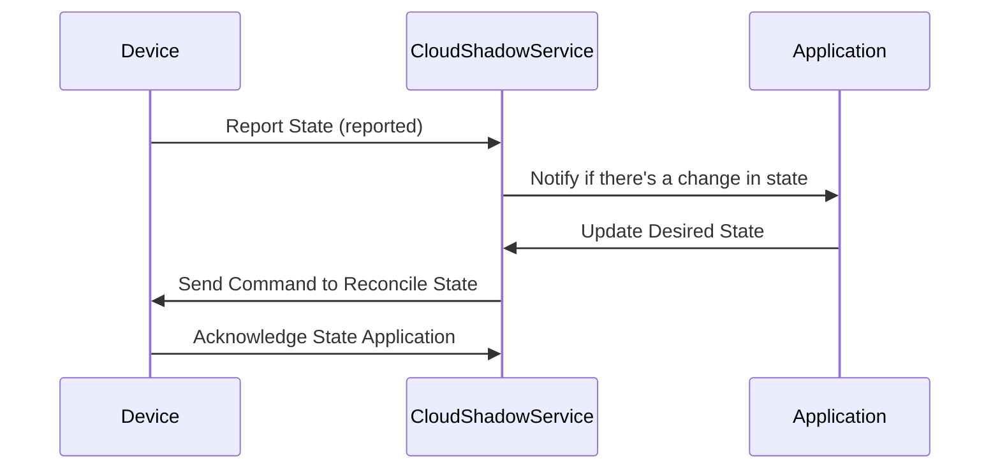

## Introduction

Device Shadowing is a design pattern used in IoT (Internet of Things) and edge computing to keep a virtual state of a physical device in the cloud. This pattern addresses the synchronization challenges between devices located on the edge and the cloud, enabling consistent state management especially when devices are intermittently connected to the cloud.

The device shadow acts as a virtual replica of the device's state and provides a mechanism through which applications can interact with IoT devices without the constraints posed by network latency or total disconnection.

## Design Pattern Components

### Device Shadow

A Device Shadow is a persistent virtual representation of an IoT device maintained in the cloud. It includes:

- **Desired State:** Configuration settings or operational commands that should be applied to the device.
- **Reported State:** The current operational and configuration status that the device sends back to the cloud.
- **Delta State:** The differential between the desired state and the reported state, used to reconcile differences and apply desired configurations.

### Synchronization Process

1. **State Update Initiation:** A change occurs either on the device or initiated by an external application via the cloud.
2. **State Transmission:** The device reports changes to the cloud shadow service.
3. **Shadow Update:** The cloud updates the shadow with the reported state and determines any disparities with the desired state.
4. **Command Propagation:** If a change in the desired state is detected, the cloud issues commands to the device to accomplish synchronization.
5. **State Application and Reporting:** The device applies the necessary changes and reports back its current state.

## Best Practices

- **State Minimization:** Keep the state data minimal yet comprehensive enough to reduce bandwidth and storage costs.
- **Conflict Resolution:** Implement conflict resolution strategies to handle discrepancies during synchronization.
- **Security Measures:** Secure the data transmission between device and cloud using encryption and authentication protocols.
- **Offline Capabilities:** Design devices to handle operations offline and update state once back online to maintain application consistency.

## Example Code

Below is a simplified representation of the device shadowing process using TypeScript and Node.js:

```typescript
interface DeviceState {
  desired: Record<string, any>;
  reported: Record<string, any>;
  delta: Record<string, any>;
}

class DeviceShadowService {
  private deviceState: DeviceState;

  constructor(initialState: DeviceState) {
    this.deviceState = initialState;
  }

  updateDesiredState(newDesired: Record<string, any>) {
    this.deviceState.desired = newDesired;
    this.calculateDelta();
  }

  reportState(newReported: Record<string, any>) {
    this.deviceState.reported = newReported;
    this.calculateDelta();
  }

  private calculateDelta() {
    const { desired, reported } = this.deviceState;
    this.deviceState.delta = Object.keys(desired).reduce((delta, key) => {
      if (desired[key] !== reported[key]) {
        delta[key] = desired[key];
      }
      return delta;
    }, {} as Record<string, any>);
  }

  getDeltaState() {
    return this.deviceState.delta;
  }
}
```

## Diagrams

### UML Sequence Diagram

The following diagram illustrates the sequence of interactions between components in the Device Shadowing pattern:



## Related Patterns

- **Command Query Responsibility Segregation (CQRS):** Separates read and update operations for data storage.
- **Event Sourcing:** Persist changes as a sequence of events to reconstruct system state.
- **Leader Election:** Manage distribution of tasks in edge-to-cloud communication ensuring one active instance makes decisions.

## Additional Resources

- [AWS IoT Device Shadow Service](https://docs.aws.amazon.com/iot/latest/developerguide/iot-device-shadows.html)
- [Azure IoT Hub Device Twin](https://learn.microsoft.com/en-us/azure/iot-hub/iot-hub-devguide-device-twins)
- [Google Cloud IoT Core](https://cloud.google.com/iot-core/docs)

## Summary

Device Shadowing is an invaluable pattern for maintaining reliable stateful interactions between IoT devices and cloud applications in environments with intermittent connectivity. By ensuring a synchronized, virtual representation of device states, it provides a seamless interface for applications and devices to operate effectively, maximizing scalability and response efficiency. Implementing this pattern can improve system resilience and provide better user experiences in many IoT applications.
