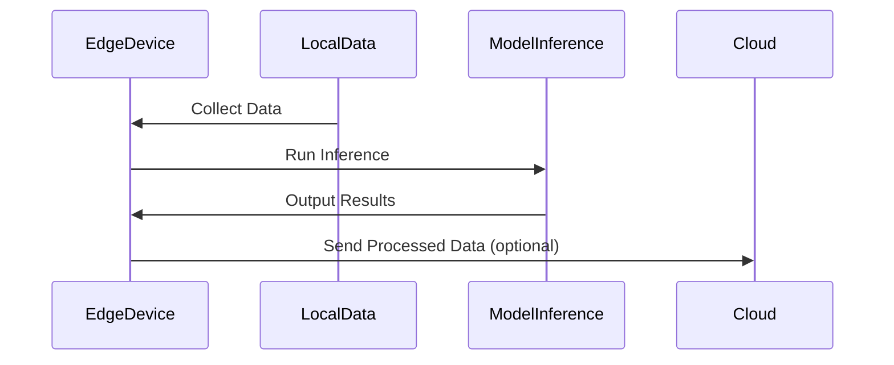

## Introduction

The **Edge AI Inference** pattern is a strategic approach in edge computing designed to enhance the performance and responsiveness of applications by executing machine learning models directly on edge devices. By doing so, it minimizes latency, reduces bandwidth costs, and ensures that real-time data analysis and decisions are made closer to the data source.

## Design Pattern Overview

Edge AI inference involves executing AI/ML models on devices at the edge of a network, such as sensors, smartphones, and IoT devices. These devices often operate in environments where connectivity is intermittent or where immediate decision-making is critical. The pattern addresses several concerns associated with traditional cloud-based AI, including latency, bandwidth, privacy, and operational cost.

### Key Concepts

1. **Decentralization**: ML inference runs directly on edge devices, decentralizing processing from centralized cloud servers.
2. **Real-Time Processing**: The pattern allows for real-time analytics, reducing the delay associated with data transmission to and from the cloud.
3. **Cost Efficiency**: By reducing bandwidth and cloud processing requirements, this pattern can lower operational costs.
4. **Privacy**: Keeping data on the device it originated from can enhance data privacy and security.

## Architectural Approach

Incorporating Edge AI Inference requires consideration of various architectural components:

- **Model Optimization**: Models need to be optimized for edge computing to accommodate the limited resources available on devices.
- **Model Deployment**: Mechanisms for efficiently deploying and updating models across a wide range of devices.
- **Data Handling**: Strategies for managing data locally, including pre-processing and periodic offloading to a central system if necessary.

## Example Code

Here's an example using TensorFlow Lite for deploying a model on an edge device:

```python
import tensorflow as tf
import numpy as np

interpreter = tf.lite.Interpreter(model_path="model.tflite")

interpreter.allocate_tensors()

input_details = interpreter.get_input_details()
output_details = interpreter.get_output_details()

input_data = np.array([...], dtype=np.float32)

interpreter.set_tensor(input_details[0]['index'], input_data)
interpreter.invoke()

output_data = interpreter.get_tensor(output_details[0]['index'])
print("Prediction:", output_data)
```

## Diagrams

Here's a simple diagram illustrating the workflow of Edge AI Inference.



## Related Patterns

- **Data Locality Pattern**: Enhances performance by bringing computation to the location of data.
- **Fog Computing Pattern**: Extends cloud capabilities to the edge, providing infrastructure for computing, storage, and networking services.
- **Microservices Pattern**: Architecting applications as a collection of loosely coupled services can facilitate distributed processing on the edge.

## Additional Resources

- [TensorFlow Lite Official Documentation](https://www.tensorflow.org/lite)
- [Apache Kafka for Edge Streams](https://kafka.apache.org/)
- [AWS Greengrass for Edge AI](https://aws.amazon.com/greengrass/)

## Summary

The **Edge AI Inference** pattern leverages the power of edge computing to execute machine learning models locally, offering significant gains in processing speed, cost savings, and data privacy. By minimizing reliance on centralized cloud resources, this pattern supports scalable, responsive, and secure AI deployments in diverse operational environments.
