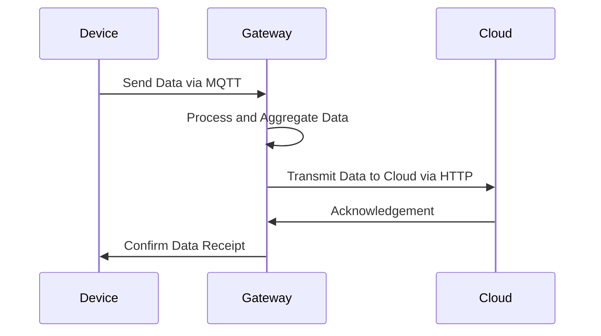

## Introduction

The **IoT Gateway Implementation** pattern involves deploying an intermediary device or software solution to facilitate communication between IoT devices and cloud services. This design pattern addresses challenges such as protocol translation, data aggregation, and security enforcement, ensuring that data from a wide array of IoT devices can be seamlessly integrated and processed by cloud systems.

## Design Pattern Details

- **Protocol Translation**: IoT devices often use various communication protocols that the cloud does not inherently support. Gateways must translate protocols like MQTT, CoAP, Zigbee to HTTP or other cloud-friendly protocols.

- **Data Aggregation and Filtering**: To reduce the amount of data sent to the cloud, gateways can aggregate and filter data locally. They offer preprocessing capabilities, like averaging sensor data or detecting significant changes, minimizing unnecessary cloud storage and processing.

- **Enhanced Security**: Acting as the first line of defense, gateways can implement security measures such as encryption, authentication, and firewall capabilities to protect data in transit and prevent unauthorized access.

- **Device Management**: IoT gateways can handle device provisioning, monitoring, and management, maintaining device registries, and facilitating firmware updates.

- **Local Processing and Decision Making**: Gateways can perform complex computations locally, allowing for real-time actions and decisions without cloud latency, crucial for time-sensitive applications.

## Architectural Approaches

### Centralized vs. Distributed Deployment

- **Centralized**: A single, powerful gateway handles all data processing, providing a uniform solution easier to manage but potentially becoming a bottleneck.

- **Distributed**: Multiple gateways spread across locations offering enhanced fault tolerance and scalability, though they may introduce complexities in synchronization and data consistency.

### Serverless Gateway Solutions

Utilizing cloud provider services like AWS IoT Greengrass or Azure IoT Edge can provide scalable, managed gateway functionalities. Serverless solutions abstract infrastructure management, providing automatic scaling, event-driven processing, and seamless cloud integration.

## Example Code

### Using Python with Paho MQTT

```python
import paho.mqtt.client as mqtt

def on_connect(client, userdata, flags, rc):
    print("Connected with result code " + str(rc))
    client.subscribe("iot/sensors/temperature")

def on_message(client, userdata, msg):
    payload = msg.payload.decode()
    print(f"Message received: {msg.topic} {payload}")
    # Perform protocol translation or preprocessing here

client = mqtt.Client()
client.on_connect = on_connect
client.on_message = on_message

client.connect("iot-broker.example.com", 1883, 60)
client.loop_forever()
```

## Diagrams

### Sequence Diagram: Device to Cloud Communication



## Related Patterns

- **Edge Device Integration**: Focuses on integrating computing capabilities directly into IoT devices, suitable for scenarios demanding low latency.

- **Cloud Backend Integration**: Connects IoT gateways and devices with backend cloud services to enhance functionalities using cloud-native features.

## Additional Resources

- [AWS IoT Greengrass Documentation](https://aws.amazon.com/greengrass/)
- [Microsoft Azure IoT Edge](https://azure.microsoft.com/en-us/services/iot-edge/)
- [The Internet of Things (IoT) Protocols](https://www.i-scoop.eu/internet-of-things-iot/internet-things-protocols-standards/)

## Summary

The **IoT Gateway Implementation** pattern is essential for managing and optimizing the flow of data from IoT devices to cloud services. By implementing gateways, organizations can benefit from enhanced security, efficient data handling, and local processing capabilities, indirectly reducing costs and improving performance. This pattern is critical when constructing robust, scalable IoT solutions that leverage the power of cloud computing efficiently.
