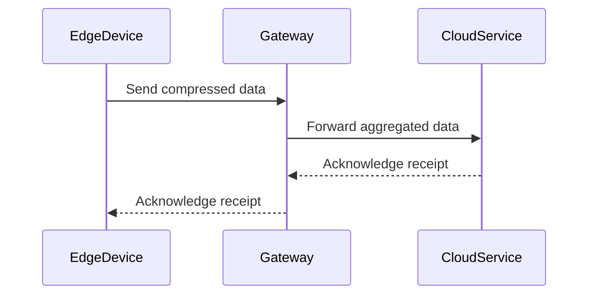

## Introduction

The **Bandwidth Optimization** pattern focuses on minimizing the amount of data that is transmitted between systems, particularly in cloud computing environments that involve edge devices and IoT. By reducing the transmitted data, organizations can significantly lower costs associated with data transfer and improve system performance.

## Applicability

This pattern is especially applicable in scenarios where:

- Devices or sensors generate large volumes of data continuously.
- Network bandwidth is limited or costly.
- There is a need to improve the efficiency of data processing and analysis.
- Systems involve multiple geographic locations where data needs to be synchronized or transmitted regularly.

## Architectural Approaches

1. **Data Compression**: Implementing compression algorithms to reduce the size of the data packets before transmission. Common techniques include gzip, Brotli, and custom data compression protocols tailored for specific data types.

2. **Data Aggregation**: Collecting and combining data at the point of origin before transmission. This reduces the number of data points that need to be sent over the network.

3. **Delta Encoding**: Transmitting only the changes (deltas) in the data rather than the full dataset. This is particularly useful for time-series data or streaming IoT data.

4. **Protocol Optimization**: Using efficient communication protocols that reduce overhead, such as MQTT for IoT applications, which is designed to minimize network bandwidth consumption.

5. **Edge Processing**: Performing initial data processing at the edge, close to the data source, to filter out irrelevant or redundant data before it reaches the network.

## Best Practices

- **Leverage Batch Processing**: Accumulate data and send it in bulk rather than individually, which can reduce the number of transactions and thus the overhead.
- **Prioritize Data**: Identify and prioritize data that needs immediate transmission over the data that can be delayed or aggregated.
- **Apply Incremental Updates**: Where possible, send updates incrementally to avoid transmitting entire datasets.
- **Monitor and Adjust**: Continuously monitor bandwidth usage and adjust strategies to ensure optimal performance without unnecessary costs.
- **Use Efficient Encoding**: Choose appropriate encoding techniques that maintain data integrity while effectively reducing size.

## Example Code

Below is a simple example of using data compression in a cloud application in Java:

```java
import java.io.ByteArrayOutputStream;
import java.util.zip.GZIPOutputStream;
import java.io.IOException;

public class DataCompressor {
    public static byte[] compressData(byte[] data) throws IOException {
        ByteArrayOutputStream byteArrayOutputStream = new ByteArrayOutputStream(data.length);
        try (GZIPOutputStream gzipOutputStream = new GZIPOutputStream(byteArrayOutputStream)) {
            gzipOutputStream.write(data);
        }
        return byteArrayOutputStream.toByteArray();
    }
}
```

## Diagrams



## Related Patterns

- **Cache Aside Pattern**: Storing data locally on edge devices or gateways to reduce redundant data transmission.
- **Circuit Breaker Pattern**: To manage network calls that may fail due to network-related issues, thus avoiding unnecessary data transfer attempts.
- **Data Sharding Pattern**: Distributing data so that the data which is frequently accessed together is placed close to user location to reduce bandwidth requirements.

## Additional Resources

- [AWS IoT Device Management](https://aws.amazon.com/iot-device-management/)
- [Google Cloud IoT Core](https://cloud.google.com/iot-core)
- [Azure IoT Hub Documentation](https://docs.microsoft.com/en-us/azure/iot-hub/)

## Summary

The Bandwidth Optimization pattern plays an essential role in controlling data transfer costs and improving performance of cloud-based applications, especially those within the IoT and edge computing space. By incorporating data compression, aggregation, and protocol optimization among other strategies, organizations can achieve more efficient data transmission processes while maintaining the integrity and usability of their data.
