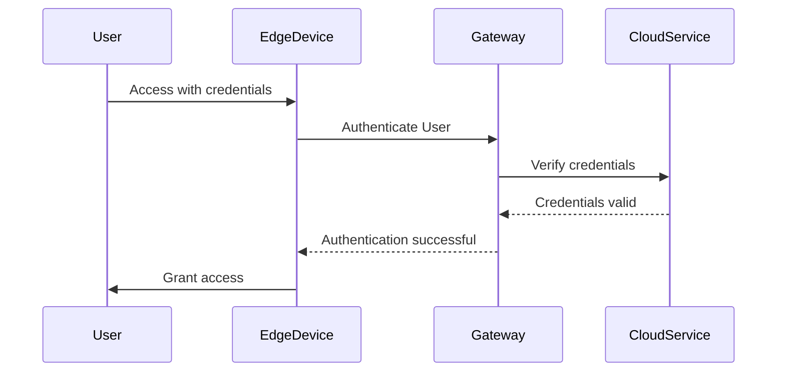

## Introduction

In edge computing, where data processing occurs at or near the data source rather than in a centralized data-processing warehouse, ensuring the security of devices and communication channels becomes paramount. Edge Security Practices focus on implementing methodologies and technologies to protect devices from both physical and cyber threats. This design pattern is crucial for maintaining the integrity, confidentiality, and availability of data and services in distributed networks, especially in environments where devices are deployed in potentially insecure locations.

## Architectural Approaches

### 1. **Device Hardening**

Device hardening involves securing edge devices by reducing their surface area of vulnerability. This is accomplished through:

- **Firmware Updates**: Regularly updating firmware to close vulnerabilities.
- **Secure Boot**: Ensuring that the device boots using only trusted software by verifying digital signatures.
- **Disabling Unused Features**: Closing unused ports and disabling unnecessary services to reduce entry points.

### 2. **Data Encryption**

Encrypting data both at rest on the device and in transit over the network protects sensitive information from unauthorized access.

- **At Rest**: Use AES-256 or equivalent encryption standards for data stored on edge devices.
- **In Transit**: Implement TLS/SSL protocols to ensure secure communication between devices, gateways, and cloud services.

### 3. **Access Control**

Deploy robust authentication and authorization mechanisms to ensure that only accredited entities can interact with edge devices.

- **Multi-Factor Authentication (MFA)**: Adds an extra layer of security beyond passwords.
- **Role-Based Access Control (RBAC)**: Define roles and access levels to manage permissions effectively.

### 4. **Network Security**

Implement strategies to protect the network connectivity of edge devices.

- **Virtual Private Network (VPN)**: Securely connect edge devices to central cloud services over public networks.
- **Firewalls and IDS/IPS**: Utilize firewalls and intrusion detection/prevention systems to monitor and secure network traffic.

### 5. **Remote Management and Monitoring**

- **Centralized Monitoring**: Use centralized platforms to monitor the health and security status of edge devices.
- **Automated Alerts**: Set up alerts for suspicious activities or anomalies detected in the edge devices.

## Example Code

```go
package main

import (
	"fmt"
	"os/exec"
)

// Example function to ensure system boot uses trusted software
func secureBoot() error {
	cmd := exec.Command("enable-secure-boot")
	err := cmd.Run()
	if err != nil {
		return fmt.Errorf("failed to enable secure boot: %v", err)
	}
	return nil
}

// Example encryption function for data at rest
func encryptDataAtRest(data []byte, key []byte) ([]byte, error) {
	// Use AES encryption for the demonstration
	encryptedData := make([]byte, len(data)) // Placeholder
	// Implement AES encryption logic
	return encryptedData, nil
}

func main() {
	err := secureBoot()
	if err != nil {
		fmt.Println(err)
	}
	fmt.Println("Secure boot enabled.")

	data := []byte("sensitive data")
	key := []byte("encryptionkey123")
	encrypted, err := encryptDataAtRest(data, key)
	if err != nil {
		fmt.Println("Encryption failed:", err)
		return
	}
	fmt.Println("Data encrypted:", encrypted)
}
```

## Diagrams

### UML Sequence Diagram



## Related Patterns

- **Zero Trust Security**: Emphasizes verifying every attempt to access both the network and the devices themselves.
- **Data Masking**: Adds an additional layer of security through data anonymization techniques to further protect data at rest.
- **Automated Patch Management**: Encourages automated patching to mitigate known vulnerabilities promptly.

## Additional Resources

- [OWASP Internet of Things Project](https://owasp.org/www-project-internet-of-things/)
- [NIST Cybersecurity Framework](https://www.nist.gov/cyberframework)
- [Cloud Security Alliance](https://cloudsecurityalliance.org/)

## Summary

Edge Security Practices are crucial for protecting distributed devices from a wide array of threats. By implementing device hardening, data encryption, access controls, robust network security, and proactive monitoring, organizations can secure their edge computing environments effectively. This not only protects critical data but also ensures the seamless integration of edge devices with central cloud systems, maintaining an efficient, secure, and robust infrastructure.
