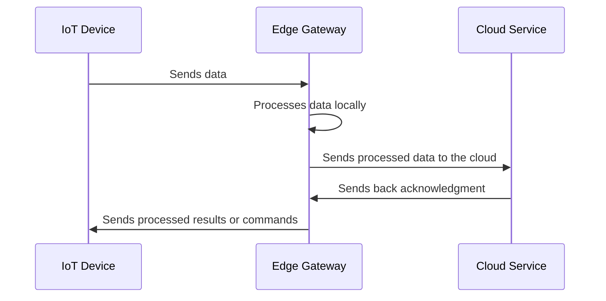

## Overview

Edge Orchestration refers to the method of strategically managing and orchestrating computing resources among a network of edge devices that are typically located close to the data source. This pattern optimizes resource allocation and processing across distributed and decentralized nodes, improving performance, reducing latency, and enhancing the scalability of IoT applications and devices.

## Design Patterns and Architectural Approaches

### Architectural Components

- **Edge Gateway**: Acts as a bridge between edge devices and the cloud, performing essential data processing and protocol conversions.
- **Microservices**: Deployed both at the edge and cloud to ensure efficient resource usage and service delivery.
- **Containerization**: Utilizes tools like Docker and Kubernetes for deploying and managing applications at the edge.
- **Event-Driven Architecture**: Utilizes messages and events to trigger certain actions or processes in real-time.

### Core Design Elements

- **Resource Abstraction**: Leverages abstraction layers to manage heterogeneous devices effectively.
- **Dynamic Resource Allocation**: Algorithms to dynamically allocate compute resources based on real-time demand and priority.
- **Decentralized Decision Making**: Empowers local nodes to make independent or semi-independent decisions to reduce latency.
- **Fault Tolerance**: Incorporates mechanisms for failover and redundancy to ensure reliability.

## Best Practices

1. **Data Minimization**: Process data locally at the edge whenever possible to decrease the amount of data sent to central servers.
2. **Security Protocols**: Ensure robust security measures, including encryption and secure data transfer protocols.
3. **Adaptability**: Implement solutions that can dynamically adapt to network changes and varying loads.
4. **Scalability**: Design systems that can scale horizontally by adding more edge nodes as required.
5. **Monitoring and Management**: Use comprehensive monitoring tools to track the performance of edge devices and manage them efficiently.

## Example Code

Below is a simple illustration of deploying a microservice at the edge using Kubernetes:

```yaml
apiVersion: apps/v1
kind: Deployment
metadata:
  name: edge-microservice
spec:
  replicas: 2
  selector:
    matchLabels:
      app: edge-microservice
  template:
    metadata:
      labels:
        app: edge-microservice
    spec:
      containers:
      - name: edge-microservice-container
        image: edge-service-image:latest
        ports:
        - containerPort: 8080
```

## Diagrams

### Example UML Sequence Diagram



## Related Patterns

- **Fog Computing**: Extends cloud services to the network edge to bring computing resources closer to IoT devices.
- **Edge Analytics**: Performing analytical computations close to the edge devices themselves to reduce the frequency and volume of data transmission to the cloud.
- **Hybrid Cloud**: A mixed computing, storage, and services environment made up of on-premises infrastructure, private cloud services, and a public cloud.

## Additional Resources

- [AWS Greengrass](https://aws.amazon.com/greengrass/)
- [Azure IoT Edge](https://azure.microsoft.com/en-us/services/iot-edge/)
- [Google Cloud IoT](https://cloud.google.com/iot)

## Summary

Edge Orchestration is crucial for managing compute resources efficiently across distributed edge devices, optimizing performance and scalability while minimizing latency. It leverages technologies like microservices, containerization, and event-driven architecture to deliver robust solutions in an IoT ecosystem. By implementing best practices, securing protocols, and orchestrating effectively, organizations can significantly improve their edge computing capabilities.
