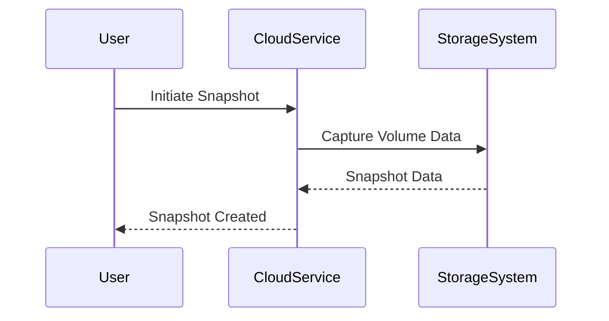

## Introduction

In the cloud computing paradigm, data backups and snapshots are fundamental patterns designed to ensure the integrity, availability, and resilience of data. These mechanisms help organizations protect against data loss, data corruption, and system outages, thereby enabling rapid recovery from unforeseen incidents and maintaining business continuity.

## Detailed Explanation

### Data Backups

Data backups involve the regular copying of data from primary to secondary storage to prevent data loss due to failures, malicious attacks, or human errors. In cloud environments, the backup process can occur on-premises, in-cloud, or in a hybrid setup. There are several types of backups:

1. **Full Backups**: A complete copy of the entire dataset, usually conducted at regular intervals.
2. **Incremental Backups**: Only the data that has changed since the last backup is copied, optimizing storage and time.
3. **Differential Backups**: All data that has changed since the last full backup is copied, providing a balance between speed and storage requirements.

### Snapshots

Snapshots are point-in-time images of data volumes or databases, capturing the exact state of the data at a given moment without interrupting ongoing operations. Snapshots are typically faster and more storage-efficient than traditional backups because they don't involve copying the entire data set. Instead, they use data block-level changes or differencing techniques to reduce unnecessary duplication:

- **Volume Snapshots**: Capture the state of entire storage volumes.
- **Database Snapshots**: Provide a means to restore databases to a specific state without requiring complete backup processes.

### Architectural Approaches

1. **Automation and Scheduling**: Automate and schedule regular backups and snapshots to ensure consistency and reduce the chance of human error.
2. **Replication**: Use multi-zone and multi-region replication to enhance data durability and availability.
3. **Lifecycle Management**: Implement policies for snapshot and backup lifecycle management to manage storage costs and ensure compliance with data retention policies.
4. **Encryption and Security**: Employ encryption for data at rest and in transit to ensure data integrity and privacy.
5. **Testing Recoverability**: Regularly test the recovery processes from backups and snapshots to ensure they work as intended when needed.

## Example Code

The following example demonstrates how to create an automated snapshot of an Amazon Elastic Block Store (EBS) volume using AWS CLI:

```bash
aws ec2 create-snapshot --volume-id vol-0123456789abcdef0 --description "My automated snapshot"
```

For Google Cloud Platform, the `gcloud` command can be used to snapshot a Persistent Disk:

```bash
gcloud compute disks snapshot my-disk --zone=us-central1-a --snapshot-names=my-snapshot
```

## Diagrams

### Sequence Diagram of the Snapshot Creation Process



## Related Patterns

- **Data Replication**: Ensures continuous data availability and consistency across regions or zones.
- **Cold and Hot Data Separation**: Organizes data by access frequency to optimize storage and retrieval.
- **Failover Pattern**: Provides mechanisms for automatic recovery from failures by switching to replica systems.

## Additional Resources

- [AWS Backup and Recovery Solutions](https://aws.amazon.com/backup-recovery)
- [Google Cloud Storage Documentation](https://cloud.google.com/storage/docs)
- [Azure Backup Overview](https://learn.microsoft.com/en-us/azure/backup/backup-overview)

## Summary

Data Backups and Snapshots are indispensable for ensuring business continuity and rapid disaster recovery in cloud computing frameworks. Through efficient practices like automated scheduling, lifecycle management, and secure storage, organizations can safeguard their critical data assets, maintaining operational resilience and reliability in the event of unforeseen disruptions.
