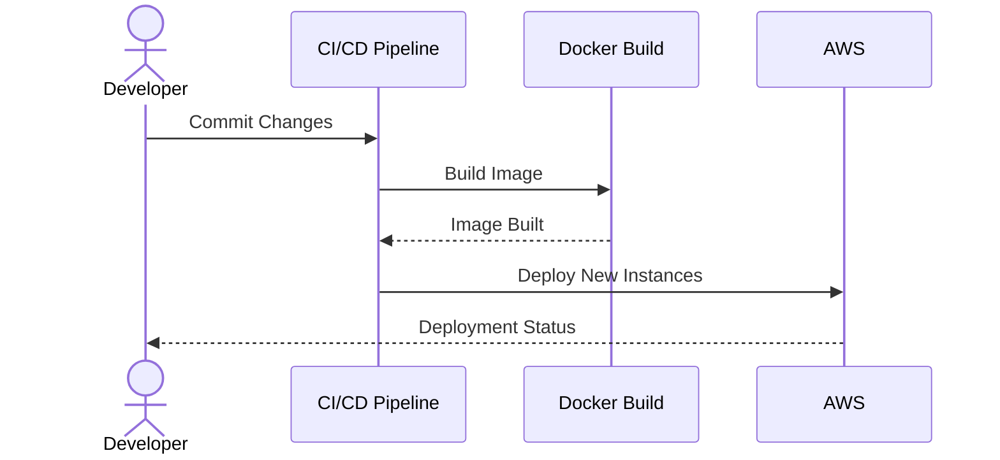

## Overview

The Immutable Infrastructure pattern is a powerful cloud computing paradigm that fundamentally transforms how deployment and infrastructure management are handled. By ensuring that infrastructure components are never modified once they are deployed, but instead replaced with new instances as updates or changes are needed, this pattern simplifies the recovery process, guarantees environment consistency, and curtails the risks associated with configuration drift.

## Architectural Approaches

### Core Concept

The cornerstone of Immutable Infrastructure is that infrastructure components (such as servers, containers, or virtual machines) are never changed post-deployment. When an update is necessary, a new version of the component is built, tested, and deployed, and the old version is decommissioned. 

### Benefits

- **Consistency:** Eliminates unexpected changes and ensures environments are identical across development, testing, and production.
- **Reliability:** By deploying tested and validated images, you minimize bugs and downtimes.
- **Faster Recovery:** Rollbacks become trivial as previous versions can be redeployed rapidly.
- **Reduced Complexity:** Fewer moving parts in deployment and fewer state-change scenarios to handle.

### Implementation Strategy

1. **Base Image Creation:** Start with a base image that contains all the dependencies and configurations required by the application.
2. **Versioning:** Version control all infrastructure and application changes, creating new images for any update.
3. **Automated Testing:** Integrate robust testing frameworks to validate images throughout the CI/CD pipeline.
4. **Deployment Automation:** Use orchestration tools to automate spinning up new instances and retiring old ones.

## Example Code

Below is a basic example using a combination of scripts and Terraform configurations to manage immutable infrastructure on a cloud platform.

```yaml
version: '3'
services:
  app-service:
    image: myregistry/app-service:${VERSION}
    deploy:
      replicas: 2
```

*Terraform Configuration for AWS*

```hcl
resource "aws_ami_from_instance" "example" {
  count              = "${var.immutable ? 1 : 0}"
  source_instance_id = "${aws_instance.example.id}"
  name               = "example-ami"
}

resource "aws_launch_configuration" "example" {
  name          = "example-lc"
  image_id      = "${aws_ami_from_instance.example.id}"
  instance_type = "t2.micro"
}
```

## Diagrams

Here's a simple sequence diagram illustrating the deployment process using immutable infrastructure:



## Related Patterns

- **Blue-Green Deployment:** This pattern can be used in conjunction with immutable infrastructure to achieve zero-downtime deployments.
- **Canary Release:** Similar to Blue-Green, but with gradual release to a subset of users for testing.
- **Microservices:** Immutable infrastructure aligns well with microservices architectures as it leverages the benefits of isolated, disposable components.

## Additional Resources

- "Immutable Infrastructure: Stop Managing Servers - It's a BAD Thing!" by Kief Morris
- Terraform and AWS Documentation for Launch Configurations
- Docker Documentation on Building and Deploying Images

## Summary

Immutable Infrastructure revolutionizes deployment strategies by focusing on repeatable and reliable environment setups. By adopting this pattern, organizations can reduce downtime, simplify disaster recovery procedures, and ensure consistent application performance. This pattern aligns particularly well with automated deployment pipelines and containerized applications, promoting a resilient and scalable cloud ecosystem.
