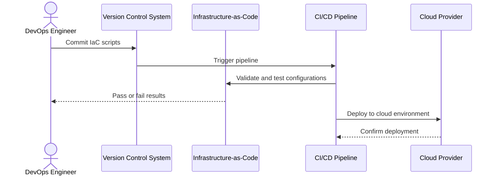

## Overview

The **Version Control of Infrastructure** design pattern is essential for maintaining a consistent, repeatable, and recoverable infrastructure in cloud environments. By applying the principles of version control to infrastructure configurations, organizations can streamline change management, improve disaster recovery capabilities, and align with DevOps practices. This pattern emphasizes the use of infrastructure-as-code (IaC) to manage cloud resources reliably.

## Detailed Explanation

### Architectural Approach

1. **Infrastructure-as-Code (IaC):** At the core of this pattern lies the practice of representing infrastructure configurations as code. Tools like Terraform, CloudFormation, or Ansible play a crucial role in expressing infrastructure elements in a declarative manner.

2. **Version Control Systems (VCS):** Utilize tools such as Git, SVN, or Mercurial to store IaC scripts. These systems help track changes over time, enabling rollback, audit trails, and collaborative development.

3. **Continuous Integration/Continuous Deployment (CI/CD):** Integrate the version-controlled code into CI/CD pipelines to automate testing and deployment processes. This enhances infrastructure reliability and speeds up recovery and provisioning times.

4. **Environment Consistency:** Ensure that development, testing, and production environments are consistent. IaC and VCS integration allows a single source of truth for infrastructure configurations, reducing discrepancies and configuration drift.

5. **Change Management and Auditing:** Leverage the capabilities of VCS to manage change requests, review processes, and maintain historical records of configuration changes, which is vital for compliance and auditing.

### Best Practices

- **Modularize Code:** Break down infrastructure code into reusable modules to simplify maintenance and enhance understanding.

- **Use Branching Strategies:** Adopt robust branching strategies like Git Flow to manage and isolate changes for different environments or purposes.

- **Implement Automated Testing:** Integrate testing for infrastructure code to catch errors early in the lifecycle using tools like Terratest or InSpec.

- **Backups and Snapshots:** Regularly back up critical infrastructure configurations and use cloud-native snapshot features to ensure data recovery.

### Example Code

Here's a simple example using Terraform to provision an AWS S3 bucket:

```hcl
provider "aws" {
  region = "us-east-1"
}

resource "aws_s3_bucket" "example" {
  bucket = "my-example-bucket"
  acl    = "private"

  versioning {
    enabled = true
  }
}
```

This Terraform script can be stored in a Git repository, allowing for version control and collaborative change management.

### Diagrams

#### Sequence Diagram



## Related Patterns

- **Immutable Infrastructure:** Focuses on deploying new versions of services or applications instead of modifying existing ones.
  
- **Infrastructure as Code:** A foundational practice for the Version Control of Infrastructure pattern.

- **Blue-Green Deployment:** Utilizes version-controlled infrastructure for seamless transitioning between old and new environments.

## Additional Resources

- [Terraform Documentation](https://www.terraform.io/docs/index.html)
- [AWS CloudFormation](https://aws.amazon.com/cloudformation/)
- [Git Best Practices](https://git-scm.com/doc)

## Summary

The **Version Control of Infrastructure** pattern is vital in modern cloud architectures for ensuring robust disaster recovery, consistency across environments, and efficient change management. By leveraging IaC and version control systems, organizations can achieve greater agility and resilience in their cloud operations, thereby enabling smoother business continuity and recovery processes.
