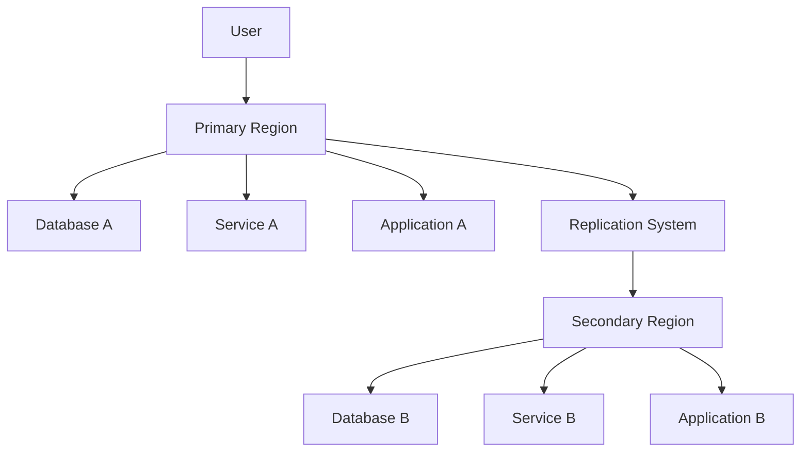

## Introduction

Cross-Region Replication is a cloud computing design pattern used to synchronize data across different geographical regions. This pattern is vital for disaster recovery, ensuring business continuity, and enhancing the availability and performance of distributed applications. By deploying services and copying data to multiple regions, organizations reduce the risk of data loss, enable seamless failover, and improve user experience by serving content closer to users.

## Detailed Explanation

### Key Objectives

1. **Disaster Recovery**: Protects against regional failures caused by natural disasters, outages, or technical failures by having data and services available in another region.

2. **High Availability**: Ensures that services remain operational and accessible even if one region experiences issues.

3. **Performance Improvement**: Allows users to access data and services from the region closest to them, reducing latency and improving performance.

### Architectural Approaches

- **Asynchronous Data Replication**: Transfers data at regular intervals or upon updates, not requiring real-time synchronization, which is often suitable for non-critical applications.
  
- **Synchronous Data Replication**: Ensures that data is the same across all regions by writing changes to multiple locations simultaneously, crucial for applications requiring consistency.

- **Active-Passive Strategy**: One region acts as the primary service provider, with the secondary region serving as a backup. In the event of a failure, services are switched to the backup.

- **Active-Active Strategy**: Both regions handle traffic and load, providing continuous availability and balancing the load across regions.

### Best Practices

- **Data Integrity**: Regularly verify replicated data across regions to ensure integrity and consistency.
  
- **Automation**: Implement automated failover and replication processes to minimize manual intervention and reduce recovery time.

- **Security**: Ensure that data transfer across regions complies with data protection regulations and uses encryption for connections and storage.

- **Monitoring and Alerts**: Use monitoring tools to detect anomalies in replication, latency, and uptime, and configure alerts for prompt responses.

### Example Code Snippet

Below is a simplified example of setting up cross-region replication using AWS S3:

```bash
aws s3api put-bucket-replication --bucket source-bucket \
--replication-configuration '{
    "Role": "arn:aws:iam::account-id:role/replication-role",
    "Rules": [{
        "Id": "ReplicationRule1",
        "Prefix": "",
        "Status": "Enabled",
        "Destination": {
            "Bucket": "arn:aws:s3:::destination-bucket"
        }
    }]
}'
```

This command sets up an S3 bucket named `source-bucket` to replicate its contents to `destination-bucket` across regions using an IAM role.

## Diagrams

### Cross-Region Replication Architecture



## Related Patterns

- **Global Load Balancing**: Distributes traffic across multiple regions and enhances performance and reliability.
  
- **Backup and Restore**: Maintains data backups to restore services in case of failure.

- **Multi-Cloud Strategy**: Utilizes multiple cloud service providers to enhance reliability and availability.

## Additional Resources

- [AWS Multi-Region Application Architecture](https://aws.amazon.com/architecture/well-architected/multi-region/)
- [Azure Cross-Region Replication](https://learn.microsoft.com/azure/storage/common/storage-redundancy)
- [Google Cloud Disaster Recovery](https://cloud.google.com/solutions/disaster-recovery/)

## Summary

Cross-Region Replication is a critical pattern for achieving disaster recovery, business continuity, and enhanced performance in cloud environments. By replicating data and services across regions, businesses can protect against regional outages and provide a seamless user experience worldwide. Adopting best practices, such as automating replication and ensuring security, can further strengthen this strategy.
