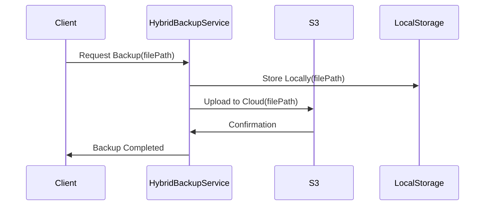

## Introduction

Hybrid Disaster Recovery (DR) Solutions integrate both cloud and on-premises backups to create a comprehensive disaster recovery strategy. This approach leverages the scalability and flexibility of cloud storage with the security and control of on-premises infrastructure, ensuring data availability and rapid recovery during outages or data breaches. 

## Design Pattern Overview

### Core Concepts

- **Redundancy**: Utilize multiple locations (on-cloud and on-premises) to store data, reducing the risk of data loss due to site-specific failures.
- **Scalability**: Leverage cloud services to dynamically scale backup resources as per the volume and importance of data.
- **Speed and Efficiency**: Cloud-based services allow for quick access and restoration of data, while on-premises systems ensure high-speed backup and recovery for critically sensitive data.
- **Cost-Effectiveness**: Optimizes costs by balancing on-premises infrastructure with cloud-based resources, allowing businesses to pay only for what they need.

### Architectural Approaches

1. **Data Tiering Strategy**: Differentiates between high-priority and low-priority data, storing them on-premises and in the cloud, respectively.
2. **Automated Failover Mechanism**: Quickly switches operations from a failed system to the backup system, minimizing downtime.
3. **Incremental Backups**: Store only the incremental changes in the cloud, saving bandwidth and costs.

### Best Practices

- **Regular Testing**: Periodically test recovery processes to ensure they function as expected.
- **Security Protocols**: Employ robust encryption and authentication protocols for data in transit and at rest.
- **Compliance Management**: Ensure that the hybrid setup complies with relevant industry standards and regulations.

## Example Code

Here's a simple example demonstrating the hybrid approach using AWS and a local storage backup mechanism.

```java
import com.amazonaws.services.s3.AmazonS3;
import com.amazonaws.services.s3.model.PutObjectRequest;
import java.io.File;

public class HybridBackupService {
    private AmazonS3 s3Client;
    private String bucketName;
    private String localBackupDir;

    public HybridBackupService(AmazonS3 s3Client, String bucketName, String localBackupDir) {
        this.s3Client = s3Client;
        this.bucketName = bucketName;
        this.localBackupDir = localBackupDir;
    }

    public void backupFile(String filePath) {
        File file = new File(filePath);
        // Local backup
        File localBackupFile = new File(localBackupDir + file.getName());
        file.renameTo(localBackupFile);
        
        // Cloud backup
        s3Client.putObject(new PutObjectRequest(bucketName, file.getName(), localBackupFile));
    }
}
```

## Diagrams

### UML Sequence Diagram



## Related Patterns

- **Multi-Cloud Architecture**: Promotes the use of multiple cloud providers for enhanced resilience and reliability.
- **Backup and Restore**: Standard pattern for ensuring the availability of data through regular backups and efficient restore mechanisms.
- **Geo-Redundancy**: Distributing backups across multiple geographic locations for added protection against regional disruptions.

## Additional Resources

- [AWS Disaster Recovery Strategies](https://aws.amazon.com/disaster-recovery/)
- [Azure Site Recovery](https://azure.microsoft.com/en-us/services/site-recovery/)
- [Google Cloud Backup and Disaster Recovery](https://cloud.google.com/backup-disaster-recovery)

## Summary

Hybrid Disaster Recovery Solutions offer a robust framework that combines on-premises and cloud environments to ensure data resiliency, optimize costs, and comply with regulatory requirements. By leveraging the strengths of both infrastructures, organizations can achieve high levels of business continuity and safeguard their critical assets from unforeseen disasters.
