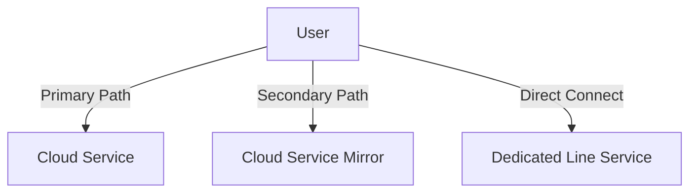
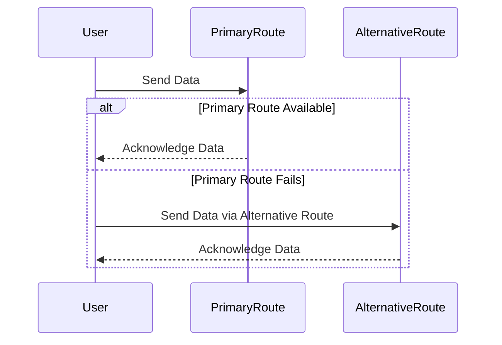

## Introduction

In today's highly digital and interconnected world, continuous access to cloud services is critical for business operations and customer satisfaction. Network Redundancy is a cloud design pattern focused on ensuring alternative network paths are available to maintain service availability in the event of network complications or failures. It plays a vital role in Disaster Recovery and Business Continuity plans by mitigating risks related to single points of failure in network infrastructures.

## Design Pattern Explanation

Network Redundancy involves deploying multiple network connections between end-users and cloud services. This design pattern ensures that if one network path fails due to hardware malfunctions, link failures, or any other disruption, an alternative path can take over seamlessly, minimizing downtime and maintaining accessibility.

### Key Components

1. **Redundant Network Paths**: Utilize multiple network routes to connect users to resources. These can include physical cabling in local environments, or multiple internet routes for public cloud services.
   
2. **Failover Mechanisms**: Implement smart routing technologies that can detect failures in primary paths and automatically reroute traffic to backup routes without manual intervention.

3. **Load Balancing**: Distribute network traffic across multiple paths to optimize resource usage and avoid over-reliance on a single route.

4. **Geographical Diversity**: To further enhance redundancy, utilize geographically diverse network resources to mitigate regional network failures.

### Implementation Strategies

- **Multipath Routing**: Configure networking devices to establish multipath routes using protocols like Border Gateway Protocol (BGP), which can support multiple internet service providers (ISPs).
  
- **Virtual Private Network (VPN) Bypass**: Implement secondary VPN connections to ensure secure communications even if primary VPN tunnels fail.

- **Dedicated Direct Connects**: Use dedicated connections, such as AWS Direct Connect or Azure ExpressRoute, to bypass the public internet for increased reliability and reduced latency.

## Example Code

Here's how you might configure a simple BGP-based redundancy using two ISPs:

```plaintext
router bgp 65000
 network 192.0.2.0 mask 255.255.255.0
 neighbor 203.0.113.1 remote-as 65001
 neighbor 203.0.113.1 description ISP1
 neighbor 203.0.113.2 remote-as 65002
 neighbor 203.0.113.2 description ISP2

address-family ipv4
  neighbor 203.0.113.1 activate
  neighbor 203.0.113.2 activate
exit-address-family
```

This configuration sets up two separate BGP peers for ensuring internet traffic redundancy through two different ISPs.

## Diagrams

### Network Redundancy Architecture



### Sequence Diagram for Failover



## Related Patterns

- **Load Balancer**: Distributes network traffic across redundant servers or paths to ensure high availability and reliability.
  
- **Circuit Breaker**: Acts as a fail-safe by instantly redirecting traffic in case of service faults or latency problems.

## Additional Resources

- [AWS Well-Architected Framework – Reliability Pillar](https://aws.amazon.com/architecture/well-architected/)
- [Azure Network Watcher](https://docs.microsoft.com/en-us/azure/network-watcher/network-watcher-overview)

## Summary

Network Redundancy is an essential design pattern in modern cloud architecture, enabling businesses to ensure service resilience against network disturbances. By employing redundant paths, failover mechanisms, load balancing, and geographically diverse networks, organizations can protect their services from unexpected interruptions, thereby enhancing overall reliability and customer satisfaction. This proactive approach helps maintain business continuity, reinforces disaster recovery strategies, and ultimately safeguards the integrity of cloud-based operations.
