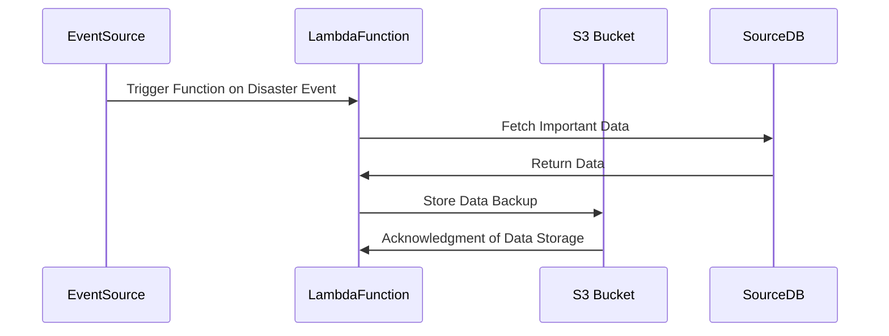

Serverless Disaster Recovery (SDR) is an emerging pattern in cloud computing that utilizes serverless architectures to achieve cost-effective and efficient disaster recovery solutions. Traditional disaster recovery approaches often involve maintaining standby servers and extensive configurations, leading to high costs and complexity. SDR leverages serverless technologies, such as AWS Lambda, Azure Functions, and Google Cloud Functions, to automate and streamline the disaster recovery process.

## Architectural Overview

In an SDR setup, essential functions and services are defined as serverless units. These functions get triggered automatically in response to specific disaster events, such as data center outages or data corruption incidents. The serverless paradigm ensures that these functions remain dormant and incur no cost until they are executed, drastically reducing the financial burden associated with disaster recovery infrastructure.

### Key Components

- **Event Sources**: Cloud services that detect and trigger disaster-related events, such as monitoring alarms, logs, and audit reports.
- **Serverless Functions**: These functions handle the core recovery logic, like data restoration from backups, failover to a secondary region, or user rerouting.
- **State Management**: Services like AWS Step Functions, Azure Durable Functions, or workflow orchestrators that manage state transitions during the recovery process.
- **Data Storage**: Distributed and resilient data storage solutions, such as AWS S3, Google Cloud Storage, or Azure Blob Storage, which keep secure backups.

## Best Practices

1. **Automated Recovery Workflows**: Develop automated workflows for disaster detection and recovery using cloud-native orchestration tools to ensure a rapid response.
2. **Testing and Validation**: Regularly test disaster recovery plans with simulations to validate functionality and update them as needed.
3. **Scalable and Stateless Functions**: Ensure serverless functions are designed to be stateless, allowing for easy scaling and migration in response to evolving disaster scenarios.
4. **Monitoring and Alerts**: Implement comprehensive monitoring tools to detect potential threats and initiate serverless disaster recovery operations swiftly.
5. **Cost Management**: Leverage pay-per-use serverless pricing to optimize costs only when recovery operations are necessary.

## Example Code

Here's a basic example in JavaScript using AWS Lambda to replicate data from a primary database to an S3 bucket following an outage event:

```javascript
const AWS = require('aws-sdk');
const s3 = new AWS.S3();
const sourceDBConnection = new AWS.RDSDataService({});

exports.handler = async (event) => {
  try {
    // Query to get data from the primary database
    const data = await sourceDBConnection.executeStatement({
      resourceArn: 'arn:aws:rds:us-west-2:123456789012:cluster:database-1',
      secretArn: 'arn:aws:secretsmanager:us-west-2:123456789012:secret:database-password',
      sql: 'SELECT * FROM importantData'
    }).promise();

    // Serialize and store data into S3 bucket as backup
    const putParams = {
      Bucket: 'backup-bucket',
      Key: `backup-${Date.now()}.json`,
      Body: JSON.stringify(data.records)
    };

    await s3.putObject(putParams).promise();
    console.log('Backup successfully created!');
  } catch (error) {
    console.error('Error during backup:', error);
  }
};
```

## Diagrams

### Serverless Disaster Recovery Sequence Diagram



## Related Patterns

- **Backup-as-a-Service**: Utilizes cloud services for automated data backup, complementing SDR by providing data snapshots ready for recovery.
- **Active-Active Failover**: Different approach where redundant systems are constantly running, reducing recovery time for critical applications.
- **Autoscaling**: Ensures system resources scale dynamically, which can be incorporated into SDR for handling loads post-recovery.

## Additional Resources

- [AWS Disaster Recovery](https://aws.amazon.com/disaster-recovery/)
- [Azure Functions Best Practices](https://docs.microsoft.com/en-us/azure/azure-functions/functions-best-practices)
- [Google Cloud Functions Overview](https://cloud.google.com/functions/docs)

## Summary

Serverless Disaster Recovery provides a modern, efficient, and cost-effective approach to disaster recovery by leveraging the flexibility and scalability of serverless architectures. By adopting this pattern, organizations can achieve rapid recovery times while minimizing infrastructure costs and complexity. The serverless model ensures that recovery processes are ready to run on demand, preserving business continuity across various disaster scenarios.
