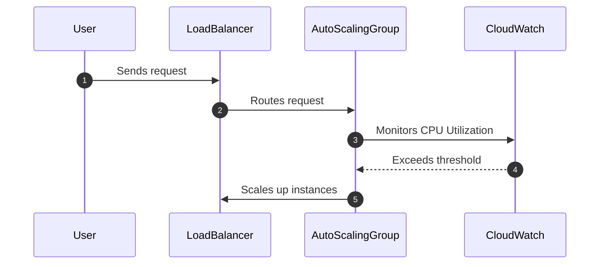

## Overview

Automated Scaling for Disaster Response is a cloud computing design pattern that focuses on the automatic adjustment of resources in a cloud infrastructure to manage unexpected surges in load during disaster recovery operations. This pattern is crucial for maintaining service availability and operational efficiency, ensuring that recovery processes are efficient, timely, and cost-effective.

## Design Pattern Description

In the event of a disaster, the need to recover and maintain normal business operations becomes a priority. Automated Scaling for Disaster Response pattern addresses this need by leveraging cloud-native features to dynamically scale computing resources to match changing demands. This involves upward scaling (adding more resources) when demand increases, or downward scaling (removing resources) when demand normalizes, without human intervention.

### Objectives

- **Ensure Service Availability**: Automatically adapt resource allocation to handle increased loads during disasters.
- **Optimize Cost**: Align resource usage with actual demand to prevent over-provisioning and reduce unnecessary costs.
- **Enhance Operational Efficiency**: Reduce manual intervention and streamline disaster recovery processes.

## Architectural Approaches

1. **Auto-Scaling Groups**:
   - Utilize cloud provider services like AWS Auto Scaling, Google Cloud Instance Groups, or Azure Scale Sets.
   - Define policies based on metrics such as CPU utilization, request rate, or custom metrics to trigger scaling actions.

2. **Event-Driven Architecture**:
   - Implement event-driven systems that respond to operational metrics or incident alerts, invoking scaling actions as needed.
   - Use event stream processing technologies like Apache Kafka or AWS Lambda to detect and respond to changes.

3. **Container Orchestration**:
   - Leverage Kubernetes or Docker Swarm to manage containerized applications, providing automatic scaling through orchestration policies.
   - Automatically adjust the number of running containers based on workload demands.

## Best Practices

- **Define Clear Scaling Policies**: Establish thresholds and metrics for scaling actions that align with operational goals and business requirements.
- **Implement Load Testing**: Regularly conduct load testing to predict scaling requirements under different disaster scenarios.
- **Utilize Multi-Region Deployments**: Enhance fault tolerance by deploying applications across multiple geographic regions.
- **Monitor and Adjust**: Continuously monitor application performance and adjust scaling policies as necessary.

## Example Code

Below is a simple example using AWS Auto Scaling to manage scaling based on CPU utilization:

```yaml
Resources:
  MyAutoScalingGroup:
    Type: AWS::AutoScaling::AutoScalingGroup
    Properties:
      MinSize: '1'
      MaxSize: '10'
      DesiredCapacity: '2'
      LaunchConfigurationName: !Ref MyLaunchConfiguration
      TargetGroupARNs:
        - !Ref MyTargetGroup
      VPCZoneIdentifier:
        - subnet-12345678
        - subnet-87654321
        
  ScalingPolicy:
    Type: AWS::AutoScaling::ScalingPolicy
    Properties:
      AutoScalingGroupName: !Ref MyAutoScalingGroup
      PolicyType: TargetTrackingScaling
      TargetTrackingConfiguration:
        TargetValue: 60.0
        PredefinedMetricSpecification:
          PredefinedMetricType: ASGAverageCPUUtilization
```

## Diagrams

### UML Sequence Diagram



## Related Patterns

- **Circuit Breaker Pattern**: Prevent cascade failures by gracefully degrading services.
- **Retry Pattern**: Handle transient failures by retrying failed operations without human intervention.
- **Chaos Engineering**: Identify weaknesses by intentionally causing failures to test the resilience of the system.

## Additional Resources

- [AWS Auto Scaling Documentation](https://docs.aws.amazon.com/autoscaling/ec2/userguide/what-is-amazon-ec2-auto-scaling.html)
- [Google Cloud Autoscaler Guide](https://cloud.google.com/compute/docs/autoscaler)
- [Azure Autoscale Overview](https://docs.microsoft.com/en-us/azure/architecture/best-practices/auto-scaling)

## Summary

Automated Scaling for Disaster Response is a powerful pattern that empowers organizations to maintain resilience and efficiency during disruptive events. By intelligently managing cloud resources, businesses can ensure business continuity, enhance operational efficiency, and mitigate the risks associated with disasters. This pattern, when implemented with best practices and aligned with organizational goals, becomes an essential component of a comprehensive disaster recovery and business continuity strategy.
