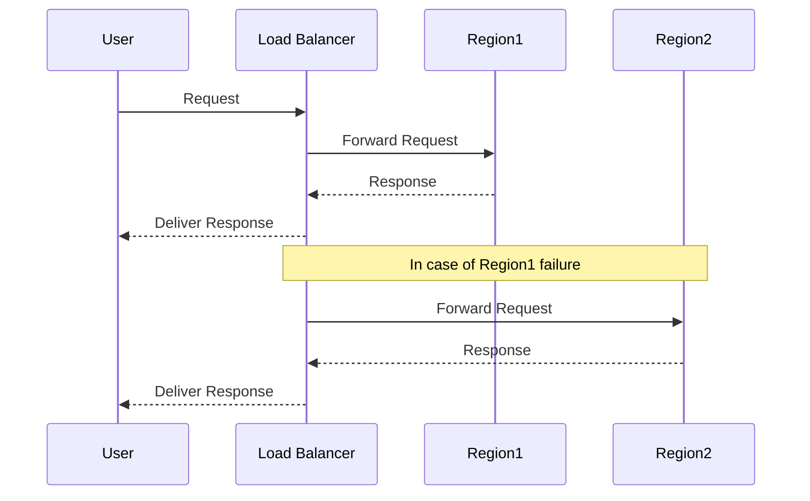

## Introduction

Geo-Redundancy is a vital design pattern for achieving high availability and resilience in cloud computing. By duplicating critical resources and data across multiple geographic locations, organizations can ensure continuity of operations even in the face of regional outages or disasters. This pattern is especially crucial for applications and services that require 24/7 availability and minimal downtime.

## Design Pattern Details

### Architectural Approach

Geo-Redundancy is implemented by deploying applications and their underlying resources across multiple geographic zones or regions within a cloud provider's infrastructure. These zones are isolated from each other to prevent a failure in one from affecting the other. The primary goals of Geo-Redundancy are to:

- **Increase Availability**: By having redundant resources in geographically diverse locations, applications can continue operating even if one region fails.
- **Enhance Disaster Recovery**: Provide a fallback mechanism in case of natural disasters, regulatory issues, or unexpected regional outages.
- **Reduce Latency**: Serve users from the closest geographic location, optimizing response times.

### Implementation Strategies

1. **Active-Active Model**: In this model, all redundant resources are actively serving client requests. Load is distributed across multiple geographic locations using global load balancers or DNS-based routing.

2. **Active-Passive Model**: Only one location is actively serving requests at a time. The passive location acts as a backup, ready to take over should the active instance become unavailable.

3. **Data Synchronization**: Ensure consistent data across all locations through replication technologies. Techniques such as eventual consistency, synchronous, or asynchronous replication can be used depending on the use case requirements.

### Best Practices

- **Regular Testing**: Conduct failover tests regularly to validate that the geo-redundant setup works as expected.
- **Data Sovereignty**: Be aware of and comply with data residency and sovereignty laws in different jurisdictions.
- **Network Configuration**: Optimize networking settings to handle failovers smoothly and efficiently.

## Example Code

Below is an example using Terraform to set up an active-active geo-redundant deployment on AWS:

```hcl
provider "aws" {
  region = "us-west-2"
}

resource "aws_instance" "example_east" {
  ami           = "ami-0c55b159cbfafe1f0"
  instance_type = "t2.micro"
}

provider "aws" {
  alias  = "us_east"
  region = "us-east-1"
}

resource "aws_instance" "example_west" {
  provider      = aws.us_east
  ami           = "ami-0c55b159cbfafe1f0"
  instance_type = "t2.micro"
}

resource "aws_route53_record" "www" {
  zone_id = "Z3M3LMPEXAMPLE"
  name    = "www.example.com"
  type    = "A"

  alias {
    name                   = aws_lb.main.dns_name
    zone_id                = aws_lb.main.zone_id
    evaluate_target_health = true
  }
}
```

## Diagrams

Here's a simplified sequence diagram illustrating the geo-redundancy process in an active-active model using Mermaid:



## Related Patterns

- **Failover Pattern**: Involves switching to a standby resource or instance upon failure.
- **Backup and Restore**: Regularly backing up data and restoring it in case of data loss.
- **Load Balancing**: Distributes network or application traffic across multiple servers.

## Additional Resources

- [AWS Multi-Region Application Architecture](https://aws.amazon.com/architecture/multi-region/)
- [Google Cloud Disaster Recovery Strategies](https://cloud.google.com/architecture/dr-scenarios)
- [Azure Cross-Region Replication](https://docs.microsoft.com/en-us/azure/storage/common/storage-redundancy)

## Summary

Geo-Redundancy is indispensable for mission-critical applications that require high availability and minimal downtime. By leveraging multiple geographic regions, businesses can safeguard against localized failures, optimize user experience by reducing latency, and ensure compliance with data governance laws. Adopting Geo-Redundancy as part of a broader cloud strategy enables organizations to deliver reliable, robust, and scalable services to their users globally.
