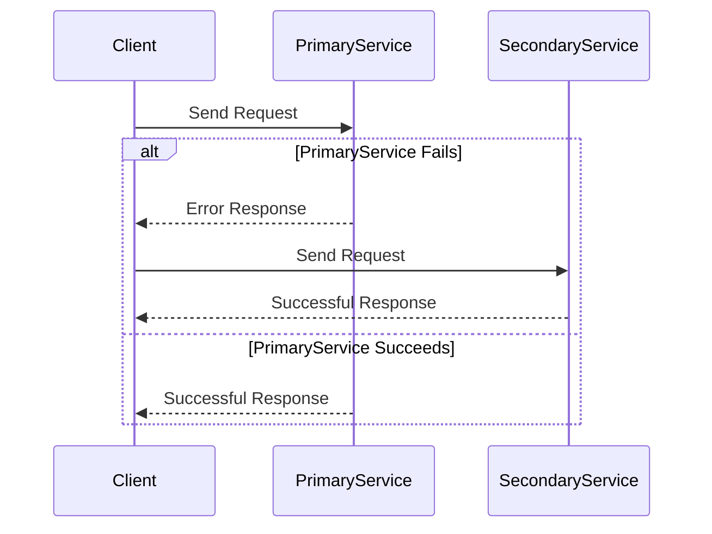

## Overview

**Application-Level Resilience** in the cloud involves designing applications that can withstand failures without significant impact on performance or availability. This pattern focuses on incorporating failover mechanisms directly within the application layer. By anticipating potential points of failure, applications can maintain functionality through alternate paths, mirroring services, or dynamic scaling, ensuring minimal downtime and service disruption.

## Key Concepts

- **Failover Strategies**: Implementing backup mechanisms for critical processes within the application to ensure seamless user experience during failures.
- **Redundancy**: Using redundant resources (e.g., multiple instance setups) to allow transitions from primary to secondary resources without user impact.
- **Graceful Degradation**: Designing applications so that if some components fail, the service degrades gracefully rather than catastrophically.
- **Load Balancing**: Distributing network or application traffic across multiple servers to ensure no single component becomes a single point of failure.
- **Service Mesh**: Leveraging a dedicated infrastructure layer to facilitate service-to-service communications, which inherently supports resilience through behaviors like retry logic and circuit breaking.

## Architectural Approaches

1. **Multi-AZ Deployments**: Deploy services across multiple availability zones to achieve geographic redundancy, enhancing resilience against zone-wide failures.
   
2. **Circuit Breakers**: Implement this pattern to detect failures and encapsulate the logic of preventing the application from performing operations likely to fail.
   
3. **Retry and Timeout Logic**: Incorporate intelligent retry mechanisms with exponential backoff strategies to handle transient failures in networks or services.

4. **Chaos Engineering**: Proactively simulate application failures (using tools like Chaos Monkey) to identify weaknesses in application resilience.

### Example Code

Here's a simple Java implementation of a retry mechanism using a library like Resilience4j:

```java
import io.github.resilience4j.retry.Retry;
import io.github.resilience4j.retry.RetryConfig;

import java.time.Duration;
import java.util.function.Supplier;

public class ResilientService {

    private final RetryConfig retryConfig = RetryConfig.custom()
            .maxAttempts(3)
            .waitDuration(Duration.ofMillis(500))
            .build();
            
    private final Retry retry = Retry.of("id", retryConfig);

    public String callExternalService() {
        Supplier<String> supplier = Retry.decorateSupplier(retry, this::externalServiceOperation);
        return supplier.get();
    }

    private String externalServiceOperation() {
        // Dummy operation to simulate network call
        if (Math.random() > 0.7) {
            return "Success";
        } else {
            throw new RuntimeException("Transient Failure");
        }
    }
}
```

### Diagrams

Below is sequence diagram illustrating a typical failover scenario:



## Related Patterns

- **Bulkheads**: Isolate different components or services to prevent a failure in one from impacting others.
- **Throttling**: Manage the consumption of resources to prevent overloads and ensure smooth service performance.
- **Retries**: Implement retry mechanisms for operations that might fail due to transient faults.

## Additional Resources

1. [Amazon Web Services Resilience Hub](https://aws.amazon.com/resilience-hub/)
2. [Azure Chaos Studio](https://azure.microsoft.com/en-us/services/chaos-studio/)
3. [Google Cloud Reliability Design](https://cloud.google.com/architecture/reliability-design)

## Summary

Application-Level Resilience is a critical pattern for building robust cloud-native applications. Ensuring high availability and continuity through techniques like failover strategy, redundancy, circuit breaking, and chaos engineering can significantly enhance the stability and reliability of your services. By integrating these resilience practices, businesses can protect against potential service outages and maintain user trust.
