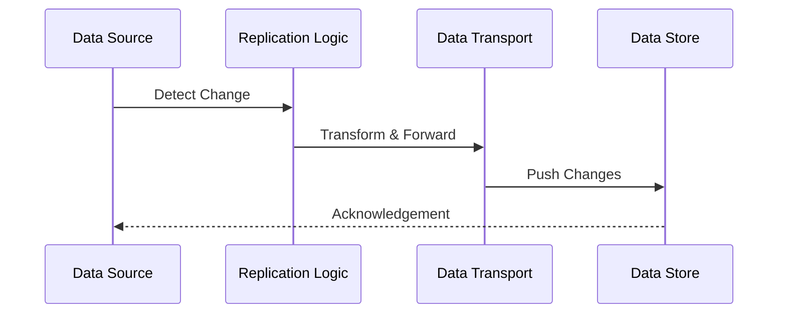

## Introduction

In today's connected world, maintaining data consistency across various systems in real-time is crucial for business continuity and disaster recovery. **Real-Time Data Synchronization** is a design pattern that ensures data integrity across disparate systems, facilitating seamless and uninterrupted availability. This pattern is especially vital in cloud environments where data is distributed across multiple geographic regions and services.

## Detailed Explanation

Real-time data synchronization involves the continuous and instant updating of data from one system to another, making sure that any data change is propagated across all systems involved. The primary goal is to ensure that all systems reflect the same state at any given time, which is critical in reducing data conflicts and ensuring operational reliability.

### Key Components

1. **Data Source**: The origin from where data changes occur.
2. **Replication Logic**: Mechanisms and algorithms to detect and capture data changes.
3. **Data Transport**: Secure, efficient channels for streaming data to target systems.
4. **Conflict Resolution**: Logic to handle conflicts that arise when concurrent updates occur.
5. **Data Store**: The target location(s) where data is updated and stored.

### Engineering Considerations

- **Latency**: Minimizing the time lag between data changes and synchronization.
  
- **Scalability**: Ensuring the system can handle increased data volumes and user loads.

- **Fault Tolerance**: Implementing error handling and retry mechanisms to manage failures.

- **Security**: Protecting data during transmission and ensuring secure access.

## Architectural Approaches

1. **Change Data Capture (CDC)**: A method for watching and capturing data changes (inserts, updates, deletes) from the source database in real-time.

2. **Event Streaming**: Using tools like Apache Kafka or Google Cloud Pub/Sub to stream change events to consumer systems.

3. **Data Lakes**: Central repositories for raw data from different source systems, allowing for comprehensive data analysis and archiving.

4. **Microservices Integration**: Using API gateways and service meshes to manage and distribute data updates among different microservices.

## Best Practices

- **Avoid Tight Coupling**: Design systems where data sync processes operate independently to avoid high impact during outages.

- **Prioritize Consistency Models**: Choose between eventual, strong, or causal consistency based on application requirements.

- **Employ Bulk Load Strategies**: Utilize bulk data transfers during initial sync or disaster recovery scenarios.

- **Leverage Cloud-native Services**: Use managed cloud services that offer replication and syncing features out-of-the-box.

## Example Code

Below is a simple example of a CDC implementation using Kafka in Java:

```java
Properties props = new Properties();
props.put("bootstrap.servers", "localhost:9092");
props.put("group.id", "sync-group");
props.put("enable.auto.commit", "true");
props.put("key.deserializer", "org.apache.kafka.common.serialization.StringDeserializer");
props.put("value.deserializer", "org.apache.kafka.common.serialization.StringDeserializer");

KafkaConsumer<String, String> consumer = new KafkaConsumer<>(props);
consumer.subscribe(Arrays.asList("source-topic"));

while (true) {
    ConsumerRecords<String, String> records = consumer.poll(Duration.ofMillis(100));
    for (ConsumerRecord<String, String> record : records) {
        System.out.printf("Offset = %d, Key = %s, Value = %s%n", record.offset(), record.key(), record.value());
        // Process and sync data to target systems
    }
}
```

## Diagrams

### Real-Time Data Synchronization Flow



## Related Patterns

- **Backup and Restore**: Focuses on periodic data snapshots for recovery.
- **Event Sourcing**: Maintains a history of changes as a sequence of events.
- **CQRS (Command Query Responsibility Segregation)**: Segregates reading and writing of data to optimize performance.

## Additional Resources

- [Google Cloud Data Synchronization](https://cloud.google.com/solutions/real-time-synchronization)
- [AWS Real-time Data Replication](https://aws.amazon.com/dms/)
- [Apache Kafka Documentation](https://kafka.apache.org/documentation/)

## Summary

Real-Time Data Synchronization is a powerful pattern ensuring that systems reflect consistent data views across various environments, critical for seamless business operations and robust disaster recovery solutions. By leveraging modern data streaming and replication technologies, it helps organizations maintain highly reliable and responsive systems that can meet the demands of today's data-driven insights and operations.
