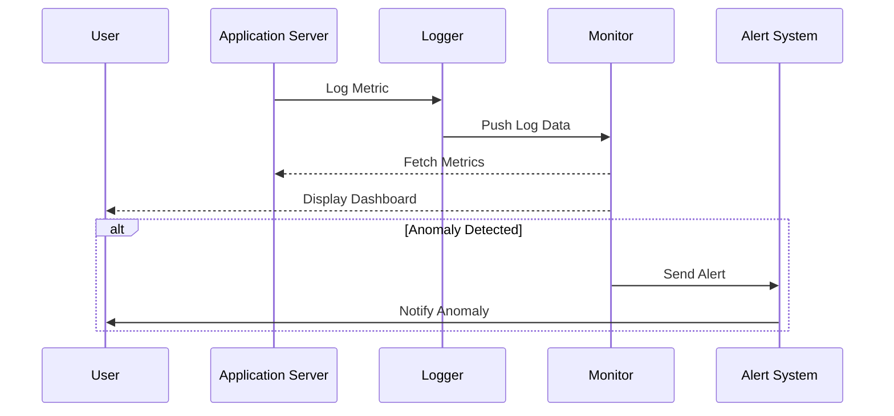

Infrastructure Monitoring for Disaster Recovery (DR) is a vital design pattern in cloud computing aimed at promptly detecting infrastructure failures to ensure business continuity. Effective monitoring allows organizations to identify and mitigate issues before they impact critical business operations negatively.


Infrastructure monitoring involves the continuous observation of system metrics, application logs, and network statistics to identify anomalies that can indicate underlying problems in the cloud infrastructure. 

## Objectives

- Early detection of system anomalies.
- Faster incident response times.
- Reduction in downtime and improved system reliability.
- Ensuring data integrity and availability during a disaster scenario.

## Architectural Approaches

1. **Automated Monitoring Solutions**: Utilize comprehensive monitoring tools like Prometheus, Grafana, AWS CloudWatch, and Azure Monitor, which provide dashboards and alerts for real-time monitoring of cloud resources.

2. **Distributed Logging**: Implement centralized logging systems such as ELK Stack (Elasticsearch, Logstash, Kibana) to aggregate logs from different parts of a cloud deployment, giving consolidated insight into system behavior.

3. **Health Checks**: Set up automated health checks for critical system components to assess their availability and responsiveness continuously.

4. **Alerting Mechanisms**: Configure alerting mechanisms that notify DevOps teams via email, SMS, or other channels when anomalies are detected.

5. **Anomaly Detection Using AI**: Employ machine learning models to predict potential failures by detecting patterns in historical data.

## Best Practices

- **Redundancy**: Implement redundancy in monitoring solutions to ensure continuous monitoring even if parts of the system fail.
- **Testing and Simulation**: Regularly test disaster recovery plans and simulate failure scenarios to fine-tune monitoring configurations.
- **Scalability**: Ensure the monitoring setup can scale with the infrastructure to handle increased loads without data loss.
- **Decentralized Monitoring**: Consider a distributed approach to monitoring data colocation to minimize latency and avoid single points of failure.
- **Data Retention Policies**: Define data retention policies for logs and metrics to balance between historical analysis capabilities and storage costs.

## Example Code

Here's a sample architecture showing how to configure a basic monitoring setup using AWS CloudWatch:

```aws cloudformation
Resources:
  CloudWatchAlarm:
    Type: "AWS::CloudWatch::Alarm"
    Properties: 
      AlarmName: "HighCPUAlarm"
      ComparisonOperator: "GreaterThanThreshold"
      EvaluationPeriods: "1"
      MetricName: "CPUUtilization"
      Namespace: "AWS/EC2"
      Period: "60"
      Statistic: "Average"
      Threshold: "70"
      ActionsEnabled: true
      AlarmActions:
        - "arn:aws:sns:us-east-1:123456789012:NotifyMe"
      AlarmDescription: "Alarm when server CPU exceeds 70%"
      Dimensions: 
      - Name: "InstanceId"
        Value: "i-0123456789abcdef0"
```

## Diagrams

Here is a simple sequence diagram depicting the monitoring workflow:




- **Failover Pattern**: Ensures automatic switching to a standby system upon failure detection.
- **Cloud Backup Pattern**: Focuses on regularly backing up data to recover in case of data loss.
- **Circuit Breaker Pattern**: Protects services from cascading failures by halting and retrying requests after failures.


- [AWS Monitoring and Logging Best Practices](https://aws.amazon.com/architecture/well-architected/framework/)
- [Azure Monitoring and Management](https://docs.microsoft.com/en-us/azure/)
- [Prometheus Monitoring](https://prometheus.io/)
- [Grafana Documentation](https://grafana.com/docs/)


Infrastructure Monitoring for DR is crucial for maintaining system reliability and ensuring continuity during failures. By leveraging automated, scalable, and intelligent monitoring solutions, organizations can substantially minimize downtime and protect their operations from unforeseen disruptions. Regular refinement of monitoring processes and tools ensures the system's resilience, aligning with best practices for disaster recovery and business continuity in cloud environments.
