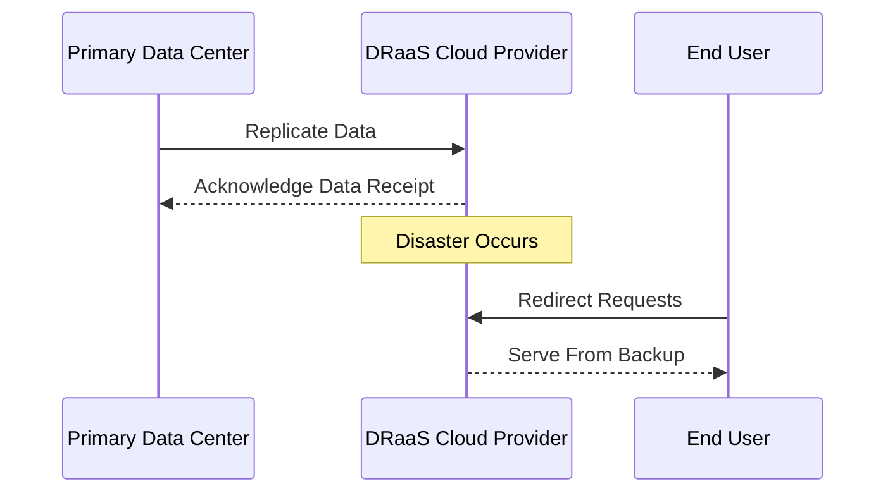

Disaster Recovery as a Service (DRaaS) is a cloud-based solution designed to provide organizations with a resilient, scalable, and cost-effective disaster recovery strategy. This service enables the replication and hosting of physical or virtual servers by a third-party provider to ensure data protection and business continuity during potential disasters, such as natural catastrophes, cyber-attacks, or system failures.

## Detailed Explanation

### Design Patterns and Architectural Approaches

1. **Replication:**
   - Data and applications are continuously replicated to cloud storage in real-time to ensure minimal data loss.
   - Utilize block-level or file-level replication for efficient data transmission.

2. **Orchestration:**
   - Automated workflows and scripts manage the failover process.
   - Use tools like AWS CloudFormation or Terraform for infrastructure orchestration.

3. **Monitoring and Alerts:**
   - Implement robust monitoring solutions to detect failures early.
   - Set up alert mechanisms using services like AWS CloudWatch or Azure Monitor.

4. **Failover:**
   - Seamless failover process ensures quick transition to backup systems.
   - Implement DNS routing changes or traffic shifting to redirect requests to backup environments.

5. **Testing:**
   - Regular testing of disaster recovery plans is crucial to ensure effectiveness.
   - Perform scheduled DR drills to identify weaknesses and areas for improvement.

### Best Practices

- **Define RTO and RPO:**
  - Clearly define Recovery Time Objectives (RTO) and Recovery Point Objectives (RPO) based on business needs.
  
- **Choose the Right Provider:**
  - Evaluate DRaaS providers based on their SLA, compliance standards, and service breadth.

- **Security and Compliance:**
  - Ensure encryption of data at rest and in transit.
  - Comply with industry regulations like GDPR, HIPAA, etc.

- **Cost Management:**
  - Monitor DRaaS costs to avoid unexpected bills.
  - Utilize cost-saving strategies like leveraging spot instances for non-critical workloads.

### Example Code

Here's an example of setting up a basic disaster recovery plan using AWS services:

```javascript
const aws = require('aws-sdk');
const rds = new aws.RDS();

async function createReadReplica() {
    try {
        const params = {
            SourceDBInstanceIdentifier: 'source-db-instance',
            TargetDBInstanceIdentifier: 'read-replica-instance',
            AvailabilityZone: 'us-west-2a'
        };
        const data = await rds.createDBInstanceReadReplica(params).promise();
        console.log('Read Replica Created:', data);
    } catch (error) {
        console.error('Error creating Read Replica:', error);
    }
}

createReadReplica();
```

### Diagrams

#### Disaster Recovery Flow



## Related Patterns

1. **Data Backup and Restore:**
   - Works in tandem with DRaaS by securing backup data needed for recovery.

2. **Load Balancing:**
   - Facilitates traffic distribution during transition to ensure optimal performance.

3. **Auto-scaling:**
   - Automatically adjusts resources during failover to maintain service levels.

## Additional Resources

- [AWS Disaster Recovery Strategies](https://aws.amazon.com/disaster-recovery/)
- [Azure Site Recovery](https://azure.microsoft.com/en-us/services/site-recovery/)
- [Google Cloud Disaster Recovery](https://cloud.google.com/solutions/disaster-recovery)

## Summary

DRaaS is a powerful strategy for ensuring business continuity and minimizing the impact of disasters on business operations. By leveraging cloud services, organizations can achieve scalable, flexible, and automated disaster recovery processes. Implementing DRaaS requires careful planning and execution, focusing on key aspects like replication, orchestration, security, and continuous testing to optimize the recovery process.
