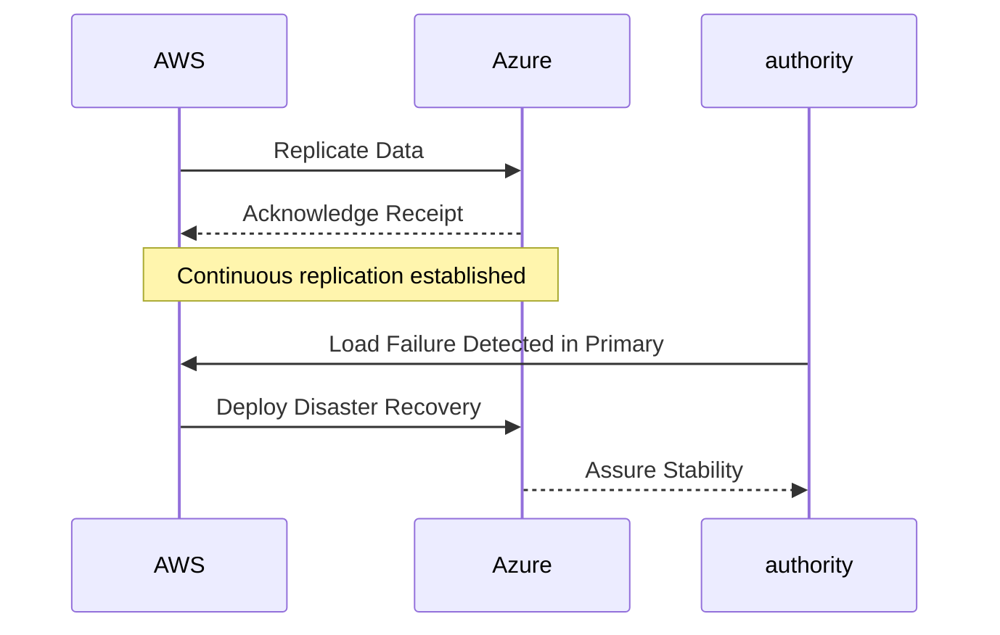

## Introduction

In today's digital landscape, maintaining business continuity is essential for enterprises to ensure their services remain operational under unforeseen circumstances. Multi-cloud disaster recovery (DR) strategies offer an approach that involves utilizing multiple cloud service providers to disperse risk, enhance resilience, and ensure uptime.

## Design Pattern

### Problem

Despite high availability guarantees, single cloud providers can experience major outages due to disasters, technical failures, or cyber-attacks. Relying entirely on one provider for disaster recovery can potentially expose businesses to risks of downtime and data loss.

### Solution

The multi-cloud DR strategy involves distributing workloads, data, and recovery systems across multiple cloud platforms. By leveraging diverse cloud ecosystems, organizations can ensure that even if one provider experiences an outage, another can take over, providing continuity and minimizing disruptions.

### Architectural Approaches

1. **Active-Passive Configuration**:
   - One cloud provider actively services all workloads while another remains on standby.
   - Data and applications are replicated continuously between the active and passive providers.
   - Automatic or manual failover mechanisms switch workloads to the passive provider during disruptions.

2. **Active-Active Configuration**:
   - Workloads are actively balanced across multiple cloud providers.
   - Traffic distribution techniques like DNS-based load balancing or hybrid cloud management platforms are employed.
   - Redundancy in place for both computation and data ensures seamless experience despite failures.

3. **Backup and Restore**:
   - Regular backups are stored across multiple providers.
   - Organizations can perform data recovery from alternative locations if a primary cloud suffers a failure.

## Best Practices

- **Consistency in Application Architecture**: Ensure that your application can seamlessly operate on multiple cloud platforms by adopting containerization and orchestrators like Kubernetes.
- **Data Replication and Transfer**: Use cloud-agnostic data replication tools to ensure data consistency and availability across all platforms.
- **Testing and Monitoring**: Regularly perform DR drills across all cloud environments to validate recovery processes, and employ comprehensive monitoring solutions.
- **Security Considerations**: Secure connections and encrypt data between cross-cloud communications to protect sensitive information.

## Example Code

Here is a simple example using Terraform to define an infrastructure setup across AWS and Azure:

```hcl
provider "aws" {
  region = "us-west-2"
}

provider "azurerm" {
  features {}
}

resource "aws_instance" "web" {
  ami           = "ami-0c55b159cbfafe1f0"
  instance_type = "t2.micro"
}

resource "azurerm_linux_virtual_machine" "web" {
  name                = "example-vm"
  resource_group_name = azurerm_resource_group.example.name
  location            = azurerm_resource_group.example.location
  size                = "Standard_B1s"

  admin_username = "adminuser"
  admin_password = "P@ssword123!"

  network_interface_ids = [
    azurerm_network_interface.example.id,
  ]
}
```

## Diagrams



## Related Patterns

- **Backup and Restore**: A foundational aspect that should be integrated into any multi-cloud DR strategy.
- **Active-Active Failover**: Used when high availability is critical, and redundancy is a design requirement.
- **Geo-Redundancy**: Involves provisioning resources across multiple geographic regions to improve resilience.

## Additional Resources

- [NIST Guidelines on Cloud Resiliency](https://www.nist.gov/publication/cloud)
- [AWS Cloud Resiliency Whitepaper](https://aws.amazon.com/whitepapers/)
- [Azure Resiliency Technical Documentation](https://docs.microsoft.com/en-us/azure/architecture/resiliency)

## Summary

Multi-cloud DR strategies offer a robust way to minimize risks associated with cloud provider outages by leveraging the strengths and coverages of multiple cloud services. This pattern empowers organizations to enhance resilience and maintain service continuity, thereby safeguarding their business operations from unexpected failures and disasters. Employing such strategies can provide a competitive edge and peace of mind, ensuring that critical applications and data remain secure and accessible.
