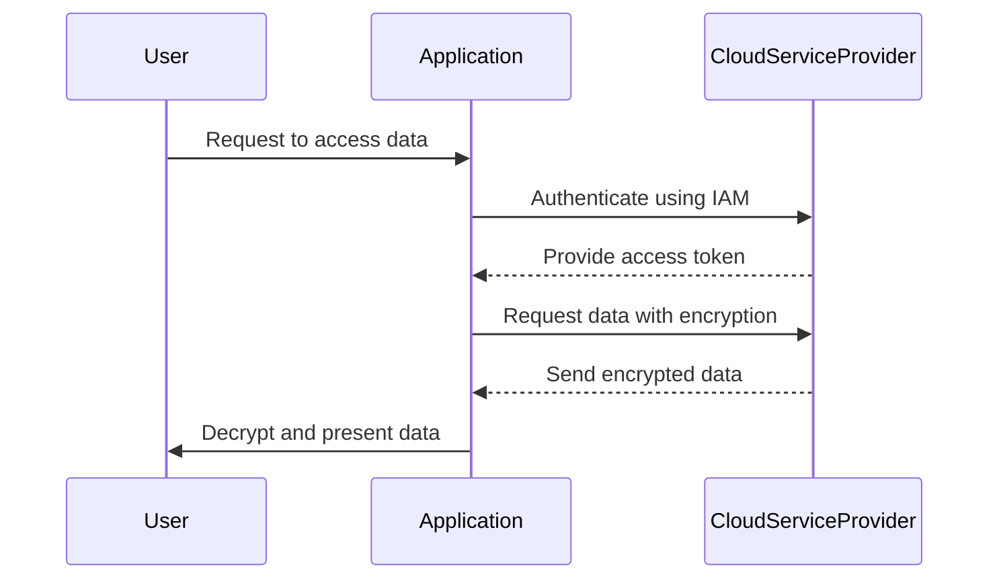

## Introduction

Data Protection Policies in the context of cloud-based Disaster Recovery (DR) focus on ensuring the integrity, confidentiality, and availability of data. These policies are necessary to mitigate risks associated with data breaches and data loss during disaster scenarios. They establish a framework for secure data handling, storage, and recovery processes.

## Detailed Explanation

Data Protection Policies include a variety of best practices and strategies designed to protect sensitive data in cloud environments. They ensure that data remains secure throughout its lifecycle, from creation and storage to retrieval and destruction. Key components of these policies are:

### Data Encryption

- **In-transit encryption**: Secure data transmission between users and cloud services using protocols such as TLS/SSL.
- **At-rest encryption**: Protect data stored within cloud environments using standards like AES-256.
  
### Access Controls

- **Identity and Access Management (IAM)**: Define roles, permissions, and policies to manage who can access what data.
- **Multi-factor Authentication (MFA)**: Implement MFA to add an extra layer of security for accessing sensitive data.

### Backup and Recovery

- **Automated backups**: Schedule regular backups to ensure that data can be restored in case of accidental deletion or corruption.
- **Geographically distributed copies**: Store data copies in different locations to enhance recovery capability.

### Data Integrity and Validation

- **Checksum validation**: Use checksums to ensure data has not been altered during storage or transmission.
- **Regular audits**: Conduct audits to verify that data protection practices are effectively implemented.

### Compliance and Regulations

- **GDPR, HIPAA, etc.**: Ensure that data handling practices comply with relevant legal and regulatory requirements.
- **Data Sovereignty**: Consider where data is physically located to comply with jurisdiction-specific regulations.

## Example Code

Here's a simplified code snippet illustrating how to apply data protection practices in a cloud environment using AWS services:

```java
import software.amazon.awssdk.services.s3.S3Client;
import software.amazon.awssdk.services.s3.model.*;

public class S3DataProtectionExample {
    public static void main(String[] args) {
        S3Client s3 = S3Client.builder().build();
        String bucketName = "my-secure-bucket";

        // Example of enabling bucket encryption
        s3.putBucketEncryption(
            PutBucketEncryptionRequest.builder()
                .bucket(bucketName)
                .serverSideEncryptionConfiguration(
                    ServerSideEncryptionConfiguration.builder()
                        .rules(ServerSideEncryptionRule.builder()
                            .applyServerSideEncryptionByDefault(
                                ServerSideEncryptionByDefault.builder()
                                    .sseAlgorithm(ServerSideEncryption.AES256)
                                    .build())
                            .build())
                        .build())
                .build());

        // Example of bucket policy for public access prevention
        s3.putBucketPolicy(
            PutBucketPolicyRequest.builder()
                .bucket(bucketName)
                .policy("{ \"Version\":\"2012-10-17\", \"Statement\":[ { \"Sid\":\"PublicAccessBlock\", " +
                        "\"Effect\":\"Deny\", \"Principal\":\"*\", \"Action\":\"s3:*\", \"Resource\":\"" +
                        "arn:aws:s3:::" + bucketName + "/*\" } ] }")
                .build());
    }
}
```

## Diagrams

Below is a logical flow illustrating Data Protection Policies using a sequence diagram:



## Related Patterns

- **Backup and Restore**: Focuses on data backup strategies and reliable data recovery mechanisms.
- **Failover and Resilience**: Ensures continuity of services through automatic failover.
- **Data Masking**: Protects sensitive data by obfuscating it within applications.

## Additional Resources

- [AWS Data Protection Whitepaper](https://aws.amazon.com/)
- [Microsoft Azure Security Best Practices](https://azure.microsoft.com/)
- [Google Cloud Security Overview](https://cloud.google.com/)
- [The Open Group Data Protection Policy](https://www.opengroup.org/)

## Summary

Data Protection Policies are integral to maintaining the security of data within cloud environments, particularly during disaster recovery. By implementing these policies, organizations can protect their data from unauthorized access, ensure compliance with regulations, and maintain continuity in situations of data loss or breaches. Adopting encryption, access control, and regular audits are all part of a robust data protection strategy ensuring resilience and trustworthiness of cloud services.
