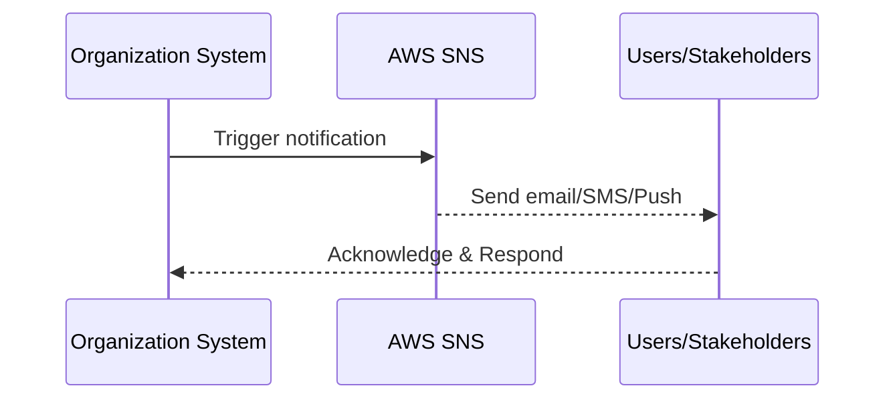

## Overview

Effective communication during a disaster is critical to ensure all stakeholders are informed and necessary actions are taken with coordination across teams. Communication Plans during Disasters focuses on addressing the challenges in dissemination of information across organizational structures, leveraging cloud capabilities and ensuring rapid response in crisis situations.

## Explanation

### Design Pattern Description

Disaster Communication Plans are a critical component of a comprehensive disaster recovery and business continuity strategy. The aim is to maintain transparent and consistent communication with stakeholders, which includes customers, employees, partners, and regulatory bodies during a disaster.

Cloud-based solutions provide robust platforms to implement scalable, reliable, and real-time communication systems. Key to this pattern is the establishment of predefined communication protocols, the use of automated notifications, and leveraging cloud tools to disseminate information swiftly.

### Architectural Approach

1. **Predefined Protocols**: Establish clear communication channels and roles prior to any disaster. This ensures everyone knows their responsibilities and whom to contact.
   
2. **Cloud-Based Notification System**: Use cloud services to automate notifications across multiple channels such as email, SMS, and mobile push notifications. AWS Simple Notification Service (SNS) and Azure Notification Hubs provide customizable, scalable options.

3. **Real-time Status Dashboards**: Implement dashboards using tools like Datadog, Grafana, or AWS CloudWatch to provide stakeholders with real-time operational status and data.

4. **Redundant Communication Channels**: Ensure multiple communication paths and platforms are available to mitigate any points of failure. This can include collaboration tools like Slack, Microsoft Teams, or even dedicated apps.

5. **Integration with Incident Management Tools**: Integrate with incident management and ticketing software like Jira or ServiceNow to track resolution processes and immediate action items.

### Best Practices

- **Regular Testing and Simulation**: Conduct regular drills and tests to ensure everyone is familiar with the communication plan under various disaster scenarios.
- **Clear and Concise Messaging**: Prioritize clarity in communications. Avoid technical jargon when informing non-technical stakeholders.
- **Continuous Feedback Loop**: Establish mechanisms for stakeholders to provide feedback and suggestions for improving communication strategies.
- **Documentation and Transparency**: Keep comprehensive records of all communications during a disaster for auditing and improving future response strategies.

### Example Code

Here's a simple hypothetical example of sending notifications using AWS SNS in a Java application:

```java
import software.amazon.awssdk.services.sns.SnsClient;
import software.amazon.awssdk.services.sns.model.PublishRequest;

public class NotificationService {

    private final SnsClient snsClient;

    public NotificationService(SnsClient snsClient) {
        this.snsClient = snsClient;
    }

    public void notify(String message, String topicArn) {
        PublishRequest publishRequest = PublishRequest.builder()
                .message(message)
                .topicArn(topicArn)
                .build();

        snsClient.publish(publishRequest);
    }
}
```

### Diagrams

#### Example Sequence Diagram



### Related Patterns

- **Incident Management Pattern**: Focuses on the handling and resolution of incidents during disasters.
- **Monitoring and Alerting**: Provides insights into system health and performance, critical for preemptive measures.

### Additional Resources

- [AWS Disaster Recovery whitepapers](https://aws.amazon.com/whitepapers/disaster-recovery/)
- [Azure Business Continuity](https://docs.microsoft.com/en-us/azure/architecture/example-scenario/resiliency/)

## Summary

Having robust communication plans during disasters ensures that the integrity of information dissemination is maintained, stakeholders remain informed, and the organization can respond effectively in crisis situations. By leveraging cloud-based solutions, organizations can enhance the speed, reliability, and scalability of their communication efforts. Regular drills, clear messaging, and openness to feedback are critical to maintaining effective communication practices.
