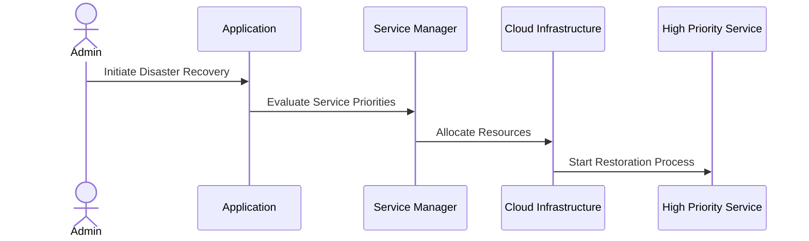

## Overview

Resource Prioritization is a critical pattern in disaster recovery and business continuity planning within cloud environments. It involves identifying essential services and resources, ensuring they are restored first during recovery efforts to minimize downtime and maintain business operations.

## Detailed Explanation

The Resource Prioritization pattern emphasizes the importance of a systematic approach to identifying mission-critical applications, infrastructure components, and data. By prioritizing these aspects, organizations can efficiently allocate resources to restore services with minimal impact on operations. This pattern is particularly pertinent in cloud environments where resource allocation is flexible and dynamic.

### Key Components

1. **Critical Services Identification**:
   - Determine which services are crucial to the daily operations and financial health of the organization.
   - Implement dependency mapping to understand the interrelations between services and infrastructure.

2. **Priority Levels Assignment**:
   - Assign priority levels to services based on their business importance and operational necessity.
   - Create a tiered recovery plan with specific timelines for each priority level.

3. **Resource Allocation Strategies**:
   - Allocate cloud resources dynamically based on service prioritization.
   - Use automation scripts to shift resources swiftly to higher-priority services during recovery.

4. **Monitoring and Updating**:
   - Continuously monitor service performance and update the prioritization plan as business needs evolve.

### Architectural Approaches

- **Automated Workflows**: Utilize cloud-native automation tools such as AWS Lambda or Azure Functions to manage the prioritization and recovery processes.
- **Failover and Redundancy**: Implement redundancy strategies to ensure high-priority services have failovers and can be quickly restored.
- **Infrastructure as Code (IaC)**: Leverage services like Terraform or AWS CloudFormation for rapid provisioning of prioritized resources.

### Best Practices

- Conduct regular business impact analyses to reassess and update resource priorities.
- Develop clear communication channels for decision-making during recovery efforts.
- Continuously test and refine disaster recovery plans through simulations and drills.

### Example Code

Below is an example of a basic Terraform script that deploys high-priority resources:

```hcl
provider "aws" {
  region = "us-west-2"
}

resource "aws_instance" "critical_service" {
  ami           = "ami-0abcdef1234567890"
  instance_type = "t2.micro"
  tags = {
    Name     = "CriticalService"
    Priority = "High"
  }
}
```

### Diagrams



## Related Patterns

- **Multi-Region Deployment**: Enhances fault tolerance by deploying services in multiple regions.
- **Data Replication**: Ensures data is consistently backed up and available in different locations.
- **Blue-Green Deployment**: Facilitates seamless updates and recovery by maintaining environments for production and standby.

## Additional Resources

- AWS Disaster Recovery Strategies and Best Practices
- Azure Disaster Recovery Guidelines
- GCP Business Continuity Best Practices

## Summary

Resource Prioritization is a vital pattern for cloud-based disaster recovery, focusing on restoring critical services first to maintain business continuity. By identifying priority services and deploying appropriate resource allocation and automation strategies, organizations can minimize downtime and ensure sustained operations during adverse events. This strategic approach is an essential component of resilient cloud architecture and effective business continuity planning.
