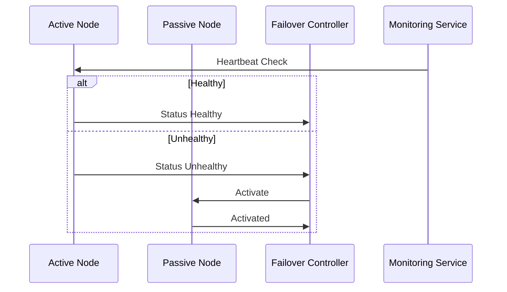

## Introduction

The **Active-Passive Failover** pattern is integral to disaster recovery and business continuity strategies in cloud environments. This pattern involves maintaining a primary (active) system that handles all operational processes and a secondary (passive) system as a standby that remains idle until the active system fails. Upon failure, the passive system is activated to seamlessly take over operations, minimizing downtime and preserving business continuity.

## Design Pattern Context

The need for disaster recovery and business continuity has prompted organizations to adopt failover strategies that ensure high availability of services. The Active-Passive Failover pattern is particularly suited for systems where the cost of downtime can be exceedingly high, such as financial services, healthcare, and e-commerce platforms.

## Architectural Approach

### Core Components

1. **Primary System (Active Node):** The node that currently handles all requests and business logic. It is the main operational unit of the deployment.

2. **Secondary System (Passive Node):** The standby node, often kept synchronized with the active node through replication techniques.

3. **Heartbeat Mechanism:** Utilized to monitor the health of the active node. If a failure is detected, the passive node is activated.

4. **Failover Controller:** The logic or service responsible for initiating the failover process when the active node fails.

### Implementation Strategy

- **Data Replication:** Ensure that data between the active and passive systems is synchronized in real-time or near real-time to avoid data loss.

- **Health Monitoring:** Implement continuous monitoring using heartbeat signals to verify the operational status of the active node.

- **Automated Failover Triggering:** On detecting a failure in the active node, the failover controller should programmatically switch operations to the passive node with minimized latency.

## Example Code

Below is a simplified example in Java, illustrating the fundamental components of an Active-Passive Failover setup.

```java
class FailoverController {
    private Node activeNode;
    private Node passiveNode;

    public void monitor() {
        ScheduledExecutorService executor = Executors.newScheduledThreadPool(1);
        executor.scheduleAtFixedRate(() -> {
            if (!activeNode.isHealthy()) {
                initiateFailover();
            }
        }, 0, 5, TimeUnit.SECONDS);
    }

    private void initiateFailover() {
        System.out.println("Failing over to passive node...");
        passiveNode.activate();
        activeNode.deactivate();
    }
}

class Node {
    private boolean active;

    public void activate() {
        this.active = true;
        // Logic to transition this node to active mode
    }

    public void deactivate() {
        this.active = false;
        // Logic to transition this node to passive mode
    }

    public boolean isHealthy() {
        // Health check logic
        return active; // Simulate health check
    }
}
```

## UML Diagram



## Best Practices

- **Regular Testing:** Regularly test failover procedures to ensure the passive node can handle the operational load during activation.
  
- **Synchronous Replication:** Ensure data consistency between the active and passive nodes to minimize discrepancies during failover.
  
- **Compliance and Security:** Ensure compliance with necessary regulatory frameworks and implement security best practices for data replication and failover processes.

## Related Patterns

- **Active-Active Failover:** Unlike Active-Passive, where the passive node is idle, both nodes handle traffic simultaneously, enhancing load balancing and fault tolerance.

- **Hot Standby:** Similar to Active-Passive but allows for the passive node to perform read-only operations until a failover occurs.

## Additional Resources

1. [AWS Disaster Recovery Strategies](https://aws.amazon.com/disaster-recovery/)
2. [Azure Site Recovery](https://azure.microsoft.com/en-us/services/site-recovery/)
3. [GCP Disaster Recovery](https://cloud.google.com/solutions/disaster-recovery)

## Summary

The Active-Passive Failover pattern remains a cornerstone of disaster recovery designs, ensuring high availability and seamless transitions during downtime events. Through meticulous synchronization of data and automated monitoring, businesses can safeguard against operational disruptions, maintaining service reliability and consumer trust.
