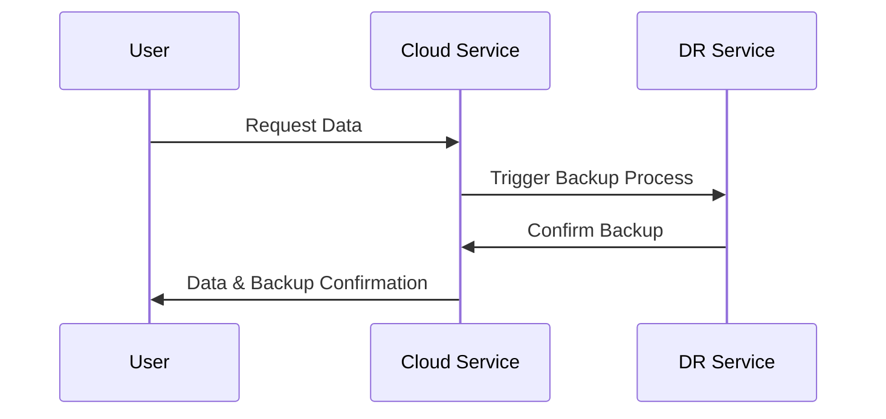

## Introduction

In cloud environments, disaster recovery (DR) planning is crucial for ensuring business continuity. However, implementing a DR plan involves considerable cost, and finding a balance between cost and recovery needs is essential for organizations aiming to protect themselves from potential data loss while managing budgets effectively.

### Key Concepts

- **Recovery Time Objective (RTO)**: The duration of time within which a business process must be restored after a disruption to avoid unacceptable consequences.
- **Recovery Point Objective (RPO)**: The maximum tolerable period during which data might be lost due to a major incident.
- **Total Cost of Ownership (TCO)**: The comprehensive assessment of the total direct and indirect costs associated with implementing and maintaining a DR plan.

## Design Pattern Explanation

The "Cost Considerations in DR Planning" pattern emphasizes the need for strategic decision-making in balancing the costs associated with disaster recovery with the need to maintain business operations and data integrity.

### Architectural Approaches

1. **Tiered Storage Solutions**: Implement hierarchical storage systems to balance cost and performance. Use more expensive, high-performance storage for critical data with low RTO/RPO requirements and less costly storage options for less critical data.

2. **Pay-as-you-go Services**: Leverage cloud services that offer pay-as-you-go models, ensuring you only pay for DR resources when needed.

3. **Automated Backup and Restoration**: Automate the backup and restoration processes to reduce the manual effort and associated costs while improving accuracy and reliability.

4. **Geographic Redundancy**: Ensure geographical diversity in data storage and processing to handle regional disruptions, taking cost-effective measures like using less expensive regions with robust service availability.

5. **Hybrid DR Models**: Combine on-premise and cloud-based solutions to optimize costs. Use cloud for scalable storage and cost-effective compute power while maintaining critical components on-premise for faster access.

## Example Code

In a disaster recovery scenario using AWS services, you can implement automated backups using AWS Lambda and Amazon S3:

```typescript
const AWS = require('aws-sdk');
const s3 = new AWS.S3();

exports.handler = async (event) => {
    const params = {
        Bucket: 'my-database-backup-bucket',
        Key: `backup-${Date.now()}.json`,
        Body: JSON.stringify(event.data) // Assume event.data holds the data to back up
    };

    try {
        const result = await s3.upload(params).promise();
        console.log('Backup success:', result.Location);
    } catch (error) {
        console.error('Backup failed:', error);
    }
};
```

## Diagram



## Related Patterns

- **Backup and Restore Pattern**: Focuses on periodically backing up data and providing reliable restore procedures.
- **Active-Active Failover Pattern**: Ensures availability by keeping multiple instances active across distributed locations.
- **Latency Mitigation Pattern**: Addresses reducing latency in cross-region DR setups.

## Additional Resources

- AWS Disaster Recovery Strategies: [AWS DR Strategies whitepaper](https://aws.amazon.com/whitepapers/disaster-recovery/)
- Azure Site Recovery: [Azure DR documentation](https://learn.microsoft.com/en-us/azure/site-recovery/site-recovery-overview)
- Google's Cloud DR Planning: [GCP DR guidance](https://cloud.google.com/solutions/dr-scenarios)

## Summary

Balancing cost with recovery needs in disaster recovery planning is critical for organizations relying on cloud services. By employing strategic practices such as tiered storage, automated processes, pay-as-you-go models, geographic redundancy, and hybrid models, businesses can optimize the costs associated with DR while ensuring resilience and business continuity. Each DR strategy should be tailored to the specific needs and budget constraints of the organization to achieve the best possible outcome.
