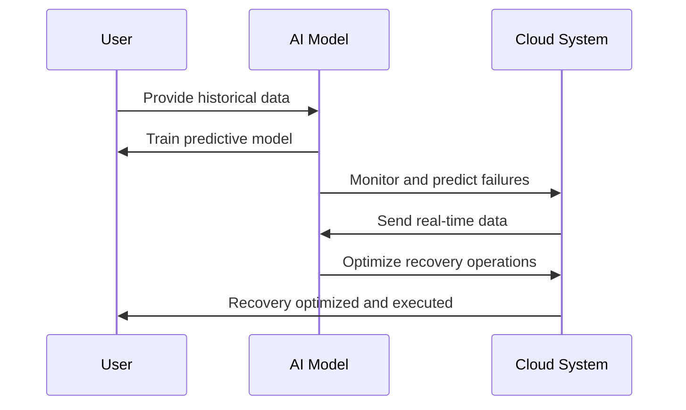

## Overview

The integration of Artificial Intelligence (AI) into disaster recovery (DR) planning offers innovative capabilities for predicting potential failures and optimizing recovery processes in cloud environments. Leveraging machine learning algorithms, AI can analyze vast amounts of historical data to foresee outages, determine risk factors, and orchestrate effective recovery strategies. This pattern provides a structured approach to utilizing AI technologies in DR planning, enhancing resilience and minimizing downtime.

## Detailed Explanation

### Predictive Analytics

AI-driven predictive analytics involve the use of historical data to forecast future events. In the context of disaster recovery, this capability is instrumental in anticipating system failures or recognizing emerging threats that could disrupt services. By implementing machine learning models, cloud systems can continuously monitor data streams for anomalies or patterns indicative of potential failures. 

**Key Techniques:**
- **Anomaly Detection:** Identifying unusual patterns in data that might signal upcoming failures.
- **Predictive Maintenance:** Forecasting hardware or software degradation based on usage patterns and environmental factors.
- **Risk Assessment Models:** Quantifying the likelihood and impact of various failure scenarios.

### Optimization of Recovery Operations

AI can optimize disaster recovery operations by devising efficient workflows for failover and restoration processes. This includes optimizing resource allocation, reducing recovery time objectives (RTO), and minimizing data loss through optimized recovery point objectives (RPO).

**Key Techniques:**
- **Automated Resource Provisioning:** Dynamic scaling and resource management during failover to ensure swift service recovery.
- **Intelligent Workflow Orchestration:** Adaptive workflows that adjust recovery procedures based on real-time data and predicted conditions.
- **Data Prioritization Algorithms:** Prioritizing critical data recovery to restore essential services rapidly.

### Implementation Considerations

- **Data Quality and Integrity:** High-quality, comprehensive datasets are essential for training effective AI models. Ensuring data integrity is crucial for reliable predictions and optimizations.
- **Model Training and Updating:** Regularly updating AI models with new data and refining algorithms to adapt to evolving threats and system architecture changes.
- **Integration with Existing Systems:** Seamless integration with cloud infrastructure management tools and DR systems is necessary for coherent operations.

## Example Code

Below is a simple Python script using a scikit-learn library to create a basic predictive model for failure prediction based on historical performance data.

```python
import numpy as np
from sklearn.model_selection import train_test_split
from sklearn.ensemble import RandomForestClassifier
from sklearn.metrics import classification_report

data = np.loadtxt('system_data.csv', delimiter=',')
X = data[:, :-1]  # Features
y = data[:, -1]   # Target variable indicating failure

X_train, X_test, y_train, y_test = train_test_split(X, y, test_size=0.2, random_state=42)

model = RandomForestClassifier(n_estimators=100, random_state=42)
model.fit(X_train, y_train)

y_pred = model.predict(X_test)
print(classification_report(y_test, y_pred))
```

## Diagram



## Related Patterns

- **Self-Healing Pattern:** Automatically detecting and resolving faults to maintain system stability.
- **Backup and Restore Pattern:** Systematic copying of data to secure storage and restoring it in case of failure.

## Additional Resources

1. [Google Cloud AI for Disaster Recovery](https://cloud.google.com/solutions/disaster-recovery)
2. [AWS Disaster Recovery Strategies](https://aws.amazon.com/disaster-recovery/)
3. [Microsoft Azure AI for Business Continuity](https://azure.microsoft.com/en-us/services/business-continuity/)

## Summary

Integrating AI into disaster recovery planning empowers organizations to preemptively address potential failures and optimize their recovery processes in cloud environments. By utilizing AI's predictive capabilities, companies can enhance their resilience, minimize service disruptions, and ensure business continuity in the face of unforeseen events. As cloud infrastructure continues to grow in complexity, the strategic implementation of AI will continue to be a critical component of robust DR strategies.
