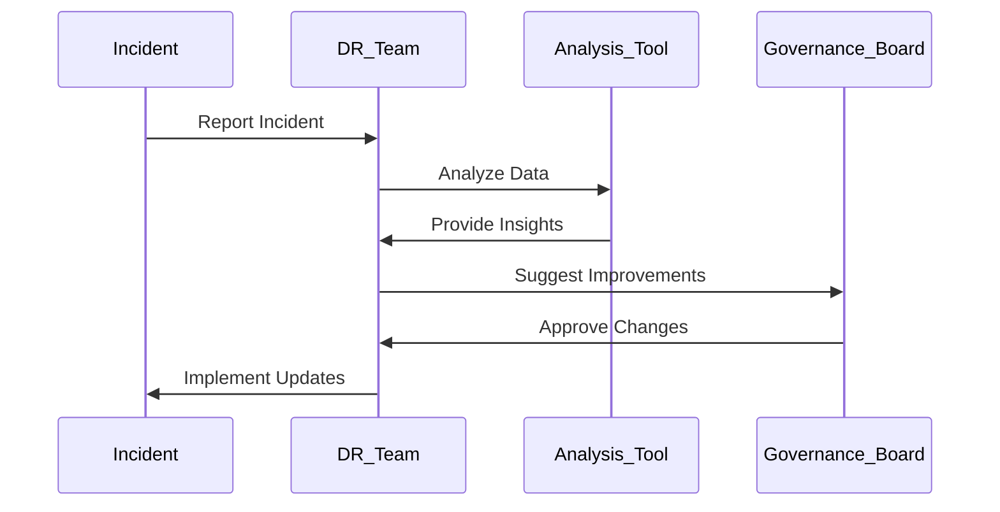

## Introduction

The Continuous Improvement of Disaster Recovery (DR) Strategies pattern emphasizes the necessity of consistently reviewing and updating disaster recovery plans to address new challenges, accommodate evolving technologies, and improve overall resilience. This pattern is vital in ensuring that organizations can maintain business continuity and swiftly restore operations in the event of disruptions, particularly in dynamic cloud environments.

## Detailed Explanation

### Concept

Continuous Improvement is a proactive process of iteratively refining DR strategies by analyzing previous disaster recovery exercises, incident responses, and technological advancements. This pattern enables organizations to adapt to changes in infrastructure, business processes, and threat landscapes.

### Key Characteristics

- **Feedback Loops**: Establish mechanisms for gathering insights from DR drills and actual incidents, ensuring that lessons learned are captured.
- **Regular Reviews**: Conduct periodic evaluations of DR plans and strategies to identify areas that require enhancement.
- **Cross-functional Collaboration**: Involve diverse teams, including IT, operations, and business units, to ensure comprehensive insights and inclusive improvements.
- **Technology Adaptation**: Leverage emerging cloud services and technologies to optimize DR plans and incorporate innovative solutions.

### Best Practices

1. **Establish a DR Governance Framework**: Develop a governance framework that outlines roles, responsibilities, and processes for regular DR plan reviews and updates.
2. **Incorporate Lessons Learned**: Utilize post-incident reports and DR exercise outcomes to inform plan modifications and improvements.
3. **Utilize Data Analytics**: Employ data mining and machine learning techniques to analyze incident trends and predict future DR challenges.
4. **Automate Testing and Updates**: Use automation tools to execute DR tests and update plans based on the test outcomes rapidly.
5. **Engage Stakeholders**: Ensure continuous involvement of stakeholders by conducting regular workshops and feedback sessions.

### Example Code

Below is an example to automate DR plan testing and updates using a simple script to validate a backup process in a cloud environment, using Python:

```python
import boto3

def validate_backup(snapshot_id):
    ec2 = boto3.client('ec2')
    try:
        response = ec2.describe_snapshots(SnapshotIds=[snapshot_id])
        state = response['Snapshots'][0]['State']
        if state == 'completed':
            print(f"Snapshot {snapshot_id} successfully validated.")
        else:
            print(f"Snapshot {snapshot_id} is in state {state}.")
    except Exception as e:
        print(f"Error validating backup: {e}")

validate_backup('snap-0123456789abcdef0')
```

### Diagrams

Below is UML Sequence Diagram illustrating the feedback loop process in continuous improvement of DR strategies:



### Related Patterns

- **Automated Backup and Recovery**: Establishing automated systems for backup and recovery processes to ensure consistency and reliability.
- **Disaster Recovery as a Service (DRaaS)**: Leveraging cloud-based solutions to provide scalable and flexible DR services.

### Additional Resources

- *"Designing and Building Scalable Disaster Recovery Solutions in Cloud", Amazon Web Services Whitepaper*
- *Business Continuity and Disaster Recovery Planning for IT Professionals, Susan Snedaker*

## Summary

Continuous Improvement of DR Strategies is an essential pattern for maintaining robust disaster recovery capabilities. By consistently evaluating DR plans and incorporating lessons learned from past incidents, organizations can enhance their resilience, reduce downtime, and ensure seamless business continuity in the ever-evolving cloud landscape.
