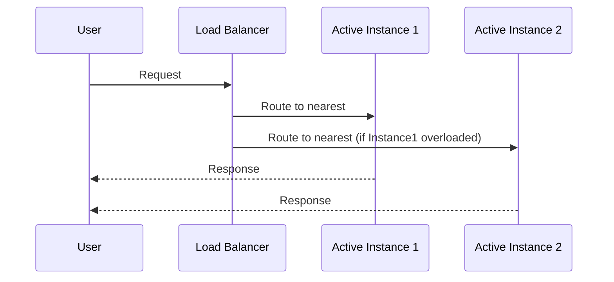

### Introduction

Active-active deployment is a cloud architecture pattern designed to provide high availability and load distribution by running multiple instances of an application or service in geographically distributed locations. This pattern is fundamental for enterprises aiming to achieve minimized downtime and maximize service reliability.

### Detailed Explanation

In an active-active configuration, multiple instances (or nodes) of an application are active simultaneously, often distributed across various geographical regions. This setup ensures that if one instance fails or requires maintenance, other instances can seamlessly handle the incoming traffic, thereby reducing downtime and preventing service interruption.

**Key Characteristics:**

- **Load Distribution:** Concurrent traffic handling across multiple nodes to avoid overloading any single instance.
- **Fault Tolerance:** Automatic rerouting of traffic if one or more instances fail.
- **Reduced Latency:** Improved response times by serving requests from the nearest geographical instance to the user.
- **Scalability:** Easy addition of more instances to manage increased load.
- **Disaster Recovery:** Preparation for geographic disasters by having replicas in multiple locations.

### Architectural Approaches

1. **Global Load Balancing:** Use DNS-based or application-level load balancers to distribute requests across active nodes. This can be implemented using services such as AWS Route 53, Google Cloud Load Balancing, or Azure Traffic Manager.

2. **Geographic Distribution:** Deploy instances in strategically selected data centers to ensure coverage over the desired geographical areas.

3. **Data Synchronization:** Utilize database replication and eventual consistency models to maintain updated data across all instances. Technologies such as Amazon RDS Multi-AZ, Google Cloud Spanner, or Apache Cassandra can be employed.

4. **Stateless Services:** Design applications to be stateless whenever possible, allowing requests to be processed by any instance without the need for session affinity.

### Example Code

Here is a simplified example of configuring an active-active deployment with an NGINX load balancer:

```nginx
http {
    upstream backend {
        server backend1.example.com;
        server backend2.example.com;
    }

    server {
        listen 80;
        
        location / {
            proxy_pass http://backend;
        }
    }
}
```

In this configuration, NGINX will distribute incoming traffic between two backend servers.

### Diagrams



### Best Practices

- **Health Checks:** Implement robust health checks at the load balancer level to detect and reroute traffic based on instance health.
- **Consistent Data Replication:** Ensure that data replication strategies are optimized to handle network latencies and partial failures.
- **Auto-scaling:** Configure auto-scaling policies to dynamically adjust the number of active nodes based on load.

### Related Patterns

- **Active-Passive Failover:** Unlike active-active, active-passive has standby instances that only activate during failure cases.
- **Circuit Breaker Pattern:** An essential component in microservices architecture for detecting failures and preventing cascading failures.

### Additional Resources

- [Google Cloud Load Balancing Documentation](https://cloud.google.com/load-balancing)
- [AWS Disaster Recovery Strategies](https://aws.amazon.com/architecture/disaster-recovery/)
- [Azure Traffic Manager Overview](https://docs.microsoft.com/en-us/azure/traffic-manager/traffic-manager-overview)

### Summary

The active-active deployment pattern is a powerful cloud architecture strategy to enhance application availability, performance, and fault tolerance. By deploying applications across multiple geographically distributed active instances, enterprises can ensure continuous service delivery, minimize latency, and maintain robust disaster recovery plans. By implementing global load balancing, consistent data synchronization, and robust health checks, organizations can effectively leverage active-active deployments to meet their high-availability requirements.
