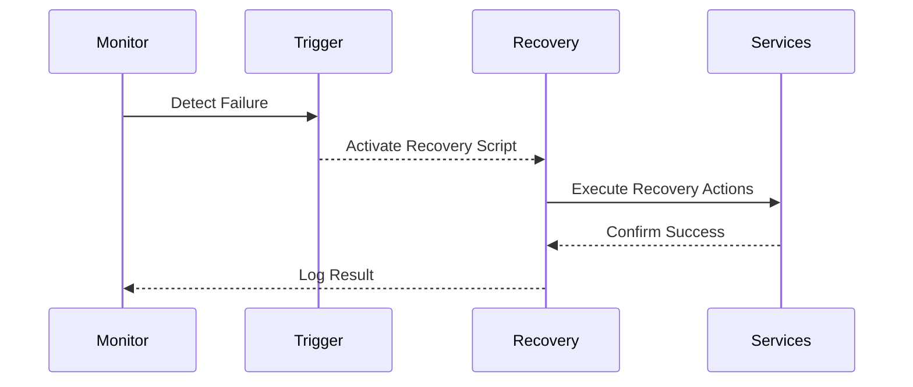

## Overview

In the ever-evolving digital landscape, ensuring business continuity and minimizing downtime are critical challenges for organizations. **Automated Recovery Procedures** are designed to swiftly restore services after a disruption, using scripted and automated solutions to reduce human intervention. This design pattern is particularly beneficial in cloud environments where distributed systems increase complexity and potential points of failure.

## Detailed Explanation

### Architectural Approach

Automated Recovery Procedures typically involve pre-defined scripts or programs that execute corrective actions in response to service disruptions. Key components include:

- **Monitoring Systems**: Continuously check the health and performance of services.
- **Trigger Mechanisms**: Detect anomalies or failures and activate recovery scripts.
- **Automated Scripts**: Perform recovery actions such as restarting services, reallocating resources, or switching to backup systems.
- **Logging Systems**: Record recovery activities and outcomes for auditing and analysis.
 
### Best Practices

1. **Comprehensive Monitoring**: Implement robust monitoring solutions that provide real-time insights into the health of your services.
2. **Clear Trigger Conditions**: Define precise conditions under which automation should initiate recovery procedures to avoid false triggers.
3. **Modular Scripts**: Develop modular and reusable scripts that can be adapted to different scenarios and service architectures.
4. **Thorough Testing**: Regularly test your recovery procedures to ensure their effectiveness and update them as necessary.
5. **Graceful Rollback Mechanisms**: Incorporate rollback solutions in the event of partial restores or unsuccessful recoveries.

### Example Code

Here is a simplified example using a Python script to automatically restart a failed service on AWS using Boto3:

```python
import boto3
import time

def restart_instance(instance_id, region='us-west-1'):
    ec2 = boto3.client('ec2', region_name=region)
    try:
        ec2.stop_instances(InstanceIds=[instance_id])
        print(f"Stopping instance {instance_id}...")
        ec2.get_waiter('instance_stopped').wait(InstanceIds=[instance_id])
        
        ec2.start_instances(InstanceIds=[instance_id])
        print(f"Starting instance {instance_id}...")
        ec2.get_waiter('instance_running').wait(InstanceIds=[instance_id])

        print(f"Instance {instance_id} is now running.")
    except Exception as e:
        print(f"Error restarting instance: {e}")

restart_instance('i-0abcd1234efgh5678')
```

### Diagrams

Here's a basic flow of an automated recovery procedure using Mermaid:



## Related Patterns

- **Self-Healing Architecture**: Focuses on systems capable of automatically detecting and resolving issues.
- **Resiliency Patterns**: Design patterns aimed at enhancing overall system reliability and fault tolerance.
- **Fault Tolerance**: Methods that allow a system to continue operating in the event of a failure.

## Additional Resources

- [AWS Documentation on Automated Recovery](https://aws.amazon.com/premiumsupport/knowledge-center/start-stop-lambda-cloudwatch/)
- [Google Cloud's Automated Redundancy](https://cloud.google.com/blog/products/gcp/cloud-tools-weeks-recovering-from-failure)
- [Azure's Built-in Recovery Solutions](https://docs.microsoft.com/en-us/azure/site-recovery/)

## Summary

Automated Recovery Procedures are crucial for maintaining business continuity in the cloud. Through the strategic use of monitoring, scripting, and automation, these procedures help quickly restore services with minimal impact on users. By implementing and constantly refining these automated systems, organizations can enhance their resilience and readiness against potential disruptions.
