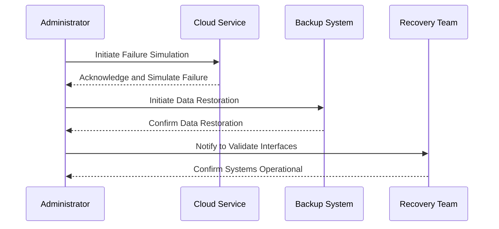

## Introduction

In the ever-evolving landscape of cloud computing, ensuring business continuity and resilience against unexpected failures is critical. **Disaster Recovery Drills** involve the systematic and periodic testing of disaster recovery (DR) plans to validate their effectiveness and refine processes to enhance readiness. This pattern is crucial for detecting potential flaws in DR strategies and enables organizations to recover quickly from outages or disruptions, minimizing downtime and data loss.

## Detailed Explanation

### Design Pattern Overview

Disaster Recovery Drills are structured exercises where an organization simulates a serious data loss or service outage to evaluate the effectiveness of its DR plan. The main objectives include:

1. **Validation and Verification**: Ensure that the DR plan is complete and can be executed successfully.
2. **Identification of Gaps**: Discover shortcomings and areas of improvement within the current plan.
3. **Team Preparation**: Train team members on executing the DR plan efficiently under stress.
4. **Process Improvement**: Refine recovery processes based on drill outcomes.

### Architectural Approaches

- **Automated Simulation**: Utilize automated tools to simulate failures in a controlled environment. Cloud service providers often offer tools that can create network issues or degrade services to test recovery.
  
- **Controlled Failover**: Test failover procedures by moving workloads to backup systems, either on-premises or in the cloud. Monitor time taken and issues encountered during the transition.

- **Data Restoration Testing**: Regularly restore data from backups to verify data integrity and ensure all critical data is recoverable.

### Paradigms and Best Practices

- **Regular Scheduling**: Schedule drills regularly (e.g., quarterly, bi-annually) to maintain preparedness. Include unannounced drills to test real response times.
  
- **Cross-Department Involvement**: Engage multiple departments within the organization to ensure comprehensive preparedness across all business functions.

- **Scenario Variations**: Create multiple scenarios, including total site failure, partial outages, and cyber-attacks, to test different aspects of the DR plan.

## Example Code (Simulated Recovery Testing Script)

Below is a simplified example of a script that may be used to conduct a simulated recovery testing using AWS CloudFormation:

```bash
#!/bin/bash


echo "Initiating Disaster Recovery Drill..."

cd /path/to/cloudformation/templates

aws cloudformation update-stack --stack-name MyApplicationStack --template-body file://simulate-failure.yml

aws cloudformation describe-stacks --stack-name MyApplicationStack --query "Stacks[0].StackStatus"

echo "Disaster condition simulation complete. Proceed with restoration."

aws rds restore-db-instance-from-db-snapshot --db-instance-identifier mydbinstance --db-snapshot-identifier mydbsnapshot

echo "Restoration process initiated. Verify application functionality."
```

## Diagrams

### UML Sequence Diagram for DR Drill Workflow



## Related Patterns

- **Backup and Restore**: Establishing reliable backup procedures that integrate seamlessly with DR plans.
- **Automated Failover**: Designing systems that can automatically switch over to backup systems during failures.

## Additional Resources

- **AWS Disaster Recovery**: [AWS Disaster Recovery Overview](https://aws.amazon.com/disaster-recovery/)
- **Azure Site Recovery**: [Azure Site Recovery Documentation](https://azure.microsoft.com/en-us/services/site-recovery/)
- **Google Cloud Backup and DR**: [GCP Backup Best Practices](https://cloud.google.com/solutions/category/backup-and-DR)

## Summary

Disaster Recovery Drills are an indispensable element of sound cloud infrastructure strategy, verifying the robustness and effectiveness of DR plans. By regularly conducting these drills, organizations can identify weaknesses, train staff, and ensure that business processes can weather various disruptions. Implementing these drills contributes significantly to building resilient cloud architectures capable of minimizing downtime and safeguarding critical data.
