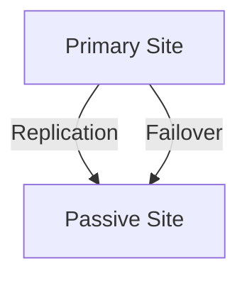

---

linkTitle: "Recovery Time Objectives (RTO)"
title: "Recovery Time Objectives (RTO): Defining Acceptable Downtime Durations"
category: "Disaster Recovery and Business Continuity in Cloud"
series: "Cloud Computing: Essential Patterns & Practices"
description: "In the context of cloud computing, Recovery Time Objectives (RTO) define the maximum acceptable amount of time that a system can be offline in the event of a disruption, ensuring business continuity and efficient disaster recovery planning."
categories:
- disaster-recovery
- business-continuity
- cloud-computing
tags:
- RTO
- downtime-management
- disaster-recovery
- cloud-strategy
- business-continuity
date: 2024-07-07
type: docs

canonical: "https://softwarepatternslexicon.com/18/16/7"
license: "© 2024 Tokenizer Inc. CC BY-NC-SA 4.0"
---

## Introduction

In today's digital-first environment, ensuring business continuity is a crucial objective for companies relying on cloud-based infrastructures. The concept of Recovery Time Objectives (RTO) plays a pivotal role in disaster recovery and business continuity planning. This article delves into the significance of RTO within cloud computing, detailing its implementation, associated challenges, and best practices to efficiently handle unexpected downtime.

## Understanding RTO

Recovery Time Objective (RTO) is a critical metric that indicates the maximum tolerable duration that a system or application can be offline after a failure or disruption. The goal is to resume operations within this predefined time frame to minimize business impact. It helps organizations to prioritize recovery processes and resources effectively in the event of failures such as data breaches, system crashes, or natural disasters.

## Importance of RTO in Cloud Computing

1. **Business Continuity**: RTO ensures that critical operations can restart swiftly, thus minimizing interruptions to business processes and services.
2. **Cost Management**: Defines the investments required in disaster recovery plans by determining acceptable downtime durations.
3. **Risk Mitigation**: Helps in assessing and preparing for risks by designing strategies that address potential downtimes within acceptable limits.
4. **Service Level Agreements (SLAs)**: Guides the formulation of SLAs with cloud service providers to align with business expectations on recovery timelines.

## RTO Determination Example

Determining RTO involves several factors, including the criticality of the application, potential revenue loss, customer impact, and operational dependencies. Here's a simplified example to illustrate:

- **Example Scenario**: An e-commerce platform assessing RTO for its payment processing system might calculate potential loss per hour of downtime and then decide on an RTO that aligns with both operational needs and financial justifications, say 15 minutes.

## Best Practices for Managing RTO

- **Assess and Prioritize**: Conduct a thorough analysis of business processes to identify critical applications and their acceptable downtime.
- **Regular Testing**: Implement regular drills to test disaster recovery plans and adjust RTO goals based on real-world outcomes and lessons learned.
- **Leverage Automation**: Use automated recovery solutions that can reduce downtime and enable faster restoration of services.
- **Collaboration with Providers**: Work closely with cloud service providers to ensure their disaster recovery capabilities meet your RTO requirements.

## Architectural Approaches for Achieving RTO

1. **Active-Passive Configuration**: Maintain a secondary (passive) site that can swiftly be activated if the primary site fails.
2. **Auto-Scaling and Load Balancing**: Utilize cloud-native features to distribute workloads dynamically, maintaining availability even during peak recovery times.
3. **Data Replication**: Employ synchronous or asynchronous data replication to ensure that data is up-to-date and recoverable.

## Example Code

Consider a simple Kubernetes setup to ensure high availability, which can be used to manage parts of RTO.

```yaml
apiVersion: apps/v1
kind: Deployment
metadata:
  name: payment-processing
spec:
  replicas: 3
  template:
    metadata:
      labels:
        app: payment-processing
    spec:
      containers:
      - name: payment-container
        image: payment-image:latest
        ports:
        - containerPort: 8080
```

Mermaid diagram illustrating the Active-Passive architecture:



## Related Patterns

- **Recovery Point Objectives (RPO)**: Complements RTO by defining the acceptable amount of data loss measured in time.
- **Multi-Region Deployment**: Enhances reliability by distributing workloads across multiple geographic regions.
- **Auto-Scaling Groups**: Automatically adjust the number of computational resources based on demand, aiding in rapid recovery.

## Additional Resources

- [NIST SP 800-34: Contingency Planning Guide for Federal Information Systems](https://nvlpubs.nist.gov/nistpubs/Legacy/SP/nistspecialpublication800-34r1.pdf)
- [AWS Disaster Recovery Entry Points](https://aws.amazon.com/disaster-recovery/)

## Summary

Recovery Time Objectives (RTO) are an integral part of any cloud-driven business continuity plan. By understanding and implementing RTO strategies effectively, organizations can ensure resilience against disruptions while aligning recovery plans with business needs and customer expectations. Continuous assessment and adaptation of these strategies are key to maintaining operational stability and minimizing downtime in an ever-evolving technological landscape.
