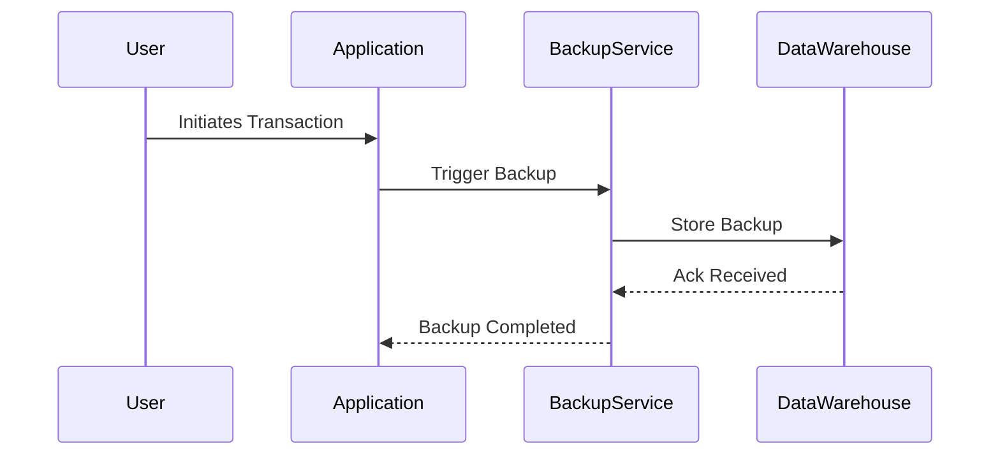

## Overview

In the realm of disaster recovery and business continuity, **Recovery Point Objectives (RPO)** play a critical role in determining the maximum duration of time in which data might be lost due to a major incident. This concept is vital for organizations that need to ensure their data is protected and that they can resume operations swiftly with minimal data loss.

## Design Pattern Explanation

### RPO Definition

The RPO is a key metric within a business continuity plan and refers to the age of the data that must be recovered from backup storage in order to resume normal operations after a disruption. It essentially outlines the amount of data loss that an organization can tolerate during a disaster recovery scenario.

### Importance of RPO

1. **Minimizes Data Loss**: Establishing a clear RPO helps organizations define the frequency of data backups required to minimize loss.
   
2. **Aligns IT and Business Goals**: RPO ensures synchronization between IT capabilities and business needs, minimizing potential business impacts of data loss.

3. **Guides Backup and Recovery Strategies**: An effective RPO informs which types of backup solutions and technologies should be implemented.

### Determining RPO

1. **Identify Critical Data**: Assess which data sets are crucial for business operations and prioritize them.
   
2. **Analyze Impact**: Investigate potential impacts of data loss on business operations to set realistic RPO times.

3. **Evaluate Technological Capabilities**: Determine the capability of existing technologies to support the desired RPO.

4. **Cost-Benefit Analysis**: Weigh the cost of implementing solutions against potential losses from not meeting RPO.

### Implementation Strategies

- **Frequent Data Backups**: Implement regular snapshots or continuous data protection solutions.
  
- **Data Replication**: Use technologies like database replication for mission-critical data to achieve near-zero RPO.

- **Cloud Solutions**: Leverage cloud services for more dynamic and scalable backup solutions.

## Example Code

While RPO is more of a strategic concept, here’s a Java snippet to illustrate how data synchronization or replication might be implemented in a cloud environment:

```java
import com.cloud.provider.DataReplicationService;

public class CloudReplication {
    private final DataReplicationService replicationService;

    public CloudReplication(DataReplicationService replicationService) {
        this.replicationService = replicationService;
    }

    public void replicateData(String source, String destination) {
        replicationService.replicate(source, destination);
        System.out.println("Data replication initiated from " + source + " to " + destination);
    }
    
    public static void main(String[] args) {
        DataReplicationService service = new DataReplicationService();
        CloudReplication replication = new CloudReplication(service);
        replication.replicateData("SourceDB", "ReplicaDB");
    }
}
```

## Diagrams

To further illustrate RPO, consider the following flow of data backup and recovery:



## Related Patterns

- **Recovery Time Objective (RTO)**: Complements RPO by determining how quickly operations must be restored after a disruption.

- **Continuous Data Protection (CDP)**: Provides near-zero RPO by continuously capturing changes to data.

## Additional Resources

- [AWS Disaster Recovery Strategies](https://aws.amazon.com/disaster-recovery/)
- [Azure Data Backup Solutions](https://docs.microsoft.com/en-us/azure/backup/)

## Summary

Setting RPO is an essential step for any organization aiming to safeguard its data and maintain seamless operations during disturbances. It guides businesses in selecting and integrating the right technologies and strategies to minimize data loss within tolerable limits, ensuring resilient and efficient recovery processes. A well-defined RPO allows organizations to align technological capabilities with business imperatives effectively, creating a robust disaster recovery framework.

Incorporating this pattern alongside related strategies like RTO, companies can significantly enhance their disaster preparedness and response efficacy.
