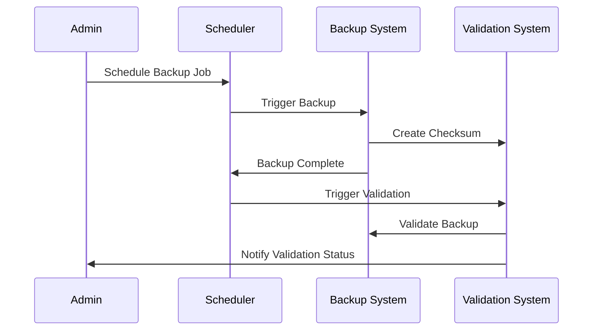

## Introduction

In cloud environments where data integrity and availability are paramount, backup validation and testing become critical components of disaster recovery and business continuity strategies. A backup is only as good as its ability to be restored, and regularly validating and testing backups ensures preparedness against data loss incidents.

## Backup Validation and Testing Explained

Backup validation and testing involve periodically verifying that data backups are complete, accurate, and can be restored to ensure continuity during any unplanned events. It includes processes for checking data integrity, conducting test restores, and auditing backup success and fidelity.

### Key Components
- **Validation**: This process checks whether backups are complete and consistent. It often involves verifying checksums or hashes, conducting integrity checks, and ensuring data validity.
- **Testing**: Testing involves performing actual restores of backup data to verify operability and usability. This ensures backups can be restored within acceptable time frames without errors.

## Architectural Approach

1. **Automated Backup Processes**: Schedule automated backups and validations to reduce human error and ensure regular, consistent backup operations.

2. **Checksum and Hashing**: Employ checksum and hashing techniques during backup to ensure data integrity and allow for validation against corruption.

3. **Test Restoration Procedures**: Simulate disaster scenarios by regularly restoring backups to test their completeness and usability. This should be part of a routine workload that validates the recovery process.

4. **Multi-Layered Testing Approach**:
   - **File Level Testing**: Ensure specific files can be restored.
   - **Volume Level Testing**: Test restoration of larger data volumes.
   - **Application-Level Testing**: Validate the restoration of entire applications and their state.

5. **Cross-Region Backups**: Use cloud providers' capabilities to create cross-region backups, ensuring data accessibility despite regional outages.

6. **Audit and Logging**: Implement logging and monitoring systems to keep audits of backup operations, failures, and successes for future analysis and reporting.

7. **Version Control**: Maintain versioning of backups to roll back to any previous state if needed.

## Example Code

### Automating Backup Validation with AWS Lambda

```javascript
const AWS = require('aws-sdk');
const s3 = new AWS.S3();

exports.handler = async (event) => {
    const params = {
        Bucket: 'your-bucket-name',
    };

    const objects = await s3.listObjectsV2(params).promise();
    
    for (let item of objects.Contents) {
        const headParams = {
            Bucket: 'your-bucket-name',
            Key: item.Key,
        };
        
        try {
            await s3.headObject(headParams).promise();
            console.log(`Validated: ${item.Key}`);
        } catch (error) {
            console.log(`Failed to validate: ${item.Key}, ${error.message}`);
        }
    }
    
    return { message: 'Validation complete' };
};
```

## Diagrams

### Sequence Diagram for Backup Validation



## Related Patterns

- **Data Archiving**: Storage of historical data for long-term retention.
- **Cross-Region Replication**: Automatic replication of data across different geographic locations for redundancy.
- **Disaster Recovery as a Service (DRaaS)**: Cloud-based solutions that ensure business continuity.

## Additional Resources

- [AWS Backup](https://aws.amazon.com/backup/)
- [Azure Site Recovery](https://azure.microsoft.com/en-us/services/site-recovery/)
- [Google Cloud Disaster Recovery Documentation](https://cloud.google.com/solutions/disaster-recovery-capture-and-replay)

## Summary

Implementing a robust backup validation and testing strategy ensures that your cloud-based business operations are resilient to data loss. Automated validation, effective testing, and consistent audits must be part of your operational regimen to secure uninterrupted access to crucial data. With these practices, organizations can ensure they are well-prepared to restore crucial services in the face of adversity, limiting the impact of potential disasters.
